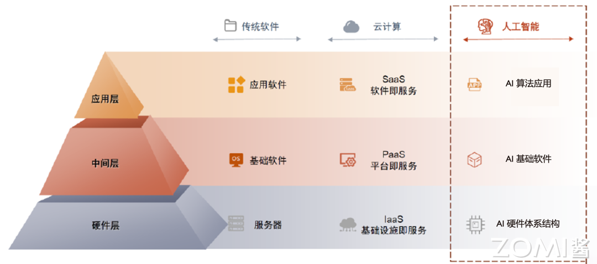
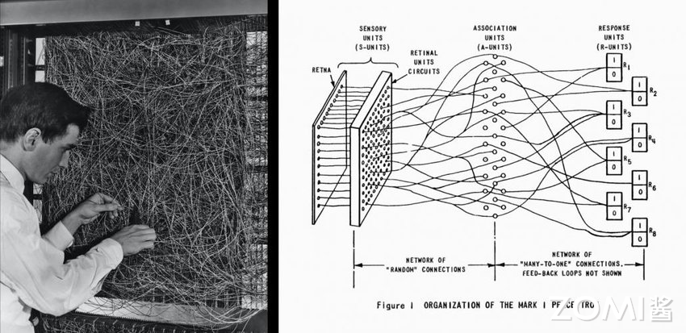
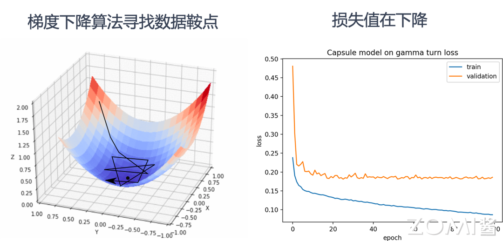
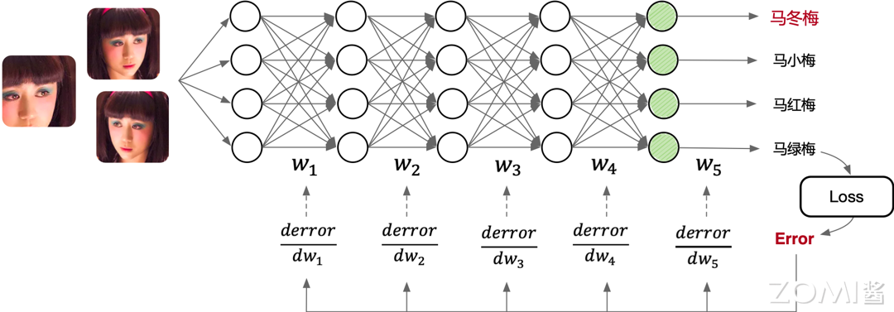

# AI系统基本概念

## 本节学习目标

1. 理解AI系统的定义和基本概念
2. 掌握AI系统在整个AI技术栈中的定位和作用
3. 了解为什么要学习AI系统
4. 认识AI系统与人工智能、机器学习、深度学习之间的关系

## 前置知识

- 了解基本的编程概念
- 具备高中数学基础（矩阵、导数基础概念）
- 对计算机系统有初步认识

---

## 1.1 什么是AI系统

### 1.1.1 AI系统的定义

**AI系统（AI System）**是连接硬件和上层应用的中间层软硬件基础设施，是人工智能时代承担类似传统软件栈中数据库、操作系统、中间件角色的关键系统组件。

如果用建筑来类比，我们可以更好地理解AI系统的位置和作用：

- **地基（硬件层）**：类似于建筑的地基，提供了最底层的算力支撑，包括GPU、NPU、TPU等AI专用芯片，以及通用的CPU、内存、存储和网络设备。
- **中间层（AI系统层）**：类似于建筑的主体结构，连接地基和屋顶，是整个AI系统的核心。这一层包括AI框架（如PyTorch、MindSpore）、AI编译器（如TVM、XLA）、以及底层算子库等。
- **屋顶（应用层）**：类似于建筑的屋顶，代表各种AI应用，如图像识别、自然语言处理、推荐系统等。



### 1.1.2 为什么需要AI系统

在AI时代，算法工程师和研究人员主要通过高级编程语言（如Python）和AI框架提供的API来编写AI算法。那么问题来了：为什么我们还需要AI系统？

答案在于**效率**和**生产力**。

让我们通过一个简单的对比来理解。假设我们要实现一个卷积神经网络LeNet：

**方式一：直接使用CUDA + cuDNN API**

这种方式需要编写数千行代码，管理内存分配释放，手动拼接模型计算图。以cudnn书写的卷积神经网络LeNet实例为例，仅内存管理就需要近百行代码，还需要精心地管理内存分配释放，拼接模型计算图，效率十分低下。

**方式二：使用AI框架（如PyTorch）**

```python
class LeNet(nn.Module):
    def __init__(self):
        super(LeNet, self).__init__()
        self.conv1 = nn.Conv2d(3, 6, 5)
        self.conv2 = nn.Conv2d(6, 16, 5)
        self.fc1 = nn.Linear(16*5*5, 120)
        self.fc2 = nn.Linear(120, 84)
        self.fc3 = nn.Linear(84, 10)

    def forward(self, x):
        out = F.relu(self.conv1(x))
        out = F.max_pool2d(out, 2)
        out = F.relu(self.conv2(out))
        out = F.max_pool2d(out, 2)
        out = out.view(out.size(0), -1)
        out = F.relu(self.fc1(out))
        out = F.relu(self.fc2(out))
        out = self.fc3(out)
        return out
```

使用AI框架只需要不到20行代码，而直接使用底层API则需要上千行。

AI系统帮助开发者解决了以下核心问题：

1. **以Python API供读者编写网络模型计算图结构**
2. **提供调用基本算子实现，大幅降低开发代码量**
3. **自动化内存管理，不暴露指针和内存管理给用户**
4. **实现自动微分功能，自动构建反向传播计算图**
5. **调用或生成运行时优化代码，调度算子在指定硬件上执行**
6. **在运行期应用并行算子，提升硬件利用率等动态优化**

### 1.1.3 AI系统与传统软件栈的类比

理解AI系统在整个技术栈中的位置，我们可以将其与传统软件栈进行类比：

| 传统软件时代 | AI时代 |
|------------|--------|
| 数据库 | AI框架（训练/推理） |
| 操作系统 | AI编译器 |
| 中间件 | AI芯片_runtime |
| 底层硬件 | AI芯片硬件 |
| 应用软件 | AI应用 |

传统的本地部署时代，三大基础软件（数据库、操作系统、中间件）实现控制硬件交互、存储管理数据、网络通信调度等共性功能，抽象并隔绝底层硬件系统的复杂性，让上层应用开发者能够专注于业务逻辑和应用功能本身的创新实现。

云时代同理，形成了IaaS、PaaS、SaaS三层架构，其中PaaS层提供应用开发环境和基础的数据分析管理服务。类比来看，进入AI时代也有承担类似功能的、连接算力和应用的基础设施中间层即AI系统，提供基础模型服务、赋能模型微调和应用开发。

---

## 1.2 AI系统与相关概念的关系

### 1.2.1 人工智能、机器学习、深度学习与神经网络

在深入学习AI系统之前，我们需要厘清几个常被混淆的概念：人工智能、机器学习、深度学习与神经网络。

可以用如下包含关系来理解：

- **人工智能（AI）**：最广泛的概念，是指让计算机系统具有模拟人类智能的能力，包括推理、学习、感知、理解等。
- **机器学习（ML）**：实现人工智能的一种方法，通过让计算机从数据中学习规律来完成特定任务，而不需要明确编程。
- **深度学习（DL）**：实现机器学习的一种技术，基于深层神经网络，能够自动学习数据的层次化表示。
- **神经网络（NN）**：深度学习的具体实现形态，使用神经网络模型来表示各种复杂的函数关系。

简单来说：机器学习是实现AI的一种方法，深度学习是一种实现机器学习的技术，神经网络是深度学习的具体实现形态。

后续的章节中，我们将会以"AI"一词代指神经网络这一具体实现形态。

### 1.2.2 AI系统的边界

需要特别说明的是，AI系统（AI System）和AI基础设施（AI Infra）虽然经常被混用，但严格来说是有区别的：

- **AI Infra（AI基础设施）**：连接AI训练推理全流程的软件应用及AI中间件基础设施。主要包含大模型从设计、生产到应用等全流程所配套的横向软硬件设施。
- **AI System（AI系统）**：AI时代连接硬件和上层应用的中间层基础设施。主要包含底层系统架构、编译器、AI框架等纵向的基础软硬件设施。

本书聚焦于AI System，侧重于纵向的基础软硬件基础设施层面的知识体系。

---

## 1.3 AI发展历程

了解AI的发展历程对于理解AI系统的设计目标和演化方向至关重要。AI的发展可以大致分为以下几个阶段：

### 1.3.1 萌芽期（1950s-1980s）

**1950年**：图灵测试被提出，用于测试机器是否能表现出与人无法区分的智能。

**1956年**：约翰·麦卡锡提出"人工智能"概念，掀起了AI发展的第一个高潮。

**1957年**：Frank Rosenblatt发明感知机（Perceptron），奠定了之后AI的基本结构，其计算以矩阵乘加运算为主。这影响了后续人工智能芯片和系统的基本算子类型，例如英伟达的新款GPU就有为矩阵计算设计的专用张量核（Tensor Core）。

**1960年**：Bernard Widrow和Hoff发明了感知器Adaline/Madaline，首次尝试把线性层叠加整合为多层感知器网络。

**1969年**：Marvin Minsky和Seymour Papert证明了单层感知器无法解决线性不可分问题（例如异或问题），神经网络的研究因此停滞不前。这为后来AI的两大驱动力埋下了伏笔：提升硬件算力，以及通过更多的层和非线性计算增加模型的非线性能力。

**1974年**：Paul Werbos在博士论文中提出用误差反向传播来训练人工神经网络，使得训练多层神经网络成为可能，有效解决了异或回路问题。这个工作奠定了之后AI的训练方式。



### 1.3.2 繁荣期（1980s-2010s）

**1986年**："深度学习"（Deep Learning）一词由Rina Dechter引入机器学习社区。

**1989年**：Yann LeCun提出用反向传导进行更新的卷积神经网络LeNet，启发了后续卷积神经网络的研究与发展。

**1998年**：现代卷积神经网络CNN的基本结构LeNet-5诞生，机器学习方法由早期基于浅层机器学习的模型变为了基于深度学习的模型。

**2006年**：Geoff Hinton等人表明多层前馈神经网络可以一次有效地预训练一层，提出了深度信念网络（Deep Belief Nets）的学习方法。

**2009年**：李飞飞教授团队展示了ImageNet数据库，之后大量计算机视觉领域的经典模型在此数据库上进行验证和评测。

### 1.3.3 突破期（2012-2020）

**2012年9月**：AlexNet赢得ImageNet竞赛，神经网络开始再次流行。AlexNet首次采用ReLU激活函数，添加Dropout层减小过拟合，LRN层增强泛化能力。AlexNet花费5到6天，采用2块英伟达GTX 580 3GB GPU进行加速，形成了AI系统以GPU等加速器为主要计算单元的架构。

**2013年**：自然语言处理模型Word2Vec诞生，首次提出将单词转换为向量的"词向量模型"。

**2014年**：GAN（对抗式生成网络）诞生，标志着深度学习进入了生成模型研究的新阶段。

**2017年**：谷歌提出基于自注意力机制的神经网络结构Transformer架构，奠定了大模型预训练算法架构的基础。

**2018年**：OpenAI和谷歌分别发布了GPT-1与BERT大模型，Transformer架构开始主导NLP领域。

### 1.3.4 大模型时代（2020-至今）

**2020年**：OpenAI推出GPT-3，模型参数规模达到1750亿（175B），成为当时最大的语言模型。

**2021年8月**：李飞飞等100多位学者发表《On the Opportunities and Risk of Foundation Models》报告，将这种基于神经网络和自监督学习技术，在大规模、广泛来源数据集上训练的AI模型称为"大模型"或"基础模型"。

**2022年11月**：搭载GPT3.5的ChatGPT横空出世，凭借逼真的自然语言交互与多场景内容生成能力引爆互联网。

**2023年3月**：GPT-4发布，具备多模态理解与多类型内容生成能力。

大模型时代的特点：
- **参数规模爆发**：从亿级到百万亿级
- **Transformer架构主流**：形成了GPT和BERT两条主要技术路线
- **多模态融合**：支持文本、图片、语音等多种模态
- **训练成本激增**：GPT-4训练一次的成本超过5000万美金

---

## 1.4 AI学习基础

### 1.4.1 前向传播与反向传播

理解神经网络的工作原理是学习AI系统的基础。神经网络的工作过程可以分为前向传播和反向传播两个阶段。

#### 前向传播（Forward Propagation）

前向传播是指数据从输入层经过隐藏层向输出层流动的过程。输入数据经过每一层的加权求和，再加上激活函数，最终在输出层产生预测结果。

以一个简单例子说明：假设输入是一张手写数字图片，输出是10个类别的概率分布（0-9数字）。数据依次通过：

1. **输入层**：接收原始图像像素值
2. **卷积层**：提取图像特征
3. **池化层**：降低特征维度
4. **全连接层**：综合特征进行分类
5. **输出层**：输出各类别的概率

#### 反向传播（Back Propagation）

反向传播是训练神经网络的核心机制。当前向传播产生输出后，计算预测值与真实标签之间的误差（损失函数Loss），然后将误差从输出层向输入层反向传播，计算每个权重对误差的贡献（梯度），最后使用梯度下降算法更新权重。



训练过程的本质是通过网络模型中的连接逐层向后传播总误差，计算每个层中每个权重和偏差对总误差的贡献（梯度），然后使用优化算法寻找最优解，从而对网络模型优化权重参数。

一句话概括：**训练AI模型的过程，就是通过不断的迭代计算，使用梯度下降的优化算法，使得损失值Loss越来越小。损失值越小就表示算法达到数学意义上的最优。**

### 1.4.2 训练与推理的区别

训练（Training）和推理（Inference）是AI模型生命周期的两个核心阶段，它们有着显著的区别：

| 特征 | 训练 | 推理 |
|------|------|------|
| 目的 | 学习数据中的规律，更新模型权重 | 使用已训练好的模型进行预测 |
| 是否需要梯度 | 是 | 否 |
| 计算资源需求 | 大 | 相对较小 |
| 延迟要求 | 相对宽松 | 通常要求低延迟 |
| 精度要求 | 通常使用FP32 | 可使用FP16/INT8等低精度 |
| 模型状态 | 可变（ weights updating） | 固定（frozen） |

训练过程需要反向传播计算梯度、更新权重，通常使用32位浮点数（FP32）以保证精度。训练一块GPU可能在数天到数周不等。

推理过程只需要执行前向传播，不需要计算梯度，可以使用量化、剪枝等技术优化，可以使用16位浮点数（FP16）或8位整数（INT8）来提升性能并降低资源消耗。



### 1.4.3 主流AI算法

目前AI模型有很多种类，从影响AI系统设计的视角，可以将代表性的AI网络结构归为以下几类：

#### 卷积神经网络（CNN）

以卷积层、池化层、全连接层等算子的组合形成的AI网络模型，在计算机视觉领域取得显著效果和广泛应用。

典型应用：
- 图像分类（ResNet、VGG等）
- 目标检测（YOLO、Faster R-CNN等）
- 语义分割（U-Net、Mask R-CNN等）

#### 循环神经网络（RNN）

以循环神经网络、长短时记忆（LSTM）等基本单元组合形成的适合时序数据预测的模型结构。

典型应用：
- 自然语言处理
- 语音识别
- 时间序列预测

#### 生成对抗网络（GAN）

训练两个神经网络相互竞争，从给定的训练数据集生成更真实的新数据。例如，从现有图像数据库生成新图像，或从歌曲数据库生成原创音乐。

#### Transformer架构

通过自注意力机制（Self-Attention）实现序列到序列的转换，成为大语言模型（LLM）的基础架构。

典型代表：
- BERT：基于Transformer Encoder的双向编码器
- GPT：基于Transformer Decoder的自回归模型
- T5：基于Transformer Encoder-Decoder的文本到文本转换模型

#### 图神经网络（GNN）

使用神经网络来学习图结构数据，提取和发掘图结构数据中的特征和模式，满足聚类、分类、预测、分割、生成等图学习任务需求。

#### 混合结构网络

组合以上不同结构类型的网络模型，如结合卷积神经网络和循环神经网络，解决如OCR等复杂应用场景的预测任务。

---

## 1.5 AI发展驱动力

催生AI热潮的原因有三个重要因素：大数据的积累、超大规模的计算能力支撑、机器学习尤其是深度学习算法取得了突破性进展。

### 1.5.1 大规模数据驱动

随着数字化发展，信息系统和平台不断沉淀了大量数据。AI算法利用数据驱动的方式解决问题，从数据中不断学习出规律和模型，进而完成分类和回归的任务。

互联网公司因为有海量的用户，这些用户不断使用互联网服务，上传文字、图片、音频等数据，积累了丰富的数据。这些数据随着时间的流逝和新业务功能的推出，数据量越来越大，数据模式越来越丰富。

以图像分类问题为例：
- MNIST手写数字识别数据集：6万样本，10个分类
- ImageNet：1600万样本，1000个分类
- 互联网Web服务中：数亿量级的图像数据

海量的数据让人工智能问题变得愈发挑战的同时，也实质性地促进了神经网络模型效果的提升。

数据对AI系统的影响：
1. **推动AI算法不断产生更高准确度与更低的误差**
2. **让AI有更广泛的应用，产生商业价值**
3. **传统的机器学习库不能满足相应的需求，产生分布式训练和AI集群的需求**
4. **多样的数据格式和任务，驱动AI框架需要有更灵活的表达能力**
5. **数据安全与模型安全问题挑战日益突出**

### 1.5.2 AI算法的进步

算法研究员和工程师不断设计新的AI算法和AI模型提升预测效果。新的算法和模型结构需要AI框架提供便于对AI范式的编程表达力和灵活性，同时也对执行性能优化提出了新的挑战。

以MNIST手写数字识别任务为例：
- 1998年：简单的CNN可以接近SVM最好效果
- 2012年：CNN可以将错误率降低到0.23%，与人所达到的错误率0.2%非常接近

新的模型不断在以下方面演化进而提升效果：
1. 更好的激活函数和层（如ReLU、Batch Norm等）
2. 更深更大的网络结构和更多的模型权重
3. 更好的训练技巧：正则化、初始化、学习方法

### 1.5.3 算力与体系结构进步

从1960年以来，计算机性能的增长主要来自摩尔定律。单纯靠工艺尺寸的进步，无法满足各种应用对性能的要求。

于是，人们开始为应用定制专用芯片，通过消除通用处理器中冗余的功能部分，来进一步提高对特定应用的计算性能：

**GPU（图形处理器）**：对图像类算法进行专用硬件加速，后来出现GPGPU（通用GPU），对适合于抽象为SIMD或SIMT的并行算法与工作负载都能起到惊人的加速效果。

**TPU（张量处理单元）**：谷歌设计的专用AI加速器，通过对神经网络模型中的算子进行抽象，转换为矩阵乘法或非线性变换，使用脉动阵列（Systolic Array）进一步提高计算密度。

**NPU（神经网络处理器）**：华为针对神经网络运算专门优化设计，可解决传统芯片在神经网络运算时效率低下的问题。华为昇腾达芬奇架构通过独创3D Cube设计，每时钟周期可进行4096次MAC运算。

算力的提升让AI取得了突破，但我们也看到，算力还是可能在短期内成为瓶颈。因此，除了单独芯片的不断迭代进行性能放大（Scale Up），系统工程师不断设计更好的分布式计算系统将计算并行，提出了AI集群来达到向外扩展（Scale Out），同时发掘深度学习的作业特点（如稀疏性等）通过算法、系统、硬件协同设计，进一步提升计算效率和性能。

---

## 1.6 大模型时代的AI系统

### 1.6.1 大模型发展现状

从参数规模上看，AI大模型先后经历了预训练模型、大规模预训练模型、超大规模预训练模型三个阶段，每年网络模型的参数规模以10倍级以上进行提升。

从技术架构上看，Transformer架构是当前大模型领域主流的算法架构基础，由此形成了GPT和BERT两条主要的技术路线。其中BERT最有名的落地案例是谷歌的AlphaGo。在GPT3.0发布后，GPT逐渐成为大模型的主流路线。

从支持模态上看，AI大模型可分为：
- **大语言模型（LLM）**：如GPT、LLAMA等
- **视觉大模型（LVM）**：如CLIP、DALL·E等
- **多模态大模型（LMM）**：如GPT-4等
- **图网络大模型（GLM）**
- **科学计算大模型（LSM）**

### 1.6.2 AI系统对大模型的影响

大模型进入爆发期后，在LLM进化树中，BERT（Encoder-Only）、T5（Encoder-Decoder）、GPT（Decoder-Only）分别代表了不同的架构方向。

那为什么在大模型时代，曾经风光无限的BERT家族和T5家族会逐渐没落？

从纯算法模型结构上，T5的模型结构不是线性的，因为在Decoder和Encoder之间有复杂的连接关系，导致T5在真正大规模堆叠的时候，在工程领域很难通过分布式并行高效地执行起来。

针对直接基于Decoder-Only实现的GPT模型，在工程领域实现分布式并行优化，会比T5、BERT等网络模型更加容易实现。或许不同的算法结构对于网络模型的具体效果上互有高低，但是在模型规模继续Scale up的大模型时代，工程上更容易实现分布式并行、更容易扩展、训练Token效率更高的模型，一定是更具备优势的。

这就是AI系统反过来影响算法发展的一个典型例子。

### 1.6.3 大模型时代的系统挑战

大模型训练的成本极高，GPT-4训练一次的成本超过5000万美金。百亿级别和千亿级别的MoE（Mixture of Experts）架构开始成为大模型时代考虑的下一个主流方向。

在大模型时代，系统研究员需要考虑以下问题：

- 网络模型结构算法如何实现各种并行时所需的通信量更低？
- 网络模型结构算法如何优化实现更少计算量、更少的显存需求、更容易进行推理？
- 如何设计编译器使得网络模型计算自动优化、实现通信量、计算量、显存占用更少？
- 如何设计编译器使得网络模型结构算法能够适配到不同的AI加速器上执行计算？
- 如何设计AI计算集群的网络拓扑，减少网络拥塞，降低网络传输耗时，提升线性度？

---

## 本节小结

1. **AI系统的定义**：AI系统是连接硬件和上层应用的中间层软硬件基础设施，包括AI框架、AI编译器、底层算子库等组成部分。

2. **AI系统的重要性**：AI系统将复杂的底层硬件抽象隐藏起来，让算法工程师能够专注于算法本身的设计和创新，大幅提升AI开发效率。

3. **概念关系**：机器学习是实现AI的方法，深度学习是实现机器学习的技术，神经网络是深度学习的具体实现形态。

4. **AI发展历程**：经历了萌芽期（1950s-1980s）、繁荣期（1980s-2010s）、突破期（2012-2020）和大模型时代（2020-至今）。

5. **AI学习基础**：包括前向传播、反向传播、训练与推理的区别，以及CNN、RNN、GAN、Transformer等主流算法。

6. **发展驱动力**：大数据积累、超大规模计算能力支撑、深度学习算法取得突破性进展。

7. **大模型时代挑战**：稀疏化、分布式并行、硬件协同设计成为新的研究方向。

---

## 思考与练习

1. 请解释AI系统在整个AI技术栈中的定位和作用，为什么需要AI系统？

2. 论述人工智能、机器学习、深度学习与神经网络之间的关系。

3. 描述AI训练的基本流程，包括前向传播、反向传播和梯度更新的过程。

4. 训练与推理有什么区别？为什么推理可以使用低精度计算？

5. 哪些因素驱动了AI从2012年开始的快速发展？

6. 在大模型时代，AI系统如何反过来影响算法的发展方向？请结合具体例子说明。

7. 思考：如果你要设计一个AI系统，需要考虑哪些核心问题？
