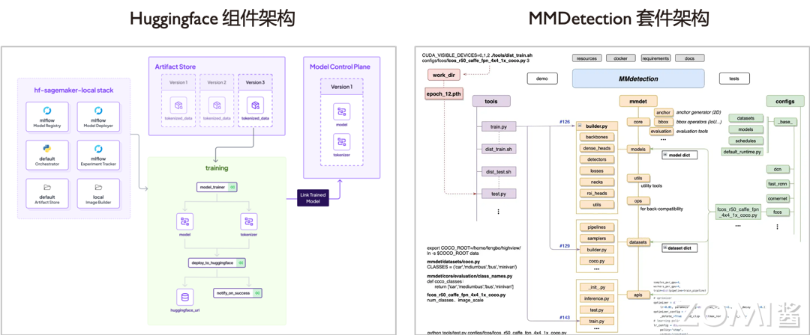
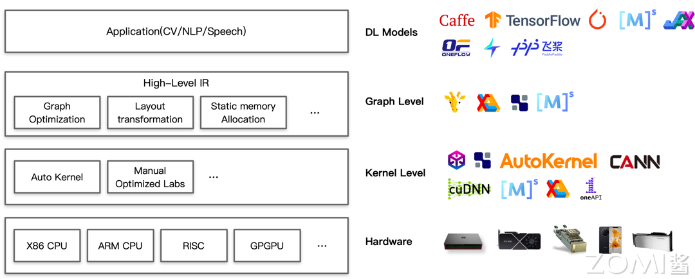

# AI系统全栈架构

## 本节学习目标

1. 理解AI系统全栈架构的层次划分
2. 掌握各层的主要职责和交互方式
3. 了解AI训练与推理框架的作用
4. 认识AI编译器与计算架构的功能
5. 熟悉AI硬件与体系结构的基本概念
6. 了解AI生态的组成

## 前置知识

- 理解1.1节AI系统基本概念
- 具备基本的计算机系统知识
- 了解操作系统和编译器的基本原理

---

## 2.1 AI系统全栈架构概述

### 2.1.1 全栈架构的层次划分

AI系统全栈架构是一个复杂的软硬件协同系统，从上到下可以分为四个主要层次：

| 层次 | 主要组件 | 核心职责 |
|------|----------|----------|
| 应用层 | AI应用、模型服务 | 业务逻辑、接口封装 |
| AI框架层 | PyTorch、MindSpore等 | 编程接口、自动微分、计算图构建 |
| AI编译器层 | TVM、XLA、Glow等 | 代码生成、优化调度 |
| 硬件层 | GPU、NPU、TPU等 | 计算执行、加速运算 |

### 2.1.2 各层的职责与交互

从上到下看，每一层都有其独特的职责：

**应用层**位于最顶层，直接面向最终用户和业务场景。这一层包括各类AI应用（如图像识别应用、自然语言处理应用）、模型部署服务等。应用层通过调用AI框架层提供的API来完成业务逻辑的实现。

**AI框架层**承上启下，是整个AI系统的核心中间层。这一层负责：
- 提供高级编程语言（如Python）的API供开发者编写神经网络模型
- 实现自动微分（Automatic Differentiation）功能，支持反向传播训练
- 构建和优化计算图（静态图或动态图）
- 管理模型的训练和推理流程
- 提供数据加载、模型管理等工具链

主流的AI框架包括PyTorch、MindSpore、TensorFlow、JAX等。

**AI编译器层**负责将计算图转换为底层硬件可执行的代码。这一层：
- 解析神经网络模型的高级表达
- 进行图优化、算子融合等编译优化
- 生成针对特定硬件的优化代码
- 管理运行时调度和资源分配

典型的AI编译器包括TVM（由Apache TVM开源）、XLA（谷歌的加速线性代数编译器）、Glow（Facebook的编译器）等。

**硬件层**是整个栈的底层基础，提供实际的计算能力。这一层包括：
- AI专用芯片（GPU、NPU、TPU等）
- 通用CPU
- 内存和存储系统
- 网络互联设备（RDMA、NVLink等）

各层之间通过精心设计的接口进行交互。上层调用下层提供的服务，下层为上层提供抽象后的能力支撑。这种分层架构使得开发者可以在不了解底层细节的情况下进行AI应用的开发，同时系统工程师可以在各个层面进行优化和创新。

---

## 2.2 AI训练与推理框架

### 2.2.1 AI框架的核心作用

AI框架不仅仅是指如PyTorch等训练框架，还包括推理框架。其核心职责是：

1. **提供编程接口**：通过Python API供用户编写网络模型计算图结构
2. **自动微分**：高效地对网络模型自动求导等。由于网络模型中大部分算子较为通用，AI框架提前封装好算子的自动求导函数，待用户触发训练过程自动透明地进行全模型的自动求导
3. **计算图构建**：静态计算图、动态计算图构建等
4. **中间表达构建**：通过构建网络模型的中间表达及多层中间表达，让模型本身可以更好地被下层AI编译器编译生成高效的后端代码

### 2.2.2 AI框架的核心功能模块

AI框架作为一个复杂的软件系统，包含多个核心功能模块：

#### 网络模型构建模块

网络模型构建模块负责提供卷积神经网络CNN、循环神经网络RNN、Transformer结构等基本结构和算子支持的API。语言的基本语法和框架的API接口提供基本算子的支持。当前主要以使用Python语言内嵌调用AI框架的方式进行网络模型的开发。

#### 模型算法实现模块

模型算法实现模块封装了算法层面的配置和API供用户选择。算法一般被封装为AI框架的配置或API供用户选择，有些AI框架也提供拦截接口给用户一定程度灵活性定制自定义算法。

#### 计算图构建模块

不同的AI框架类型决定了其使用静态还是动态图进行构建：
- **静态计算图**：在执行前完整地定义计算图，有利于获取更多信息做全图优化，但调试相对困难
- **动态计算图**：在实际执行时才动态构建计算图，有利于调试，但优化机会有限

目前实际处于一个融合的状态，如PyTorch 2.X版本后推出Dynamo特性支持原生静态图。

#### 自动求导模块

自动求导（Automatic Differentiation，AutoGrad）是深度学习框架的核心功能之一。由于网络模型中大部分算子较为通用，AI框架提前封装好算子的自动求导函数，待用户触发训练过程自动透明地进行全模型的自动求导，以支持梯度下降等训练算法需要的权重梯度数据的获取。

#### 中间表达构建模块

多层次中间表达（Intermediate Representation，IR）是连接AI框架和AI编译器的桥梁。通过构建网络模型的中间表达及多层中间表达，让模型本身可以更好地被下层AI编译器编译生成高效的后端代码。

#### 工具链模块

工具链模块提供了如模型在不同硬件的迁移、在不同框架的迁移、模型转换、调试、可视化、类型系统等功能。就像传统的软件工程中调试器、可视化、类型系统等工具链的支撑，让整个开发过程中跨平台、问题诊断、缺陷验证等得以高效实现。

#### 生命周期管理模块

生命周期管理模块负责数据读取、训练与推理等流程开发与管理。机器学习领域的DevOps也就是MLOps的基础工具支持。其可以让重复模块被复用，同时让底层工具有精确的信息进行模块间的调度与多任务的优化。

### 2.2.3 主流AI框架介绍

#### PyTorch

PyTorch由Meta（原Facebook）开发，是目前最流行的深度学习框架之一。PyTorch采用命令式编程风格，动态图执行，调试方便，社区活跃。PyTorch 2.0引入了torch.compile特性，支持将动态图转换为静态图进行优化。

#### TensorFlow

TensorFlow由谷歌于2015年开源，是工业界应用最广泛的深度学习框架之一。TensorFlow提供静态图（Graph mode）和动态图（Eager mode）两种执行模式。TensorFlow 2.0默认启用动态图执行，大幅提升了开发体验。TensorFlow的高级封装Keras使得模型构建更加简便。

#### MindSpore

MindSpore由华为于2020年开源，是国产AI框架的代表。MindSpore支持端云统一架构，可以在终端和云端无缝切换。MindSpore提供了自动微分、自动并行等功能，支持多种硬件平台。

#### JAX

JAX由谷歌于2018年开源，定位为高性能数值计算框架。JAX的核心设计理念是函数转换，通过grad、jit等函数转换实现自动微分和即时编译。JAX在科学计算领域有广泛应用。

### 2.2.4 推理框架的特殊需求

推理框架与训练框架既有联系又有区别。推理框架需要关注：

1. **低延迟**：推理通常要求较低的响应延迟，需要针对延迟进行优化
2. **资源高效利用**：推理部署环境通常资源有限，需要高效利用计算资源
3. **低精度计算**：推理可以使用FP16、INT8等低精度格式来提升性能
4. **模型压缩**：量化、剪枝、知识蒸馏等模型压缩技术在推理中广泛应用
5. **跨平台部署**：模型可能需要部署到多种硬件平台，需要跨平台支持

---

## 2.3 AI编译与计算架构

### 2.3.1 AI编译器的定位

AI框架充分赋能深度学习领域，为AI算法的开发者提供了极大便利。但随着AI技术应用的全面发展，各厂家根据自身业务场景的需求，在AI硬件和算法上不断优化和探索，AI系统的体系结构越来越复杂，更多新的AI加速芯片被提出来，其设计变得更加多样化，AI框架运行的硬件环境和算法也趋于更多样和复杂。

为了提供不同框架和硬件体系结构之间的迁移性，ONNX等中间IR被提出，其定义了表示神经网络模型的统一格式，以促进不同AI框架之间的模型转换。

### 2.3.2 为什么需要AI编译器

在通用硬件上，高度优化的线性代数库为神经网络模型计算提供了基础加速库。此外，大多数硬件供应商还发布了专属的神经网络模型计算优化库，如MKL-DNN和cuDNN等。但基于基础加速库的优化往往落后于深度学习算法模型的更新，且大多数情况下需要针对不同的平台进行定制化的开发。

为了解决多硬件平台上的性能优化的问题，多种AI编译器被提出并得到了普及和应用。

### 2.3.3 AI编译器的核心特征

与传统编译器相比，AI编译器是一个领域特定的编译器，有四个明显的特征：

#### 主前端语言

与传统编译器不同，AI编译器通常不需要Lexer/Parser，而是基于前端高级编程语言（如Python）的AST将神经网络模型解析并构造为计算图IR，侧重于保留shape、layout等张量计算特征信息，当然部分编译器还能保留控制流的信息。

#### 多层IR设计

多层IR设计，为的是满足易用性与高性能这两种类型需求：

1. 为了让开发者使用方便，AI框架会尽量对张量的计算进行抽象封装成具体的API或者函数，算法开发者只要关注神经网络模型定义上的逻辑意义模型和算子
2. 在底层算子性能优化时，可以打破算子的边界，从更细粒度的循环调度等维度，结合不同的硬件特点完成优化

#### 面向神经网络优化

面向神经网络模型特殊的数据类型进行定义。AI领域，网络模型层的具体计算被抽象成张量的计算，这就意味着AI编译器中主要处理的数据类型也是张量。而在反向传播过程中，是深度学习最为代表性的特性，基于计算图构建的网络模型，需要具有自动微分功能。

#### DSA芯片架构支持

AI训练和推理对性能和时延都非常敏感，所以大量使用专用的AI加速芯片进行计算，而AI编译器其实是以DSA架构的AI加速芯片作为为中心的编译器，这也是区别于通用编译器的一个特征。

### 2.3.4 主流AI编译器介绍

#### TVM

TVM（Tensor Virtual Machine）由Apache开源，是一个端到端的深度学习编译器。TVM提供了从高层模型描述到硬件指令的完整编译流程。TVM的核心设计理念是通过调度（Schedule）来表达各种硬件加速优化。

#### XLA

XLA（Accelerated Linear Algebra）是谷歌为TensorFlow开发的加速线性代数编译器。XLA将TensorFlow计算图编译成优化的设备特定内核。XLA还支持JAX框架。XLA的核心优化包括算子融合、内存管理优化、即时编译等。

#### Glow

Glow由Meta（原Facebook）开发，是一个基于LLVM的深度学习编译器。Glow采用低级中间表示（LLVM IR）来进行图优化和代码生成，可以支持多种硬件后端。

#### Jittor

Jittor是清华大学开发的深度学习框架，采用了元算子统一计算图表达的技术。Jittor的编译器可以自动将计算图优化并生成高效的硬件代码。

### 2.3.5 编译优化的核心内容

AI编译器的主要优化内容包括：

#### 图优化

图优化是在计算图层面进行的优化，包括：
- **算子融合**：将多个相邻的算子合并为一个算子，减少内存访问和内核启动开销
- **常量折叠**：将可以在编译时计算的张量提前计算出来
- **公共子表达式消除**：消除重复的计算

#### 算子内循环优化

在算子内部层面，编译器可以进行循环优化：
- **循环展开**：减少循环控制开销
- **循环分块**：优化数据局部性，提高缓存命中率
- **循环重排**：优化内存访问模式

#### 自动并行化

AI编译器可以根据硬件拓扑结构自动进行并行化优化，包括：
- **算子间并行**：多个独立的算子可以并行执行
- **算子内并行**：利用SIMD或SIMT指令进行数据级并行
- **分布式并行**：支持多卡、多节点的分布式计算

#### 量化与低精度优化

AI编译器支持将FP32模型量化到FP16、INT8等低精度格式：
- 量化感知训练（Quantization Aware Training）
- 训练后量化（Post-Training Quantization）
- 混合精度计算

---

## 2.4 AI硬件与体系结构

### 2.4.1 AI硬件概述

AI硬件是整个系统栈的底层基础，负责程序的真正执行、互联与加速。AI硬件的发展经历了从通用CPU到专用AI芯片的演化过程。

#### 通用CPU

通用CPU是最基础的计算单元，具有高度的通用性，可以执行任何计算任务。但在AI场景下，CPU的并行计算能力有限，难以满足大规模神经网络模型的计算需求。

#### GPU

GPU（图形处理单元）最初为图形渲染设计，但其高度并行的架构非常适合矩阵运算，在深度学习领域得到广泛应用。GPU通过大量并行执行单元（流处理器）实现高吞吐量。

英伟达（NVIDIA）是GPU领域的领导者，其推出的Tesla系列、Quadro系列等专业GPU，以及消费级的GeForce系列，都被广泛应用于AI训练和推理。英伟达还推出了专用的张量核（Tensor Core），专门针对深度学习中的矩阵运算进行优化。

#### TPU

TPU（张量处理单元）是谷歌专门为机器学习设计的专用芯片。TPU使用脉动阵列（Systolic Array）架构，专门优化矩阵乘法和向量运算。谷歌的TPU已经经历了多代迭代，从TPU v1用于推理，到TPU v2/v3同时支持训练和推理。

#### NPU

NPU（神经网络处理器）是华为针对神经网络运算专门优化设计的专用芯片。华为昇腾达芬奇架构面向AI计算设计，通过独创3D Cube设计，每时钟周期可进行4096次MAC运算，为AI提供强大算力支持。

#### 其他AI加速器

除了上述主流AI加速器，还有多种专用AI芯片：
- 英特尔（Intel）的Nervana和Myriad系列
- 亚马逊（Amazon）的AWS Inferentia
- 特斯拉（Tesla）的Dojo芯片
- 苹果（Apple）的Neural Engine

### 2.4.2 硬件互联技术

在AI训练中，单个AI加速器的算力往往不够，需要多卡甚至多节点协同工作。硬件互联技术为这种协同提供了高带宽的通信基础。

#### NVLink

NVLink是英伟达开发的高速互联技术，可以在GPU之间提供高带宽的点对点通信。NVLink 4.0提供900GB/s的双向带宽，显著高于传统的PCIe连接。

#### NVSwitch

NVSwitch是英伟达的交换芯片，可以连接多个GPU形成高速互联网络。一个基于NVSwitch的服务器最多可以连接8个GPU，提供全互联拓扑。

#### Infinity Fabric

Infinity Fabric是AMD的GPU互联技术，用于连接同一服务器内的多个GPU。

#### RDMA

RDMA（远程直接内存访问）是一种网络技术，允许直接访问远程服务器的内存，无需操作系统介入，可以大幅降低网络延迟和CPU开销。在AI集群中，RDMA常用于节点间的数据交换。

#### InfiniBand

InfiniBand是一种高性能网络技术，提供高带宽和低延迟的互连，广泛应用于AI超级计算机和数据中心。

### 2.4.3 硬件抽象层

硬件抽象层（Hardware Abstraction Layer，HAL）是AI系统中的重要层次，它将底层硬件的复杂性抽象出来，为上层软件提供统一的编程接口。

统一的硬件接口抽象可以：
- 复用编译优化策略
- 让优化方案与具体底层的AI硬件设备和AI体系结构适当解耦
- 支持上层软件在不同硬件平台间移植

AI芯片厂商通常会提供自家的运行时库和驱动，如NVIDIA的CUDA、cuDNN、cuBLAS等，华为的CANN（Compute Architecture for Neural Networks）等。

---

## 2.5 AI生态组成

### 2.5.1 核心系统软硬件

核心系统软硬件构成了AI系统的基础设施层。通过核心系统软硬件，底层的基础架构已经可以给上层提供算力、存储、网络等资源池，可以按需给需要执行的深度学习作业隔离出指定规格的资源，执行深度学习作业。

#### 深度学习任务运行和优化环境

提供更高的运行时性能，资源隔离与调度。当深度学习作业启动，AI框架或运行时提供更好的算子与任务调度、内存管理、I/O管理，甚至未来随着作业愈发复杂，提供作业的多路复用（Multiplexing）等支持。

#### 通用资源管理和调度系统

提供更公平、高效率和稳定的平台支持。性能并不是系统设计本身的唯一考虑因素，在多租环境，还要兼顾公平、效率和稳定性，为用户提供更加可靠好用的平台。

Kubernetes等容器编排系统被广泛应用于AI集群的资源管理和调度。

#### 新型硬件及相关高性能网络和计算栈

随着加速器技术不断发展，网络互连技术提供更高的带宽，硬件层提供更高的算力与带宽支持模型训练与推理。系统需要更加灵活地支持在不同的硬件和规格假设下，不同作业如何静态与动态结合的自动优化与高性能执行。

### 2.5.2 AI算法和框架

通过深度学习算法与框架，用户可以表达模型设计和训练配置等需求，就像提供了一套特定领域的"编程语言"，并且提供了相应的编译器及工具链可以翻译成运行时软硬件环境可以执行的指令。

#### 广泛用途的高效新型通用AI算法

提供更多样的模型支持，推进和支持模型效果的提升。支持新的算子（如控制流等）、更加灵活的模型结构（如图模型等）、模型的融合（如多专家系统等）支持。

#### 多种AI框架的支持与进化

由于多种框架与工具的存在，如何为用户提供更多样的框架的统一支持与优化对提升用户体验、复用已有代码有很强的实用价值。ONNX等中间格式标准促进了不同框架间的模型互转。

#### 神经网络编译架构及优化

在编译期，通过静态分析与优化的方法，提供更优化的编译支持，提升模型的性能、正确性等。类似传统编译器，网络模型的计算图可以通过融合等手段优化，算子内可以应用大量循环优化。同时面向网络模型本身的特点，也逐渐有工作利用一些等价和非等价计算图转换进行优化。

### 2.5.3 更广泛的AI生态

随着深度学习高速发展，更大的搜索空间、运行时才能获取的数据、模型安全与隐私、部署推理的多样化需求变得日益迫切，我们需要考虑除训练以外更多的AI系统问题。

#### 机器学习新模式

强化学习等新训练范式需要通过与环境交互的过程中获取训练数据，需要设计新的系统以支持灵活的训练范式执行、部署与同步支持。

#### 自动机器学习（AutoML）

当用户想试错的搜索空间达到一定量级，通过自动化机器学习工具与算法可以更高效地进行模型的探索与训练。自动化机器学习系统可以提供多任务的高效管理与调度支持，支持搜索空间定义的程序语言等。

#### 安全与隐私

数据与模型的安全与隐私保护变得越来越重要。神经网络模型类似传统程序，功能上接受输入、处理后产生输出，但相比传统程序其解释性差，造成更容易产生安全问题，容易被攻击。同时模型本身的重要信息为权重，我们也要注意模型本身的隐私保护。

#### 模型推理、压缩与优化

如果不需要训练，只需要执行前向传播过程，则是用户开始使用模型进行推理。基于深度学习特有性质进行高效的模型部署推理是除训练外很重要的系统问题。模型推理相比训练有更低的延迟要求，更严苛的资源供给，不需要求解梯度和训练，有更低的精度要求等，如何设计面向推理的系统提出了新的机会。

同时网络模型本身可以通过模型压缩、量化等手段精简计算量与内存消耗，加速模型的部署。

---

## 2.6 AI系统的设计目标

深度学习系统的设计目标可以总结为以下几个部分：

### 2.6.1 高效编程语言、开发框架和工具链

#### 设计更具表达能力和简洁的神经网络计算原语

设计更具表达能力和简洁的神经网络计算原语以及高级编程语言。让用户能够提升AI应用程序的开发效率，屏蔽底层硬件计算的细节，更灵活的原语支持。

当前神经网络模型除了特定领域模型的算子和流程可以复用（如大语言模型Transformer架构在自然语言处理NLP领域被广泛作为基础结构），其新结构新算子的设计与开发仍遵循试错的方式进行。那么如何灵活表达新的计算算子，算子间的组合以及融合形式，屏蔽经典熟知的算子与基础模型，是算法工程师所需要语言、库与AI框架层所提供的功能支持。

#### 更直观的编辑、调试和实验工具

让用户可以完整地进行神经网络模型的开发、测试、调整诊断与修复和优化程序，提升所开发AI应用程序的性能与鲁棒性。

训练过程不是一蹴而就，其中伴随着损失函数Loss曲线不收敛、Loss值出现NaN无效值、内存溢出等算法问题与算法设计缺陷。AI工具链与AI系统本身如何在设计之初就考虑到这点，提供良好的可观测性、可调试性、允许用户注册自定义扩展等支持，是需要工具链与AI系统的设计者在AI系统的设计之初就需要提上日程的。

#### 支持AI生命周期中的各个环节

数据处理、模型开发与训练、模型压缩与推理、安全和隐私保护等。不仅能构建AI模型，能够支持全生命周期的AI程序开发，并在AI系统内对全生命周期进行分析与优化。

### 2.6.2 AI任务系统级支持

#### 支持强化学习、自动化机器学习等新的训练范式

除了对深度学习训练与推理的支持，还能支持强化学习、自动化机器学习等新的训练范式。例如，需要不断和环境或模拟器交互以获取新数据的强化学习方式，批量大规模提交搜索空间的自动化机器学习方式等。

#### 提供更强大和可扩展的计算能力

让用户的AI程序可扩展并部署于可以并行计算的节点或者集群，应对大数据和大模型的挑战。

因为当前AI模型不断通过大模型、多模态大模型以产生更好的算法效果，促使AI系统需要支持更大的模型、更多模态的输入。同时由于企业IT基础设施不断完善，能够不断沉淀新的数据，也会伴随着大数据而衍生的问题。

#### 自动编译优化算法

对计算图自动推导：尽可能的通过符号执行或即时编译JIT技术，获取更多的计算图信息，让AI框架或者AI编译器自动执行定制化的计算优化。

根据不同体系结构自动并行化：面对部署场景的多样化体系结构、训练阶段异构硬件的趋势，AI框架让用户透明地进行任务配置和并行化，以期以最为优化的方式在AI集群配置下并行化、减少I/O、充分利用通信带宽，逼近硬件提供的极限性能上限。

#### 云原生自动分布式化

自动分布式并行扩展到多个计算节点，面对云与集群场景，自动将AI任务扩展与部署，进而支撑分布式计算、弹性计算，让用户按需使用资源，也是云原生背景下AI系统所需要考虑和支持的。

### 2.6.3 探索并解决新挑战下系统设计、实现和演化

在AI系统中会随着AI算法的发展，出现对动态图、动态Shape的支持需求，利用网络模型结构的稀疏性进行压缩加速优化，为了提升训练指标TTA实现混合精度训练与部署，还有混合训练范式（如强化学习）、多任务（如自动化机器学习）等特性支持。

提供在更大规模的企业级环境的部署需求。如云环境、多租环境的训练部署需求：面对多组织、多研究员和工程师共享集群资源，以及大家迫切使用GPU资源的日益增长的需求，如何提供公平、稳定、高效的多租环境也是平台系统需要首先考虑的。

跨平台的推理部署需求。面对割裂的边缘侧硬件与软件栈，如何让模型训练一次，跨平台部署到不同软硬件平台，也是推理场景需要解决的重要问题。

最后是安全与隐私的需求。由于网络模型类似传统程序的功能，接受输入，处理后产生输出，但是相比传统程序，其解释性差，造成更容易产生安全问题，容易被攻击。同时模型本身的重要信息为权重，我们也要注意模型本身的隐私保护。

---

## 2.7 AI训练与推理流程

### 2.7.1 AI训练全流程

AI训练是将模型从随机初始化的状态，通过学习数据中的规律，逐渐优化到能够较好完成目标任务的过程。一个完整的AI训练流程包括：

1. **数据准备**：收集、清洗、标注训练数据，设计合适的数据增强策略
2. **模型设计**：选择合适的网络结构，设计损失函数
3. **训练循环**：重复执行前向传播、损失计算、反向传播、权重更新
4. **评估与调优**：使用验证集评估模型性能，调整超参数
5. **模型保存**：将训练好的模型保存为特定格式

### 2.7.2 AI推理全流程

AI推理是使用训练好的模型对新数据进行预测的过程。相比训练，推理流程更加简单直接：

1. **模型加载**：加载训练好的模型权重
2. **输入处理**：对待预测的数据进行预处理
3. **前向传播**：执行推理计算
4. **输出后处理**：将模型输出转换为可读的结果

推理相比训练有以下几个显著区别：
- 不需要计算梯度，资源消耗更低
- 通常有更严格的延迟要求
- 可以使用模型压缩技术（如量化、剪枝）进行优化
- 常需要支持跨平台部署

### 2.7.3 分布式训练

当单个AI加速器的算力和显存无法满足训练需求时，需要使用分布式训练。分布式训练主要有两种策略：

#### 数据并行（Data Parallelism）

将训练数据分成多个批次（batch），每个计算设备持有完整的模型副本，分别处理不同的数据批次，然后通过通信聚合梯度更新。

优点是实现简单，每个设备需要存储完整的模型；缺点是通信压力大，批大小受单设备显存限制。

#### 模型并行（Model Parallelism）

将模型的不同部分分配到不同的计算设备上。适用于模型过大，单个设备无法完整存储模型参数的情况。

模型并行可以分为：
- **流水线并行（Pipeline Parallelism）**：将模型的不同层分配到不同设备
- **张量并行（Tensor Parallelism）**：将同一层的参数分割到不同设备
- **专家并行（Expert Parallelism）**：MoE架构中不同专家分配到不同设备

#### 混合并行

实际训练大模型时，通常会组合多种并行策略，形成3D并行或更复杂的并行策略。

---

## 本节小结

1. **AI系统全栈架构分为四个层次**：应用层、AI框架层、AI编译器层、硬件层，各层有明确的职责分工和交互接口。

2. **AI框架层是核心中间层**：提供高级编程API、自动微分、计算图构建、生命周期管理等核心功能，是AI系统中最接近开发者的层次。

3. **AI编译器负责代码生成与优化**：将计算图转换为硬件可执行代码，进行图优化、算子融合、自动并行化等优化工作。

4. **AI硬件提供计算基础**：包括GPU、NPU、TPU等专用AI加速器，以及高带宽互联技术如NVLink、RDMA等。

5. **AI生态包含核心系统和更广泛的应用**：核心系统软硬件、AI算法框架、更广泛的机器学习新模式和AutoML等共同构成AI生态。

6. **AI系统的设计目标**：高效编程语言与工具链、对多种AI任务的系统级支持、解决新挑战下的系统设计与演化。

7. **分布式训练是处理大模型的主要手段**：包括数据并行、模型并行、流水线并行等多种策略，实际中常采用混合并行策略。

---

## 思考与练习

1. 请描述AI系统全栈架构的层次划分，并说明每一层的核心职责。

2. AI框架在AI系统中扮演什么角色？请列举AI框架的核心功能模块。

3. AI编译器相比传统编译器有哪些特征？为什么AI领域需要专门的编译器？

4. 主流的AI硬件有哪些？它们各自有什么特点？硬件互联技术的作用是什么？

5. 请解释数据并行和模型并行的区别，以及各自的优缺点。

6. AI系统的设计目标有哪些？这些目标分别针对哪些具体的挑战？

7. 在大模型时代，AI系统需要支持哪些新的需求和挑战？

8. 思考：如果你要设计一个支持大模型训练的分布式系统，需要考虑哪些核心问题？
