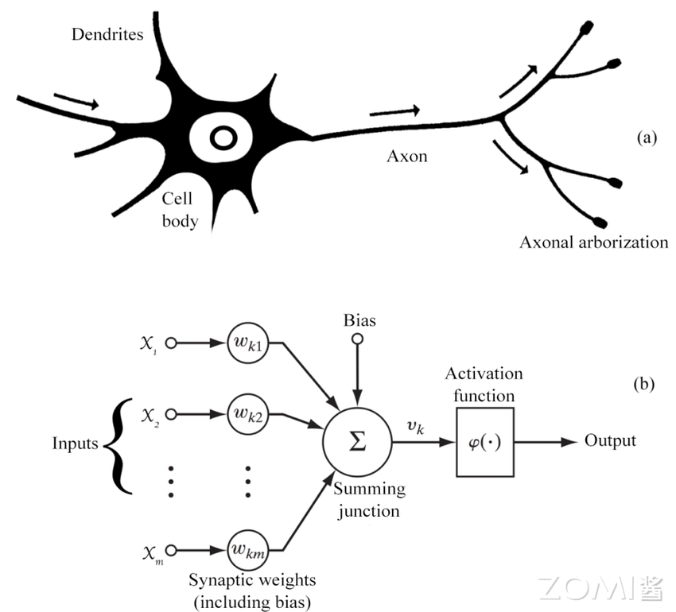
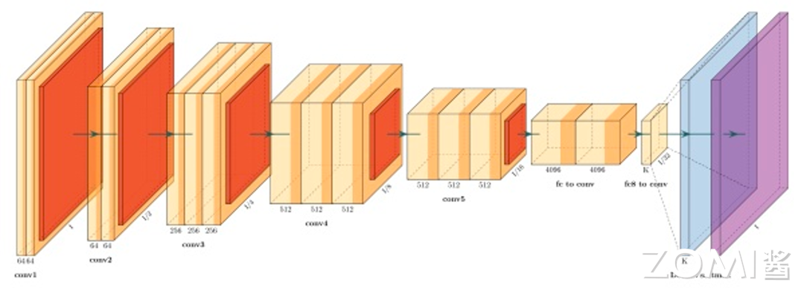
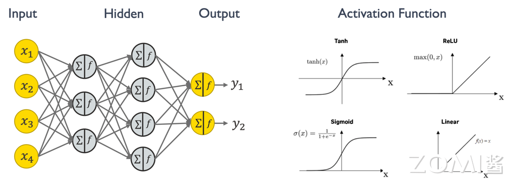
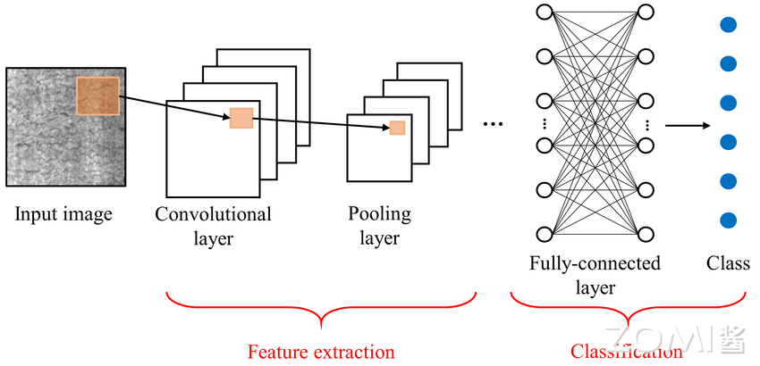

# 神经元与网络模型

## 本章学习目标

1. 理解神经元模型和工作原理
2. 掌握主流网络结构（CNN/RNN/Transformer）
3. 了解训练和推理的区别
4. 理解模型量化和压缩的基本概念

## 前置知识

- 数学基础（线性代数、概率论）
- AI系统概述

---

## 1.1 神经网络的基本概念

神经网络是人工智能算法基础的计算模型，灵感来源于人类大脑的神经系统结构。它由大量的人工神经元组成，分布在多个层次上，每个神经元都与下一层的所有神经元连接，并具有可调节的连接权重。神经网络通过学习从输入数据中提取特征，并通过层层传递信号进行信息处理，最终产生输出。这种网络结构使得神经网络在模式识别、分类、回归等任务上表现出色，尤其在大数据环境下，其表现优势更为显著。

对一个神经网络来说，主要包含如下几个知识点，这些是构成一个神经网络模型的基础组件。

### 1.1.1 神经元（Neuron）

神经元（Neuron）是神经网络的基本组成单元，模拟生物神经元的功能，接收输入信号并产生输出。在神经网络中，每个神经元接收来自前一层神经元的输出作为输入，然后将加权求和后的结果通过激活函数产生输出，传递给下一层神经元。神经元接收的每个输入都对应一个连接权重（Weight），这些权重在训练过程中会被不断调整优化，以使网络的输出更接近预期结果。

在生物神经元中，信息通过轴突和树突进行传递，人工神经元也模拟了类似的结构。人工神经元的输入类似于树突，权重类似于神经突触的强度，而激活函数则模拟了神经元的"激活"过程。

### 1.1.2 激活函数（Activation Function）

激活函数（Activation Function）用于神经元输出非线性化的函数。线性函数的表达能力有限，只能表示线性关系，而现实世界中的大多数问题都是非线性的。通过在神经网络中引入非线性激活函数，神经网络能够学习和表示复杂非线性模式，这是神经网络强大表达能力的关键所在。

常见的激活函数包括：

**ReLU（Rectified Linear Unit）**：$f(x) = max(0, x)$，计算简单高效，是目前最广泛使用的激活函数之一。ReLU函数的优点是收敛速度快，且不存在梯度饱和问题。

**Sigmoid**：$f(x) = \frac{1}{1 + e^{-x}}$，将输入压缩到$(0, 1)$区间，常用于二分类问题的输出层。缺点是容易出现梯度消失问题，且输出不是零中心化的。

**Tanh（双曲正切）**：$f(x) = \frac{e^x - e^{-x}}{e^x + e^{-x}}$，输出范围是$(-1, 1)$，是零中心化的。但同样存在梯度消失问题。

**Softmax**：常用于多分类问题的输出层，将输出转换为概率分布：$Softmax(x_i) = \frac{e^{x_i}}{\sum_j e^{x_j}}$。

### 1.1.3 模型层数（Layer）

神经网络由多个层次组成，主要包括三种类型的层：

**输入层（Input Layer）**：接收原始输入数据，不进行任何计算，只是将数据传递给下一层。输入层的神经元数量等于输入特征的维度。

**隐藏层（Hidden Layer）**：介于输入层和输出层之间的网络层，用于提取数据的不同特征。隐藏层可以有多层，网络深度指的就是隐藏层的数量。深度神经网络（DNN）通常有多个隐藏层，能够学习到更抽象的特征表示。

**输出层（Output Layer）**：产生网络的最终输出。输出层的结构取决于具体任务，例如分类任务的输出层可能使用Softmax激活函数产生类别概率。

### 1.1.4 前向传播（Forward Propagation）

前向传播（Forward Propagation）是指输入数据通过神经网络从输入层传递到最后输出层的过程，用于生成预测结果。在前向传播过程中，数据依次经过每一层的线性变换和非线性激活，最终在输出层产生预测值。

具体过程如下：

1. 输入数据进入输入层
2. 对于第$l$层的每个神经元，计算：$z^l = W^l \cdot a^{l-1} + b^l$
3. 应用激活函数：$a^l = \sigma(z^l)$
4. 将$a^l$传递给下一层，重复步骤2-3直到输出层

### 1.1.5 反向传播（Backpropagation）

反向传播（Backpropagation）是通过计算损失函数对网络参数进行调整的过程，以使网络的输出更接近预期输出。反向传播是深度学习中最重要的算法之一，它利用链式法则计算损失函数对每个参数的梯度。

反向传播的基本步骤：

1. 计算输出层的损失：给定预测值$\hat{y}$和真实值$y$，计算损失$L(y, \hat{y})$
2. 从输出层开始，利用链式法则逐层计算梯度：
   - $\frac{\partial L}{\partial W^l} = \frac{\partial L}{\partial a^L} \cdot \frac{\partial a^L}{\partial z^L} \cdot \cdots \cdot \frac{\partial a^l}{\partial z^l} \cdot \frac{\partial z^l}{\partial W^l}$
3. 使用梯度下降或其他优化算法更新参数：$W^l = W^l - \alpha \frac{\partial L}{\partial W^l}$

### 1.1.6 损失函数（Loss Function）

损失函数（Loss Function）衡量模型预测结果与实际结果之间差异的函数。神经网络训练的目标是最小化损失函数，使模型的预测尽可能接近真实值。

常见的损失函数：

**均方误差（MSE）**：$L = \frac{1}{n}\sum_{i=1}^{n}(y_i - \hat{y}_i)^2$，常用于回归任务。

**交叉熵（Cross-Entropy）**：$L = -\sum_{i=1}^{n}y_i \log(\hat{y}_i)$，常用于分类任务，特别是多分类问题。

**二元交叉熵（Binary Cross-Entropy）**：$L = -[y \log(\hat{y}) + (1-y)\log(1-\hat{y})]$，用于二分类问题。

### 1.1.7 优化算法（Optimization Algorithm）

优化算法用于调整神经网络参数以最小化损失函数。不同的优化算法会影响模型训练的收敛速度和能达到的性能。

**梯度下降（Gradient Descent）**：最基本的优化算法，沿着梯度的负方向更新参数。缺点是收敛速度慢，且容易陷入局部最优。

**随机梯度下降（SGD）**：每次使用一个样本或少量样本来估计梯度，加快收敛速度，但会带来梯度估计的噪声。

**动量（Momentum）**：引入动量概念，加速收敛并减少震荡：$v_t = \gamma v_{t-1} + \alpha \nabla L(\theta)$，$\theta = \theta - v_t$

**Adam（Adaptive Moment Estimation）**：结合动量和自适应学习率：$m_t = \beta_1 m_{t-1} + (1-\beta_1) \nabla L(\theta)$，$v_t = \beta_2 v_{t-1} + (1-\beta_2)(\nabla L(\theta))^2$，$\theta = \theta - \alpha \frac{m_t}{\sqrt{v_t} + \epsilon}$

---

## 1.2 神经网络的训练与推理

神经网络的产生包含训练和推理两个阶段。训练阶段可以描述为如下几个过程。从下图流程中可以发现，神经网络的训练阶段比推理阶段对算力和内存的需求更大，流程更加复杂，难度更大，所以很多公司芯片研发会优先考虑支持AI推理阶段。

整体来说，训练阶段的目的是通过最小化损失函数来学习数据的特征和内在关系，优化模型的参数；推理阶段则是利用训练好的模型来对新数据做出预测或决策。训练通常需要大量的计算资源，且耗时较长，通常在服务器或云端进行；而推理可以在不同的设备上进行，包括服务器、云端、移动设备等，依据模型复杂度和实际应用需求定。在推理阶段，模型的响应时间和资源消耗成为重要考虑因素，尤其是在资源受限的设备上。

### 1.2.1 训练阶段

神经网络的训练是一个迭代优化的过程，主要包括以下步骤：

1. **数据准备**：收集、清洗和预处理训练数据，将数据划分为训练集、验证集和测试集。

2. **前向传播**：将训练数据输入网络，计算网络输出。

3. **计算损失**：使用损失函数计算预测值与真实值之间的差异。

4. **反向传播**：利用链式法则计算损失函数对每个参数的梯度。

5. **参数更新**：使用优化算法根据梯度更新网络参数。

6. **迭代优化**：重复步骤2-5，直到满足停止条件（如达到预设的迭代次数或验证集性能不再提升）。

训练阶段通常需要GPU或TPU等高性能计算设备，因为需要处理大量的矩阵运算。

### 1.2.2 推理阶段

推理阶段是使用训练好的模型对新数据进行预测的过程。相比训练阶段，推理阶段的计算需求较小，主要关注点是推理速度和资源效率。

推理阶段的特点：
- 不需要计算梯度，节省了存储梯度的内存
- 模型权重可以是低精度的（如INT8），以提高推理效率
- 可以在各种设备上运行，从云端服务器到边缘设备

### 1.2.3 经典图像分类网络结构

下图是一个经典的图像分类的卷积神经网络结构，网络结构从左到右有多个网络模型层数组成，每一层都用来提取更高维的目标特征（这些中间层的输出称为特征图，特征图数据是可以通过可视化工具展示出来的，用来观察每一层的神经元都在做些什么工作），最后通过一个softmax激活函数达到分类输出映射。

---

## 1.3 权重求和计算范式

接下来我们来了解一下神经网络中的主要计算范式：**权重求和**。权重求和是神经网络中最基本也是最核心的计算操作，掌握这一计算范式对于理解AI芯片设计至关重要。

### 1.3.1 权重求和的基本原理

神经网络中90%的计算量都是在做乘加（multiply and accumulate, MAC）的操作，也称为权重求和。MAC操作可以表示为：$y = \sum_{i=1}^{n} w_i \cdot x_i + b$，其中$w_i$是权重，$x_i$是输入，$b$是偏置。

下图是一个简单的神经网络结构，左边中间灰色的圈圈表示一个简单的神经元，每个神经元里有求和和激活两个操作，求和就是指乘加或者矩阵相乘，激活函数则是决定这些神经元是否对输出有用，Tanh、ReLU、Sigmoid和Linear都是常见的激活函数。

### 1.3.2 全连接层的权重求和

全连接层（Fully Connected Layer），也称为密集连接层或仿射层，是深度学习神经网络中常见的一种层类型，通常位于网络的最后几层。全连接层的每个神经元都会与前一层的所有神经元进行全连接，通过这种方式，全连接层能够学习到输入数据的全局特征，并对其进行分类或回归等任务。

全连接层的基本概念和特点：

**连接方式**：全连接层中的每个神经元与前一层的所有神经元都有连接，这意味着每个输入特征都会影响到每个输出神经元，因此全连接层是一种高度密集的连接结构。对于一个有$n$个输入和$m$个输出的全连接层，其参数数量为$n \times m + m$（包括偏置）。

**参数学习**：全连接层中的连接权重和偏置项是需要通过反向传播算法进行学习的模型参数，这些参数的优化过程通过最小化损失函数来实现。

**特征整合**：全连接层的主要作用是将前面层提取到的特征进行整合和转换，以生成最终的输出。在图像分类任务中，全连接层通常用于将卷积层提取到的特征映射转换为类别预测分数。

**非线性变换**：在全连接层中通常会应用非线性激活函数，如ReLU（Rectified Linear Unit）、Sigmoid或Tanh等，以增加模型的表达能力和非线性拟合能力。

**输出层**：在分类任务中，全连接层通常作为网络的最后一层，并配合Softmax激活函数用于生成类别预测的概率分布。在回归任务中，全连接层的输出通常直接作为最终的预测值。

**过拟合风险**：全连接层的参数数量通常较大，因此在训练过程中容易产生过拟合的问题。为了缓解过拟合，可以采用正则化技术、Dropout等方法。

### 1.3.3 矩阵乘法在神经网络中的应用

在神经网络中，权重求和通常以矩阵乘法的形式实现。给定输入向量$\mathbf{x}$和权重矩阵$\mathbf{W}$，偏置向量$\mathbf{b}$，全连接层的计算可以表示为：

$$\mathbf{y} = \mathbf{W} \cdot \mathbf{x} + \mathbf{b}$$

对于批量输入，假设输入矩阵为$\mathbf{X} \in \mathbb{R}^{batch \times n}$，权重矩阵为$\mathbf{W} \in \mathbb{R}^{n \times m}$，则输出为$\mathbf{Y} = \mathbf{X} \cdot \mathbf{W} + \mathbf{B}$，其中$\mathbf{Y} \in \mathbb{R}^{batch \times m}$。

这种矩阵运算形式非常适合硬件加速，因为：
- 矩阵乘法具有高度的并行性
- 矩阵乘法是计算密集型操作，适合利用专用计算单元
- 矩阵乘法的数据重用率高，适合利用缓存机制

### 1.3.4 AI芯片对权重求和的支持

理解权重求和的计算范式对AI芯片设计至关重要。AI芯片需要：

1. **支持高吞吐量的MAC运算**：MAC是神经网络的核心操作，AI芯片需要能够高效执行大量的MAC运算。

2. **支持矩阵运算的并行化**：利用并行计算单元同时处理多个MAC运算，提高计算效率。

3. **提供高带宽的数据传输**：权重求和涉及大量的数据传输，AI芯片需要提供高带宽的存储和数据传输架构。

4. **支持不同精度的计算**：根据应用场景，AI芯片需要支持FP32、FP16、INT8等多种精度的MAC运算。

---

## 1.4 神经网络的多样性与应用

神经网络在深度学习中被广泛应用于各种任务，包括图像分类、目标检测、语音识别和自然语言处理等领域。不同类型的网络结构针对不同类型的数据和任务进行了优化。

### 1.4.1 网络结构的多样性

虽然神经网络的基本组件相似，但针对不同任务和数据类型，发展出了多种网络结构：

**卷积神经网络（CNN）**：主要用于处理图像数据，通过卷积操作提取空间特征。

**循环神经网络（RNN）**：主要用于处理序列数据，通过循环连接捕捉时序依赖。

**Transformer网络**：通过注意力机制处理序列数据，能够捕捉长距离依赖关系。

**图神经网络（GNN）**：用于处理图结构数据，能够学习节点和边的表示。

### 1.4.2 深度神经网络的发展趋势

随着深度学习技术的发展，神经网络呈现出以下发展趋势：

1. **网络深度不断增加**：从几层到数百层甚至上千层，如ResNet的深度达到了152层。

2. **网络结构更加复杂**：从简单的线性结构到残差连接、密集连接、注意力机制等复杂结构。

3. **模型规模持续增长**：参数数量从百万级增长到万亿级，如GPT-3有1750亿参数。

4. **多模态融合**：将文本、图像、语音等多种模态的信息融合处理。

理解这些发展趋势对于AI芯片设计至关重要，因为它们直接影响着AI芯片的架构设计和性能优化方向。

---

## 本章小结

本章介绍了神经网络的基本概念和组成组件，包括：

1. **神经元**：神经网络的基本计算单元，模拟生物神经元接收输入、进行加权求和并通过激活函数产生输出。

2. **激活函数**：引入非线性，使网络能够学习和表示复杂模式。常见的激活函数包括ReLU、Sigmoid、Tanh和Softmax。

3. **网络层次结构**：神经网络由输入层、隐藏层和输出层组成，深度网络通过多层隐藏层提取不同层次的特征。

4. **训练与推理**：训练阶段通过反向传播和优化算法学习模型参数；推理阶段使用训练好的模型进行预测。

5. **权重求和**：神经网络的核心计算范式，90%的计算量来自MAC操作，以矩阵乘法的形式高效执行。

6. **全连接层**：一种基础的层类型，通过密集连接整合前面层的特征，是许多网络结构的重要组成部分。

---

## 思考与练习

1. **神经元计算**：假设一个神经元有3个输入$x_1=0.5, x_2=-0.3, x_3=0.8$，对应的权重$w_1=0.2, w_2=0.5, w_3=-0.4$，偏置$b=0.1$。分别计算使用ReLU和Sigmoid激活函数的输出。

2. **梯度计算**：对于简单的单层网络$\hat{y} = \sigma(Wx + b)$，其中$\sigma$是Sigmoid函数，推导损失函数$L = (y - \hat{y})^2$对参数$W$和$b$的梯度。

3. **参数量计算**：对于一个全连接层，输入维度为1024，输出维度为256，计算该层的参数数量，并分析参数量对模型存储和计算量的影响。

4. **训练vs推理**：分析神经网络训练阶段和推理阶段在计算需求、内存使用和优化策略方面的主要区别。

5. **计算范式分析**：分析权重求和（MAC）操作在典型深度学习模型（如ResNet-50、BERT）中的计算占比，并讨论这对AI芯片设计的启示。
