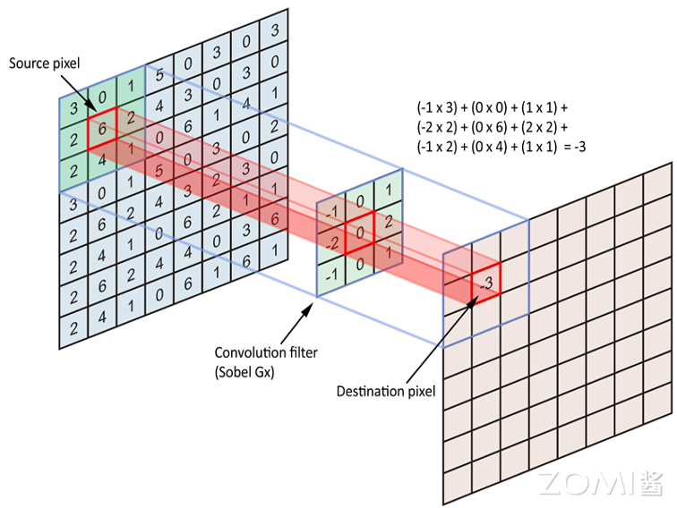

# 卷积神经网络

## 2.1 卷积层的基本概念

卷积层是深度学习神经网络中常用的一种层类型，主要用于处理图像和序列数据。它的主要作用是通过学习可重复使用的卷积核（Filter）来提取输入数据中的特征。与全连接层不同，卷积层利用局部连接和权重共享的特性，能够高效地处理高维输入数据，如图像。

### 2.1.1 卷积操作原理

卷积层通过对输入数据应用卷积操作来提取特征。卷积操作是一种在输入数据上滑动卷积核并计算卷积核与输入数据的乘积的操作，通常还会加上偏置项（Bias）并应用激活函数。

卷积操作的具体过程：

1. **卷积核（Kernel）**：卷积核是卷积层的参数，它是一个小的可学习的权重矩阵，用于在输入数据上执行卷积操作。卷积核的大小通常是正方形，例如3x3或5x5，不同的卷积核可以捕获不同的特征。

2. **滑动窗口**：卷积核在输入数据上按步长（Stride）滑动，通常从左上角开始，逐行或逐列移动。

3. **逐元素乘加**：在每个位置，将卷积核与输入数据的对应元素相乘，然后将所有乘积相加。

4. **偏置和激活**：将累加结果加上偏置，然后通过激活函数产生该位置的输出。

### 2.1.2 卷积层的关键特性

**特征图（Feature Map）**：卷积操作的输出称为特征图（Feature Map），它是通过卷积核在输入数据上滑动并应用激活函数得到的。特征图的深度（通道数）取决于卷积核的数量。

**步长和填充**：卷积操作中的步长（Stride）定义了卷积核在输入数据上滑动的步长，而填充（Padding）则是在输入数据的边界上添加额外的值，以控制输出特征图的尺寸。填充模式一般分为Same和Valid两种。Same模式表示输出Feature Map和输入的尺寸相同，Valid的输出Feature Map一般比输入小。

**参数共享**：卷积层的参数共享是指在整个输入数据上使用相同的卷积核进行卷积操作，这样可以大大减少模型的参数数量，从而减少过拟合的风险并提高模型的泛化能力。

**局部连接**：与全连接层的全局连接不同，卷积层只连接输入数据的局部区域。这种局部连接特性使得卷积层能够捕捉局部特征，如边缘、纹理等。

### 2.1.3 卷积层的数学表示

对于输入特征图$I$，卷积核$K$，卷积操作可以表示为：

$$(I * K)_{i,j} = \sum_m \sum_n I_{i+m, j+n} \cdot K_{m,n}$$

对于具有多个输入通道和多个输出通道的卷积层：

$$Y_{c_{out}, i, j} = \sum_{c_{in}} \sum_{m} \sum_{n} K_{c_{out}, c_{in}, m, n} \cdot X_{c_{in}, i+m, j+n} + b_{c_{out}}$$

其中：
- $X$是输入特征图，维度为$(C_{in}, H_{in}, W_{in})$
- $K$是卷积核，维度为$(C_{out}, C_{in}, K_h, K_w)$
- $Y$是输出特征图，维度为$(C_{out}, H_{out}, W_{out})$
- $b$是偏置

---

## 2.2 卷积层的详细计算过程

### 2.2.1 单通道卷积示例

下图是一个一层5x5的Feature Map的卷积过程，橙色表示3x3的Kernel，左侧浅色方框和Kernel相乘并累加和，得到右侧浅蓝色标记的一个输出值。Same和Valid两种Padding模式得到了不同的Feature Map输出。

以该图为例详细说明卷积计算过程：

**输入特征图**：5x5的单通道图像

**卷积核**：3x3的Kernel

**步长**：1

**Valid模式**：
- 输出尺寸 = floor((输入尺寸 - 卷积核尺寸) / 步长) + 1 = floor((5-3)/1) + 1 = 3
- 输出为3x3的特征图

**Same模式**：
- 在输入周围填充0，使输出尺寸与输入尺寸相同
- 输出为5x5的特征图

### 2.2.2 多通道卷积

实际应用中，输入图像通常是RGB三通道图像。设输入有$C_{in}$个通道，输出有$C_{out}$个通道：

1. 每个输出通道有独立的卷积核，维度为$(C_{in}, K_h, K_w)$
2. 输入通道与对应卷积核进行卷积，然后所有通道结果相加
3. 加上该输出通道的偏置，通过激活函数得到最终输出

**参数数量**：对于卷积层，参数数量为$(K_h \times K_w \times C_{in} + 1) \times C_{out}$

### 2.2.3 卷积层的FLOPs计算

卷积层的浮点运算数（FLOPs）计算公式为：

$$FLOPs = 2 \cdot H_{out} \cdot W_{out} \cdot C_{in} \cdot K_h \cdot K_w \cdot C_{out}$$

其中：
- $H_{out}, W_{out}$是输出特征图的空间尺寸
- $C_{in}$是输入通道数
- $K_h, K_w$是卷积核尺寸
- $C_{out}$是输出通道数
- 因子2是因为每次乘加运算包含一次乘法和一次加法

---

## 2.3 池化操作

在卷积层之后通常会使用池化层来减小特征图的尺寸并提取最重要的特征。池化操作通过对局部区域进行下采样来减少数据量和计算量，同时提供一定的平移不变性。

### 2.3.1 最大池化（Max Pooling）

最大池化取局部区域中的最大值：

$$Y_{i,j} = \max_{(m,n) \in \text{patch}} X_{m,n}$$

最大池化能够保留显著特征，对小的平移不敏感。

### 2.3.2 平均池化（Average Pooling）

平均池化取局部区域的平均值：

$$Y_{i,j} = \frac{1}{k_h \times k_w}\sum_{(m,n) \in \text{patch}} X_{m,n}$$

平均池化能够保留区域的整体信息，产生更平滑的特征表示。

### 2.3.3 全局池化

全局池化将整个特征图压缩为一个值，常用于网络的最后阶段：

- **全局平均池化（Global Average Pooling, GAP）**：对整个特征图求平均，输出一个标量
- **全局最大池化（Global Max Pooling）**：取整个特征图的最大值

全局池化可以有效替代全连接层，大幅减少参数数量。

---

## 2.4 经典卷积神经网络架构

### 2.4.1 LeNet-5

LeNet-5是由Yann LeCun等人于1998年提出的经典卷积神经网络，主要用于手写数字识别。它包含：
- 2个卷积层
- 2个池化层
- 2个全连接层
- 1个输出层

LeNet-5奠定了卷积神经网络的基本架构：卷积层用于特征提取，池化层用于下采样，全连接层用于分类。

### 2.4.2 AlexNet

AlexNet在2012年ImageNet竞赛中取得了突破性成果，开启了深度学习在计算机视觉领域应用的新时代。主要特点：
- 5个卷积层
- 3个全连接层
- 使用ReLU激活函数
- 使用Dropout正则化
- 使用GPU进行训练

### 2.4.3 VGGNet

VGGNet由牛津大学的研究团队提出，以其简洁统一的设计著称。主要特点：
- 使用更小的3x3卷积核代替大的卷积核
- 网络深度更深（16-19层）
- 结构非常规整，易于理解和实现

VGGNet证明了网络深度对模型性能的重要性，但同时也带来了更大的计算量和内存需求。

### 2.4.4 ResNet

ResNet（Residual Network）通过引入残差连接解决了深层网络训练困难的问题。主要特点：
- 引入跳跃连接（Skip Connection）
- 使信息能够直接跨层传递
- 允许训练非常深的网络（152层甚至更多）
- 大幅提升了模型性能

残差连接的数学形式：$\mathbf{y} = \mathcal{F}(\mathbf{x}) + \mathbf{x}$，其中$\mathcal{F}$是卷积层的映射，$\mathbf{x}$是输入。

---

## 2.5 卷积神经网络的计算特性

### 2.5.1 卷积层的计算特点

卷积神经网络在计算上具有以下特点：

1. **计算密度高**：卷积操作涉及大量的乘加运算，具有很高的计算密度。

2. **数据重用率高**：卷积核在滑动过程中可以对输入数据进行多次重用，适合利用缓存机制。

3. **空间局部性**：卷积操作只涉及局部区域的数据，具有良好的空间局部性。

4. **并行度高**：不同输出通道和空间位置可以并行计算。

### 2.5.2 卷积层对AI芯片的要求

基于卷积层的计算特点，AI芯片设计需要考虑：

1. **高吞吐量MAC单元**：卷积层的核心是MAC运算，需要高效的MAC计算单元。

2. **大带宽存储**：卷积层涉及大量的数据读写，需要高带宽的存储系统。

3. **数据复用**：芯片应支持在片上缓存卷积核和特征图数据，减少外部存储访问。

4. **灵活的卷积支持**：芯片应支持不同的卷积核尺寸、步长和填充模式。

### 2.5.3 卷积到矩阵乘的转换

AI芯片中，卷积操作通常会被转换为矩阵乘法（GEMM）来利用专用的矩阵计算单元。这种转换通过Im2Col（Image to Column）操作实现：

1. **Im2Col**：将输入特征图按照卷积窗口展开成列矩阵
2. **Col2Im**：将矩阵乘的结果转换回特征图格式

设卷积的输入和输出的特征图维度用$(IH, IW), (OH, OW)$表示，卷积核窗口的数据维度用$(KH, KW)$表示，输入通道是$IC$，输出通道是$OC$，输入输出特征图和卷积核数据维度重排的转化对应关系如下：

$$
\begin{aligned}
&input:(IC, IH, IW)\rightarrow(OH \cdot OW, KH \cdot KW \cdot IC)\\
&filter: (OC, KH, KW, IC)\rightarrow(OC, KH \cdot KW \cdot IC)\\
&output:(OC,OH, OW)\rightarrow(OC,OH \cdot OW)
\end{aligned}
$$

---

## 2.6 卷积神经网络的轻量化

随着神经网络应用的普及，越来越多的模型需要在特定的硬件平台部署，如移动端和嵌入式设备。轻量化网络模型设计旨在保持模型精度的同时减少模型参数量和计算量。

### 2.6.1 模型轻量化方法

网络模型的轻量级衡量指标有两个，一个是网络参数量，另一个是浮点运算数（FLOPs）。

**深度可分离卷积（Depthwise Separable Convolution）**

MobileNet系列的网络设计中，提出了深度可分离卷积的设计策略，其中通过Depthwise逐层卷积加1x1的卷积核来实现一个正常的卷积操作。

普通卷积的参数量：$K_h \times K_w \times C_{in} \times C_{out}$

深度可分离卷积的参数量：$K_h \times K_w \times C_{in} + 1 \times 1 \times C_{in} \times C_{out}$

例如一个3x3卷积核大小的卷积层，输入通道是16，输出通道是32：
- 正常卷积参数：$3 \times 3 \times 16 \times 32 = 4608$
- 深度可分离卷积参数：$3 \times 3 \times 16 + 1 \times 1 \times 16 \times 32 = 656$

参数量减少了约85%。

**小卷积核替代**

在VGG和InceptionNet系列网络中，提出将两个3x3卷积核代替一个5x5卷积核。这种方法在保证具有相同感知野的条件下，提升了网络的深度。参数量由$5 \times 5 \times C_i \times C_o$变成$3 \times 3 \times C_i \times C_o + 3 \times 3 \times C_i \times C_o = 18/25 \times (5 \times 5)$。

### 2.6.2 卷积核设计考虑

AI芯片设计需要考虑支持多种卷积核设计：

1. **小卷积核替代**：用多个小卷积核代替单个大卷积核
2. **多尺寸卷积核**：采用不同尺寸的卷积核来捕捉多尺度特征
3. **可变形卷积核**：从固定形状转向可变形卷积核
4. **1×1卷积核**：使用1×1卷积核构建bottleneck结构

### 2.6.3 卷积层运算优化

1. **Depthwise卷积**：用Depthwise卷积代替标准卷积，减少参数
2. **Group卷积**：应用分组卷积，提高计算效率
3. **Channel Shuffle**：通过通道混洗增强特征融合
4. **通道加权**：实施通道加权计算，动态调整通道贡献

---

## 2.7 AI计算模式与CNN

### 2.7.1 CNN的AI计算模式特点

结合卷积神经网络的计算特点，AI芯片设计需要：

1. **支持卷积运算的高效执行**：CNN的核心是卷积运算，需要高效的卷积计算单元。

2. **支持高维张量存储与计算**：卷积运算中，每一层都有大量的输入和输出通道，需要高效的内存管理。

3. **支持多种卷积配置**：支持不同的卷积核尺寸、步长、填充，满足不同网络结构的需求。

4. **支持激活函数**：除了卷积，还需要支持ReLU、Softmax等激活函数。

### 2.7.2 特征图的数据流

卷积神经网络中，数据沿着网络层次流动：

1. **输入层**：接收原始图像数据
2. **卷积层**：提取局部特征，生成特征图
3. **池化层**：下采样，减小特征图尺寸
4. **全连接层**：整合特征，进行分类或回归

每一层的输出都是下一层的输入，数据的组织和传输对芯片性能有重要影响。

---

## 本章小结

本章详细介绍了卷积神经网络的核心概念和计算原理：

1. **卷积操作**：通过卷积核在输入数据上滑动进行局部连接和权重共享，能够高效提取空间特征。

2. **卷积层的关键特性**：包括局部连接、权重共享、步长、填充等，这些特性使得CNN比全连接层更加高效。

3. **池化操作**：通过下采样减少数据量，提供平移不变性，包括最大池化和平均池化。

4. **经典架构**：从LeNet到ResNet，展示了CNN架构的演进历程。

5. **轻量化设计**：深度可分离卷积等技术大幅减少参数量，适应资源受限的部署环境。

6. **计算特性**：CNN的卷积操作具有高计算密度和高数据重用率的特点，对AI芯片架构有重要影响。

---

## 思考与练习

1. **卷积计算**：对于输入尺寸为32x32x3的图像，使用64个5x5x3的卷积核，步长为1，填充为2，计算输出特征图的尺寸和参数量。

2. **深度可分离卷积**：分析深度可分离卷积相比普通卷积在参数量和计算量上的减少比例。假设输入通道为128，输出通道为256，卷积核为3x3。

3. **卷积与矩阵乘**：说明为什么AI芯片倾向于将卷积转换为矩阵乘法执行。这种转换有什么优缺点？

4. **残差连接**：解释ResNet中残差连接的作用。为什么残差连接能够帮助训练更深的网络？

5. **AI芯片设计**：根据卷积神经网络的计算特点，讨论AI芯片应该具备哪些特性来高效支持CNN的推理计算？
