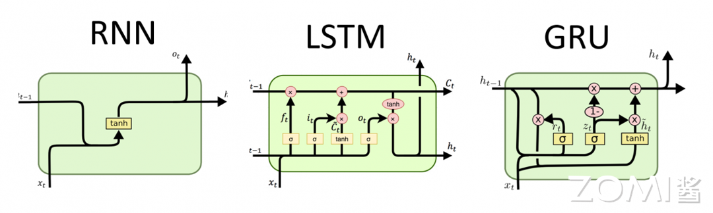

# 循环神经网络

## 3.1 循环神经网络的基本概念

循环神经网络（Recurrent Neural Network, RNN）是一种用于处理序列数据的神经网络结构。与前馈神经网络不同，RNN具有循环连接，允许信息在网络内部传递，从而能够捕捉序列数据中的时序信息和长期依赖关系。

### 3.1.1 RNN的核心思想

RNN的核心思想是引入"记忆"机制，使网络能够记住之前处理过的信息。在处理序列数据时，每个时间步的输出不仅取决于当前输入，还取决于之前的隐藏状态。这种设计使RNN特别适合处理时间序列数据、文本、语音等具有时序依赖的数据。

基本的RNN结构包括一个或多个时间步（time step），每个时间步都有一个输入和一个隐藏状态（hidden state）。隐藏状态在每个时间步都会被更新，同时也会被传递到下一个时间步。这种结构使得RNN可以对序列中的每个元素进行处理，并且在处理后保留之前的信息。

### 3.1.2 RNN的网络结构

RNN的基本结构可以用以下公式描述：

**隐藏状态更新**：
$$h_t = \sigma(W_{xh} \cdot x_t + W_{hh} \cdot h_{t-1} + b_h)$$

**输出计算**：
$$y_t = W_{hy} \cdot h_t + b_y$$

其中：
- $x_t$是时间步$t$的输入
- $h_t$是时间步$t$的隐藏状态
- $y_t$是时间步$t$的输出
- $W_{xh}, W_{hh}, W_{hy}$是权重矩阵
- $b_h, b_y$是偏置向量
- $\sigma$是激活函数（通常为tanh或ReLU）

### 3.1.3 时间步展开

RNN的"循环"特性可以通过时间步展开（Unfolding）来理解。在展开图中，每个时间步都有一个独立的网络副本，但它们共享相同的权重参数。这种表示清楚地展示了信息如何沿时间轴传递。

---

## 3.2 RNN的训练与挑战

### 3.2.1 通过时间的反向传播

训练RNN使用一种称为"通过时间的反向传播"（Backpropagation Through Time, BPTT）的算法。BPTT是反向传播算法在时间维度的扩展，其基本思想是：

1. 将RNN按时间步展开，得到一个深层前馈网络
2. 计算每个时间步的损失
3. 从最后一个时间步开始，反向传播梯度
4. 梯度沿时间轴反向传递，累积到每个时间步

BPTT的数学表达：

$$\frac{\partial L}{\partial W_{hh}} = \sum_{t=1}^{T} \frac{\partial L_t}{\partial W_{hh}}$$

其中$L$是总损失，$L_t$是时间步$t$的损失。

### 3.2.2 梯度消失与梯度爆炸

传统的RNN存在严重的梯度消失（Vanishing Gradient）和梯度爆炸（Exploding Gradient）问题。

**梯度消失**：当梯度沿时间轴反向传播时，梯度值会逐时间步衰减，导致网络难以学习长期依赖。

**梯度爆炸**：梯度值可能会随时间步指数增长，导致网络不稳定。

这些问题使得基本的RNN难以捕捉长距离依赖关系。例如，在处理长文本时，较早的输入信息难以影响后续的输出。

### 3.2.3 长距离依赖的挑战

长距离依赖是指序列中相距较远的元素之间的语义关联。例如，在句子"The cat, which already ate ... , was full."中，"cat"和"was"之间可能相隔很多词，但它们之间存在主谓关系。

基本的RNN无法有效地学习这种长距离依赖，因为：
- 信息的传递需要经过多个时间步
- 每一步的信息传递都可能损失一部分
- 梯度在反向传播时会指数衰减

---

## 3.3 长短期记忆网络（LSTM）

为了解决RNN的梯度消失问题，Hochreiter和Schmidhuber于1997年提出了长短期记忆网络（Long Short-Term Memory, LSTM）。

### 3.3.1 LSTM的核心思想

LSTM通过引入门控机制（Gating Mechanism）来控制信息的流动，从而解决长期依赖问题。LSTM的核心是细胞状态（Cell State），它像一条传送带，允许信息在整个序列处理过程中保持传递。

### 3.3.2 LSTM的门控机制

LSTM包含三个门控：

**遗忘门（Forget Gate）**：决定从细胞状态中丢弃什么信息
$$f_t = \sigma(W_f \cdot [h_{t-1}, x_t] + b_f)$$

**输入门（Input Gate）**：决定将什么新信息存储到细胞状态中
$$i_t = \sigma(W_i \cdot [h_{t-1}, x_t] + b_i)$$
$$\tilde{C}_t = \tanh(W_C \cdot [h_{t-1}, x_t] + b_C)$$

**输出门（Output Gate）**：决定输出什么信息
$$o_t = \sigma(W_o \cdot [h_{t-1}, x_t] + b_o)$$

### 3.3.3 LSTM的细胞状态更新

细胞状态的更新公式：
$$C_t = f_t \odot C_{t-1} + i_t \odot \tilde{C}_t$$

隐藏状态的更新公式：
$$h_t = o_t \odot \tanh(C_t)$$

其中$\odot$表示逐元素乘法。

### 3.3.4 LSTM解决长期依赖的原理

LSTM通过门控机制解决了梯度消失问题：

1. **遗忘门**：允许网络选择性地忘记旧信息
2. **输入门**：允许网络选择性地添加新信息
3. **细胞状态**：提供了一条直接的信息传递路径，梯度可以沿着这条路径流动而不会被衰减

这种设计使LSTM能够有效地学习和传递长期依赖信息。

---

## 3.4 门控循环单元（GRU）

门控循环单元（Gated Recurrent Unit, GRU）是由Cho等人于2014年提出的一种简化版LSTM。GRU合并了输入门和遗忘门为更新门，结构更简洁。

### 3.4.1 GRU的结构

**更新门**：
$$z_t = \sigma(W_z \cdot [h_{t-1}, x_t] + b_z)$$

**重置门**：
$$r_t = \sigma(W_r \cdot [h_{t-1}, x_t] + b_r)$$

**候选隐藏状态**：
$$\tilde{h}_t = \tanh(W_h \cdot [r_t \odot h_{t-1}, x_t] + b_h)$$

**隐藏状态更新**：
$$h_t = (1 - z_t) \odot h_{t-1} + z_t \odot \tilde{h}_t$$

### 3.4.2 GRU vs LSTM

| 特性 | LSTM | GRU |
|------|------|-----|
| 门数量 | 3个（遗忘、输入、输出） | 2个（更新、重置） |
| 参数量 | 较多 | 较少 |
| 细胞状态 | 有 | 无 |
| 计算复杂度 | 较高 | 较低 |
| 记忆能力 | 较强 | 相对较弱 |

在实际应用中，GRU在某些任务上表现与LSTM相当，但训练速度更快，参数更少。

---

## 3.5 双向循环网络

### 3.5.1 双向RNN的原理

双向循环网络（Bidirectional RNN, Bi-RNN）由Schuster和Paliwal于1997年提出，用于处理需要同时考虑前后文的任务。

Bi-RNN包含两个独立的RNN：
- **前向RNN**：从序列开头向结尾处理
- **后向RNN**：从序列结尾向开头处理

两个方向的输出在每个时间步被组合：
$$y_t = \overrightarrow{h_t} \oplus \overleftarrow{h_t}$$

### 3.5.2 双向网络的应用场景

双向网络适用于：
- **自然语言处理**：如命名实体识别，需要同时考虑词语的前后文
- **语音识别**：需要考虑语音帧的前后上下文
- **序列标注**：如词性标注、情感分析

---

## 3.6 序列到序列模型

### 3.6.1 Encoder-Decoder架构

序列到序列（Sequence-to-Sequence, Seq2Seq）模型用于将一个序列转换为另一个序列，如机器翻译、文本摘要等任务。

基本的Seq2Seq模型包含：
- **Encoder（编码器）**：将输入序列编码为固定大小的上下文向量
- **Decoder（解码器）**：根据上下文向量生成输出序列

### 3.6.2 上下文向量的问题

基本的Seq2Seq模型存在信息瓶颈问题：
- 上下文向量必须将整个输入序列的信息压缩到固定长度的向量中
- 对于长输入序列，信息损失严重
- 模型难以处理长距离依赖

### 3.6.3 注意力机制的引入

注意力机制（Attention Mechanism）解决了上下文向量的问题：

1. ** Bahdanau Attention**：允许解码器在生成每个输出时"关注"输入序列的不同部分
2. **自注意力（Self-Attention）**：允许序列内部元素之间直接交互

注意力机制的核心思想是：
$$Attention(Q, K, V) = softmax(\frac{QK^T}{\sqrt{d_k}})V$$

这为后来Transformer架构的提出奠定了基础。

---

## 3.7 RNN的计算特性与AI芯片设计

### 3.7.1 RNN的计算特点

RNN的计算具有以下特点：

1. **时序依赖性**：RNN的计算必须按时间步顺序进行，难以并行化
2. **长短期记忆**：LSTM/GRU通过门控机制实现长期记忆
3. **变长序列**：RNN可以处理不同长度的序列
4. **权重共享**：沿时间轴共享参数，减少参数量

### 3.7.2 RNN对AI芯片的挑战

1. **并行化限制**：时序依赖性限制了计算的并行度
2. **内存带宽**：RNN需要频繁读写隐藏状态
3. **变长序列处理**：需要动态的内存管理
4. **门控机制**：LSTM的门控操作增加了计算复杂度

### 3.7.3 AI芯片对RNN的支持

AI芯片设计需要考虑RNN的特殊需求：

1. **时序控制单元**：支持RNN的时间步控制
2. **高效的MAC运算**：支持LSTM/GRU的门控计算
3. **灵活的内存管理**：支持变长序列处理
4. **状态缓存**：支持隐藏状态的快速读写

---

## 3.8 RNN的变体与扩展

### 3.8.1 深度循环网络

将多个RNN层堆叠形成深度循环网络（Deep RNN），增加模型的表达能力：
- 每层接收上一层的隐藏状态作为输入
- 深层结构能学习更复杂的表示
- 训练难度随层数增加

### 3.8.2 注意力增强的循环网络

将注意力机制与RNN结合：
- 在每个时间步，decoder关注encoder的不同隐藏状态
- 解决了Seq2Seq的信息瓶颈问题
- 广泛应用于机器翻译

### 3.8.3 语音识别中的RNN

RNN在语音识别领域有广泛应用：
- **Deep Speech**：百度开发的端到端语音识别系统
- **LAS**（Listen, Attend and Spell）：Google的语音识别模型
- **CTC**（Connectionist Temporal Classification）：处理输入输出长度不对齐的问题

---

## 3.9 RNN的实际应用

### 3.9.1 自然语言处理

RNN及其变体在NLP领域有广泛应用：

1. **语言模型**：预测下一个词的概率
2. **机器翻译**：将一种语言翻译为另一种语言
3. **文本生成**：生成连贯的文本
4. **情感分析**：判断文本的情感倾向

### 3.9.2 时间序列预测

RNN适合处理时间序列数据：
1. **股票价格预测**：预测金融市场的走势
2. **天气预报**：预测气象数据
3. **能源消耗预测**：预测电力需求

### 3.9.3 视频处理

RNN可用于视频分析：
1. **视频描述**：生成视频内容的文本描述
2. **动作识别**：识别视频中的动作类别
3. **视频预测**：预测视频的未来帧

---

## 本章小结

本章系统介绍了循环神经网络的理论与实践：

1. **RNN基本原理**：通过循环连接引入记忆机制，能够处理序列数据，但存在梯度消失/爆炸问题。

2. **LSTM网络**：通过门控机制（遗忘门、输入门、输出门）解决长期依赖问题，是目前应用最广泛的循环网络之一。

3. **GRU网络**：简化版的LSTM，合并了门控数量，训练更快，参数更少。

4. **双向RNN**：同时考虑序列的前后上下文，适用于NLP等任务。

5. **Seq2Seq模型**：Encoder-Decoder架构，是机器翻译等任务的基础，引出了注意力机制。

6. **计算特性**：RNN的时序依赖性对AI芯片设计提出特殊挑战，需要有效的并行化和内存管理策略。

7. **应用领域**：RNN广泛应用于NLP、时间序列预测、语音识别等领域。

---

## 思考与练习

1. **RNN梯度分析**：对于基本RNN，分析为什么梯度消失问题在处理长序列时尤为严重。假设隐藏状态更新为$h_t = \tanh(W_{hh}h_{t-1} + W_{xh}x_t)$，推导梯度$\frac{\partial h_t}{\partial h_{t-1}}$的范数。

2. **LSTM门控设计**：解释为什么LSTM的遗忘门和输入门使用Sigmoid函数而不是Tanh函数？这种设计有什么优势？

3. **GRU简化**：说明GRU如何将LSTM的三个门简化为两个门。这种简化对模型的记忆能力有什么影响？

4. **注意力机制**：比较Seq2Seq模型中不使用注意力机制和使用注意力机制的区别。为什么注意力机制能解决长序列问题？

5. **AI芯片设计**：讨论AI芯片应该如何设计以高效支持RNN类网络的推理计算。对于时序依赖性带来的并行化限制，有什么可能的解决方案？
