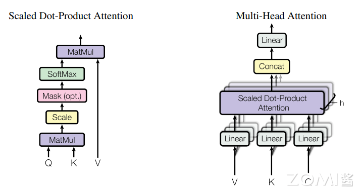

# Transformer与注意力机制

## 4.1 注意力机制的诞生

### 4.1.1 从RNN到Transformer

深度学习中的注意力机制（Attention Mechanism）是一种模仿人类视觉和认知系统的方法，它允许神经网络在处理输入数据时集中注意力于相关的部分。通过引入注意力机制，神经网络能够自动地学习并选择性地关注输入中的重要信息，提高模型的性能和泛化能力。

在Transformer出现之前，RNN及其变体（LSTM、GRU）是处理序列数据的主流方法。然而，RNN存在两个主要问题：
1. **难以并行化**：时序依赖性导致计算必须按顺序进行
2. **长距离依赖问题**：即使使用LSTM，在处理非常长的序列时仍然困难

2017年，谷歌团队在论文《Attention is All Your Need》中提出了Transformer架构，创新性地使用纯注意力机制替代了RNN，完全并行化处理序列数据。

### 4.1.2 Transformer的核心创新

Transformer架构的核心创新包括：

1. **自注意力机制（Self-Attention）**：允许序列内部元素直接交互，不需通过循环连接
2. **多头注意力（Multi-Head Attention）**：并行运行多个注意力机制，捕捉不同类型的依赖关系
3. **位置编码（Positional Encoding）**：由于没有循环结构，需要显式注入位置信息
4. **编码器-解码器结构**：Encoder处理输入序列，Decoder生成输出序列

---

## 4.2 自注意力机制详解

### 4.2.1 Scaled Dot-Product Attention

Dot-Product Attention也称为自注意力，是Transformer的基础组件。给定查询（Query）、键（Key）和值（Value）向量，自注意力的计算如下：

$$
Attention(Q, K, V) = softmax\left(\frac{QK^T}{\sqrt{d_k}}\right)V
$$

其中：
- $Q \in \mathbb{R}^{n \times d_k}$：查询矩阵
- $K \in \mathbb{R}^{m \times d_k}$：键矩阵
- $V \in \mathbb{R}^{m \times d_v}$：值矩阵
- $d_k$是键向量的维度
- $\sqrt{d_k}$是缩放因子，防止点积值过大导致梯度消失

**为什么需要缩放因子？**

当$d_k$较大时，$QK^T$的点积值方差会变大，可能使Softmax函数进入饱和区域（梯度接近0）。缩放因子$\sqrt{d_k}$使点积的方差回归到1，保证梯度稳定。



### 4.2.2 自注意力的计算过程

自注意力的计算过程可以分解为以下步骤：

1. **线性变换**：对输入$X$分别进行三个线性变换得到$Q$、$K$、$V$：
   $$Q = XW_Q, \quad K = XW_K, \quad V = XW_V$$

2. **计算注意力分数**：$QK^T$衡量Query和Key之间的相关性

3. **缩放**：除以$\sqrt{d_k}$

4. **Softmax**：获得注意力权重

5. **加权求和**：用注意力权重对$V$加权求和

### 4.2.3 自注意力的矩阵形式

用Python代码实现的自注意力网络：

```python
import torch
import torch.nn as nn
import torch.optim as optim
from torch.utils.data import DataLoader
from torchvision import datasets, transforms

# 定义自注意力模块
class SelfAttention(nn.Module):
    def __init__(self, embed_dim):
        super(SelfAttention, self).__init__()
        self.query = nn.Linear(embed_dim, embed_dim)
        self.key = nn.Linear(embed_dim, embed_dim)
        self.value = nn.Linear(embed_dim, embed_dim)

    def forward(self, x):
        q = self.query(x)
        k = self.key(x)
        v = self.value(x)
        attn_weights = torch.matmul(q, k.transpose(1, 2))
        attn_weights = nn.functional.softmax(attn_weights, dim=-1)
        attended_values = torch.matmul(attn_weights, v)
        return attended_values
```

---

## 4.3 多头注意力机制

### 4.3.1 多头注意力的原理

多头注意力机制是在自注意力机制的基础上发展起来的，是自注意力机制的变体，旨在增强模型的表达能力和泛化能力。它通过使用多个独立的注意力头，分别计算注意力权重，并将它们的结果进行拼接或加权求和，从而获得更丰富的表示。

每个注意力头有独立的$W_Q^i, W_K^i, W_V^i$参数，允许模型在不同的子空间学习不同的注意力模式。

### 4.3.2 多头注意力的计算

$$
\begin{align}
MultiHead(Q, K, V) &= Concat(head_1, head_2, ..., head_h)W^O \\
head_i &= Attention(QW_Q^i, KW_K^i, VW_V^i)
\end{align}
$$

其中：
- $h$是注意力头的数量
- $d_k = d_{model}/h$是每个头的维度
- $W^O \in \mathbb{R}^{hd_v \times d_{model}}$是输出投影矩阵

### 4.3.3 多头注意力的代码实现

```python
import torch
import torch.nn as nn
import torch.optim as optim
from torch.utils.data import DataLoader
from torchvision import datasets, transforms

# 定义多头自注意力模块
class MultiHeadSelfAttention(nn.Module):
    def __init__(self, embed_dim, num_heads):
        super(MultiHeadSelfAttention, self).__init__()
        self.num_heads = num_heads
        self.head_dim = embed_dim // num_heads

        self.query = nn.Linear(embed_dim, embed_dim)
        self.key = nn.Linear(embed_dim, embed_dim)
        self.value = nn.Linear(embed_dim, embed_dim)
        self.fc = nn.Linear(embed_dim, embed_dim)

    def forward(self, x):
        batch_size, seq_len, embed_dim = x.size()

        # 将输入向量拆分为多个头
        q = self.query(x).view(batch_size, seq_len, self.num_heads, self.head_dim).transpose(1, 2)
        k = self.key(x).view(batch_size, seq_len, self.num_heads, self.head_dim).transpose(1, 2)
        v = self.value(x).view(batch_size, seq_len, self.num_heads, self.head_dim).transpose(1, 2)

        # 计算注意力权重
        attn_weights = torch.matmul(q, k.transpose(-2, -1)) / torch.sqrt(torch.tensor(self.head_dim, dtype=torch.float))
        attn_weights = torch.softmax(attn_weights, dim=-1)

        # 注意力加权求和
        attended_values = torch.matmul(attn_weights, v).transpose(1, 2).contiguous().view(batch_size, seq_len, embed_dim)

        # 经过线性变换和残差连接
        x = self.fc(attended_values) + x

        return x
```

---

## 4.4 Transformer架构

### 4.4.1 编码器结构

Transformer的编码器（Encoder）由$N$个相同的层堆叠而成，每层包含两个子层：

1. **多头自注意力层**：对输入序列进行自注意力计算
2. **前馈神经网络**：包含两个线性变换和ReLU激活

每个子层都使用残差连接（Skip Connection）和层归一化（Layer Normalization）：
$$Output = LayerNorm(x + Sublayer(x))$$

### 4.4.2 解码器结构

Transformer的解码器（Decoder）同样由$N$个相同的层堆叠而成，每层包含三个子层：

1. **掩码多头自注意力层**：确保预测时只能看到之前的输出
2. **编码器-解码器注意力层**：Query来自解码器，Key和Value来自编码器
3. **前馈神经网络**

### 4.4.3 位置编码

由于Transformer没有循环结构，无法直接获取序列的位置信息，因此需要显式添加位置编码：

$$
\begin{align}
PE_{(pos, 2i)} &= \sin\left(\frac{pos}{10000^{2i/d_{model}}}\right) \\
PE_{(pos, 2i+1)} &= \cos\left(\frac{pos}{10000^{2i/d_{model}}}\right)
\end{align}
$$

位置编码可以采用正弦/余弦形式，也可以采用可学习的位置嵌入。

---

## 4.5 Transformer的计算特性

### 4.5.1 自注意力的计算复杂度

自注意力的计算复杂度为$O(n^2 \cdot d)$，其中：
- $n$是序列长度
- $d$是模型的维度

这意味着：
- 对于短序列，自注意力高效且能捕捉全局依赖
- 对于长序列（如长文档或视频），计算量和内存需求爆炸性增长

### 4.5.2 多头注意力的并行性

与RNN不同，自注意力可以完全并行计算：
- 序列中所有位置的表示可以同时计算
- 不需要沿时间轴顺序传递隐藏状态
- 大大加速了训练过程

### 4.5.3 长距离依赖的路径长度

Transformer中任意两个位置之间的依赖路径长度是$O(1)$，而RNN中是$O(n)$。这使得Transformer能够更高效地学习长距离依赖。

---

## 4.6 Transformer的变体与应用

### 4.6.1 BERT - 双向Transformer编码器

BERT（Bidirectional Encoder Representations from Transformers）使用双向Transformer编码器，通过掩码语言模型（MLM）和下一句预测（NSP）进行预训练。

BERT的核心创新：
- 双向语境理解
- 预训练-微调范式
- 在11项NLP任务上刷新记录

### 4.6.2 GPT系列 - 生成式预训练Transformer

GPT（Generative Pre-trained Transformer）系列采用单向Transformer解码器，通过语言建模进行预训练。

GPT的发展历程：
- GPT-1：首发开创性的预训练-微调范式
- GPT-2：扩大模型规模，尝试通用任务
- GPT-3：大规模few-shot学习
- GPT-4：多模态能力大幅提升

### 4.6.3 Vision Transformer (ViT)

ViT将Transformer应用于图像识别：
- 将图像分割为固定大小的patch
- 将patch序列作为Transformer输入
- 在ImageNet上取得与CNN相当的成绩

### 4.6.4 大语言模型中的Transformer

现代大语言模型（LLM）大多基于Transformer架构：
- **ChatGPT**：基于GPT-3.5/GPT-4，强化学习人类反馈（RLHF）
- **Llama**：Meta开源的大语言模型
- **PaLM**：Google的大规模语言模型

---

## 4.7 Transformer对AI芯片的影响

### 4.7.1 计算模式的变化

Transformer的出现改变了AI的计算模式：

1. **从卷积到注意力**：从局部连接到全局注意力
2. **从循环到并行**：从时序计算到完全并行
3. **矩阵运算主导**：大量矩阵乘法运算

### 4.7.2 AI芯片设计的新要求

Transformer对AI芯片提出了新的要求：

1. **高带宽存储**：注意力机制需要频繁读写大型矩阵
2. **灵活的稀疏支持**：如FlashAttention等稀疏注意力算法
3. **高精度混合计算**：支持FP16、BF16、FP8等多种精度
4. **专用Transformer引擎**：如NVIDIA的Transformer Engine

### 4.7.3 硬件优化策略

针对Transformer的硬件优化：

1. **算子融合**：将多个小算子融合为一个大算子，减少内存访问
2. **内存层次优化**：利用高速缓存提高数据复用率
3. **低精度推理**：使用FP8等低精度加速推理
4. **稀疏计算**：支持注意力矩阵的稀疏计算

---

## 4.8 注意力机制的深入理解

### 4.8.1 注意力机制的可视化

注意力权重可以直观地展示输入序列中各元素之间的相关性：

- 在机器翻译中，注意力权重显示了源语言词与目标语言词的对齐
- 在图像描述中，注意力权重显示了生成每个词时关注的图像区域
- 在文档分类中，自注意力显示了词与词之间的语义关联

### 4.8.2 注意力机制的物理意义

注意力机制可以被理解为一种"软寻址"方式：
- **Query**：当前位置的内容
- **Key**：可访问位置的内容
- **Value**：从可访问位置获取的信息

注意力权重表示当前位置对各可访问位置的"关注程度"。

### 4.8.3 注意力机制与其他机制的关系

注意力机制与其他机制有密切关系：

1. **与LSTM门控的关系**：注意力可以看作是一种动态的"门控"机制
2. **与全连接层的关系**：当注意力权重全为1时，注意力退化为全连接
3. **与卷积的关系**：局部注意力可以看作是一种受限的卷积

---

## 4.9 未来展望

### 4.9.1 高效注意力机制

为了解决自注意力的$O(n^2)$复杂度问题，研究者提出了多种高效注意力机制：

1. **Sparse Attention**：如Longformer、BigBird，使用稀疏模式近似全注意力
2. **Linear Attention**：如Performer、Linear Transformer，将复杂度降为$O(n)$
3. **FlashAttention**：利用GPU内存层次优化，减少内存读写

### 4.9.2 多模态融合

Transformer统一了多模态建模：
- 文本、图像、音频统一表示
- 跨模态注意力机制
- 多模态大模型（如GPT-4V）

### 4.9.3 持续演进

Transformer架构仍在不断演进：
- 更高效的结构设计
- 更强的长上下文能力
- 与其他机制的结合

---

## 本章小结

本章系统介绍了Transformer与注意力机制的核心内容：

1. **注意力机制原理**：通过Query-Key-Value架构实现"软寻址"，允许模型动态关注输入的相关部分。

2. **自注意力机制**：通过缩放点积注意力计算序列内部元素之间的相关性，完全并行化处理。

3. **多头注意力**：并行运行多个注意力头，捕捉不同类型的依赖关系，增强模型表达能力。

4. **Transformer架构**：编码器-解码器结构，配合残差连接、层归一化、位置编码等组件。

5. **计算特性**：$O(n^2)$复杂度、全并行计算、$O(1)$长距离依赖路径，对AI芯片设计有重要影响。

6. **应用领域**：从NLP扩展到计算机视觉、多模态等领域，成为现代AI的基础架构。

7. **硬件优化**：针对Transformer特点的专用硬件设计，如Transformer引擎、稀疏计算支持等。

---

## 思考与练习

1. **注意力计算**：假设输入序列长度为512，模型维度$d_{model}=768$，注意力头数$h=12$。计算单层自注意力的计算量（MACs）和参数量。

2. **与RNN对比**：比较RNN和Transformer在处理长序列时的优缺点。讨论为什么Transformer在长序列任务中表现更好。

3. **缩放因子**：解释为什么注意力机制需要除以$\sqrt{d_k}$。如果不做缩放会产生什么问题？

4. **多头注意力的作用**：分析多头注意力相比单头注意力的优势。为什么需要多个注意力头而不是一个维度更高的单头注意力？

5. **硬件设计**：讨论AI芯片应该如何优化以更好地支持Transformer推理。重点考虑注意力机制的计算特点。
