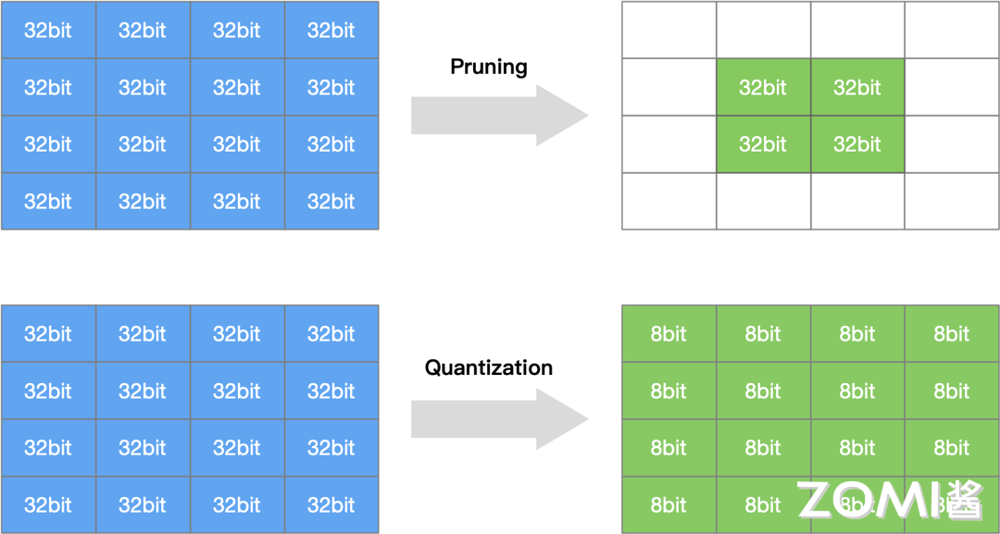
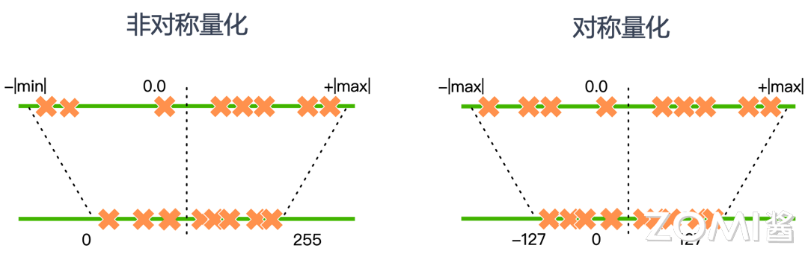
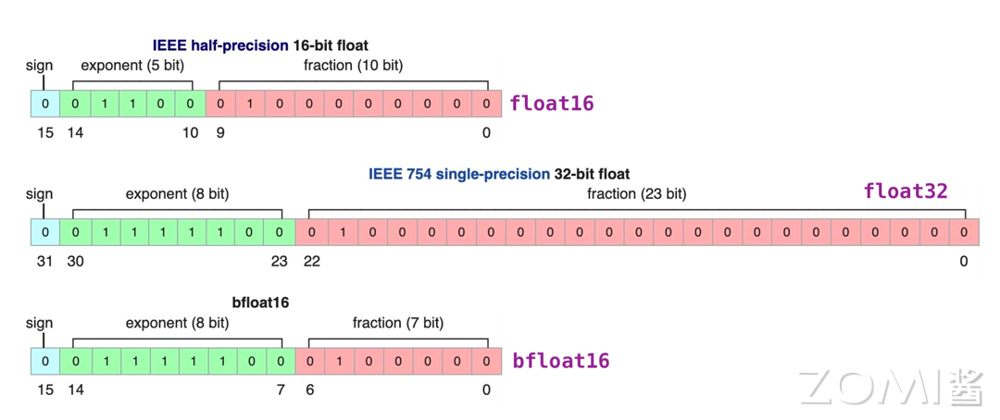
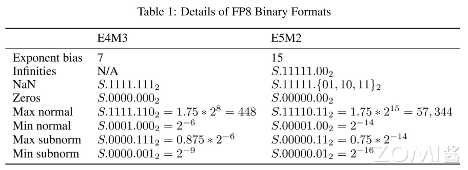
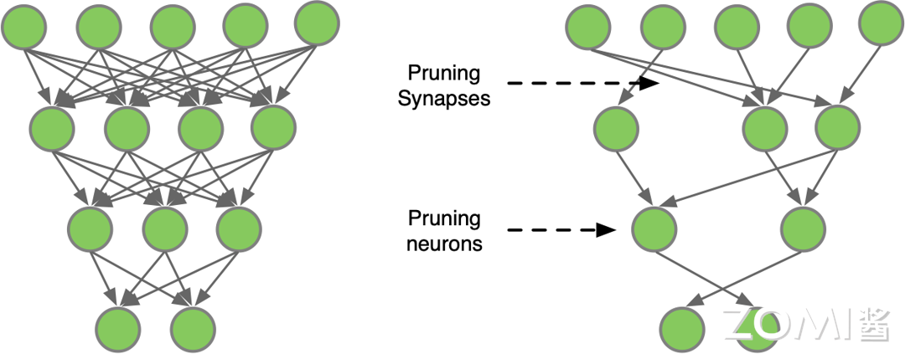
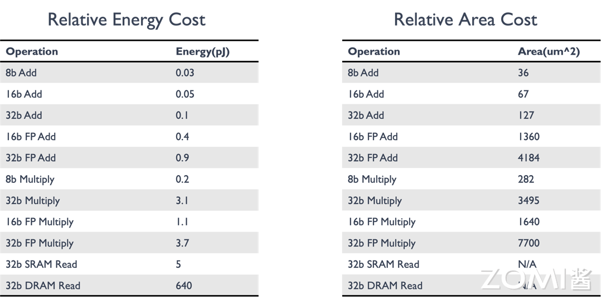
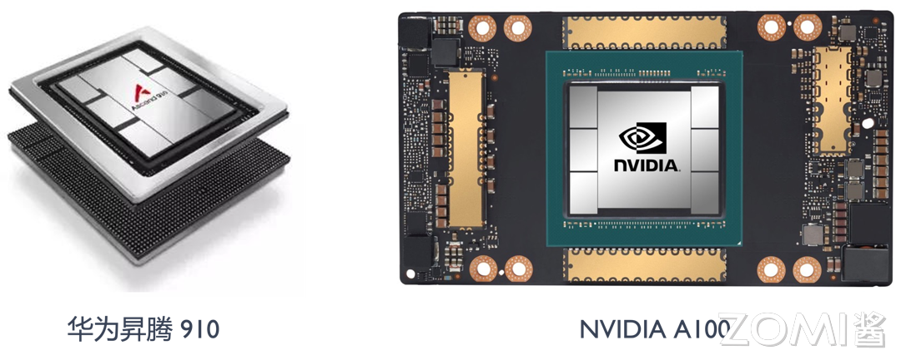

# 模型量化基础

## 5.1 模型量化概述

### 5.1.1 什么是模型量化

模型量化是指通过减少神经模型权重表示或者激活所需的比特数来将高精度模型转换为低精度模型的过程。在深度学习训练中，通常使用FP32（32位浮点）精度来保证模型收敛和精度；而在推理阶段，过高的精度并不是必需的，低精度量化可以在保持模型性能的同时大幅减少计算和存储需求。

量化是模型压缩和加速的重要技术之一，与网络剪枝、知识蒸馏等方法共同构成模型压缩技术体系。量化压缩与网络剪枝的示意如下图所示：

### 5.1.2 为什么需要模型量化

将高比特模型进行低比特量化具有如下几个好处：

**1. 降低内存**

低比特量化将模型的权重和激活值转换为较低位宽度的整数或定点数，从而大幅减少了模型的存储需求。一个FP32模型占用的存储空间是INT8模型的4倍。这意味着一个原本需要4GB存储的模型，量化后可能只需要1GB。

**2. 降低成本**

低比特量化降低了神经网络中乘法和加法操作的精度要求，从而减少了计算量，加速了推理过程。例如，使用INT8进行MAC运算比FP32快4倍，同时硬件资源消耗更少。

**3. 降低能耗**

低比特量化减少了模型的计算需求，因此可以降低模型在移动设备和嵌入式系统上的能耗。在边缘设备中，能耗是关键考量指标，低比特量化可以显著延长设备电池寿命。

**4. 提升速度**

虽然低比特量化会引入一定程度的信息丢失，但在合理选择量化参数的情况下，可以最大程度地保持模型的性能和准确度，同时获得存储和计算上的优势。

**5. 丰富模型的部署场景**

低比特量化压缩了模型参数，可以使得模型更容易在移动设备、边缘设备和嵌入式系统等资源受限的环境中部署和运行，为各种应用场景提供更大的灵活性和可行性。

---

## 5.2 量化基本概念

### 5.2.1 量化数学原理

量化的本质是在高精度数值和低精度数值之间建立一种映射关系。设$R$表示浮点数，$Q$表示量化后的整数，$S$表示缩放因子（Scale），$Z$表示零值（Zero Point）。量化的基本公式为：

$$
Q = R/S + Z
$$

对于反向过程（反量化）：

$$
R = (Q - Z) \times S
$$

其中：
- $S = (R_{max} - R_{min})/(Q_{max} - Q_{min})$
- $Z = Q_{max} - R_{max}/S$

### 5.2.2 对称量化和非对称量化

量化策略分为对称量化和非对称量化两种。

**对称量化（Symmetric Quantization）**

对称量化中，浮点数的最大值和最小值关于0对称，即$R_{max} = -R_{min}$。这意味着只需要找到浮点区间的绝对值最大的那个值即可。

对称量化的特点：
- 零点固定为0
- 量化范围是$[-127, 127]$（对于INT8）
- 实现简单，计算效率高
- 对于正负数均匀分布的数据效果好

对称量化的问题：当数据分布不均匀时，如浮点数X全部是正数，进行8bit非对称量化后的数据全部在[0, 127]一侧，那么[-128, 0]的区间就浪费了。

**非对称量化（Asymmetric Quantization）**

非对称量化允许浮点数据分布在任意范围，不需要关于0对称。零点$Z$可以是任意值，不一定是0。

非对称量化的特点：
- 零点$Z$可以是任意值
- 量化范围充分利用[0, 255]（对于INT8）
- 对于数据分布偏斜的情况更友好
- 计算复杂度稍高

下图是两种量化方法进行8bit量化数据映射的示意图：

### 5.2.3 量化粒度

神经网络的权重量化以layer为单位，求每一层权重的量化参数（S, Z）时候，分为by channel和by layer两种方式：

**By Layer量化**
- 整个层的所有参数共用一组(S, Z)
- 量化参数存储开销小
- 实现简单

**By Channel量化**
- 每层的每个channel都计算一个(S, Z)
- 量化精度更高
- 需要存储更多的量化参数
- 适合权重分布不均匀的层

在实际部署中需要权衡量化精度提升和量化参数存储开销。

---

## 5.3 量化方法

### 5.3.1 MinMax量化

MinMax量化是最简单也最通用的量化算法。基本思想是将浮点数的最小值映射到量化类型的最小值，最大值映射到量化类型的最大值。

设原始浮点数据范围为$[R_{min}, R_{max}]$，量化后的整数范围为$[Q_{min}, Q_{max}]$（对于INT8为[-128, 127]或[0, 255]）。

**缩放因子计算**：
$$S = \frac{R_{max} - R_{min}}{Q_{max} - Q_{min}}$$

**零点计算**：
$$Z = Q_{min} - \frac{R_{min}}{S}$$

**量化过程**：
$$Q = round\left(\frac{R}{S}\right) + Z$$

### 5.3.2 KL散度量化

KL散度量化是一种更精确的量化方法，它通过最小化原始浮点分布和量化后分布之间的KL散度来确定量化参数。

KL散度（也称为相对熵）衡量两个概率分布之间的差异：
$$D_{KL}(P \| Q) = \sum_i P(i) \log\frac{P(i)}{Q(i)}$$

KL散度量化的步骤：
1. 收集原始浮点数据的直方图分布
2. 对不同的缩放因子候选值，计算量化后的分布
3. 选择使KL散度最小的缩放因子

KL散度量化相比MinMax量化能更好地保留原始数据的分布信息，但计算复杂度更高。

### 5.3.3 百分位量化（Percentile Quantization）

百分位量化使用数据的百分位数来确定量化范围，而不是使用最大值和最小值。这种方法对异常值更鲁棒。

设使用$p$百分位，则：
$$R_{min} = percentile(X, 100-p), \quad R_{max} = percentile(X, p)$$

### 5.3.4 幂律量化（Power-Law Quantization）

幂律量化根据数据的幂律分布特性进行量化设计，适用于某些特定分布的数据。

---

## 5.4 数据精度格式

### 5.4.1 浮点数表示基础

在深入AI数据类型之前，先回顾一下计算机中浮点数的表示方法。浮点数采用IEEE 754标准，由三部分组成：

- **符号位（S）**：1位，表示正负
- **指数部分（E）**：决定数值范围
- **尾数部分（M）**：决定数值精度

对于规格化浮点数，其真实值为：
$$(-1)^S \times 2^{E-B} \times (1+M)$$

其中$B = 2^{E_{bw}-1} - 1$是指数偏移量，$E_{bw}$是指数位宽。

### 5.4.2 AI中的浮点数据类型

目前神经网络中的常用的类型有FP32, TF32, FP16, BF16这四种类型。

**FP32（单精度浮点）**

FP32是单精度浮点数格式，是一种广泛使用的数据格式，其可以表示很大的实数范围，足够深度学习训练和推理中使用。每个数据占4个字节（32位）。

FP32的组成：
- 符号位：1位
- 指数部分：8位
- 尾数部分：23位

**TF32（Tensor Float 32）**

Tensor Float 32是Tensor Core支持的新型数据类型，从英伟达A100中开始支持。TF32的峰值计算速度相比FP32有了很大的提升。

TF32的组成：
- 符号位：1位
- 指数部分：8位（与FP32相同）
- 尾数部分：10位（比FP16多，但比FP32少）

**FP16（半精度浮点）**

FP16是一种半精度浮点格式，深度学习有使用FP16而不是FP32的趋势，因为较低精度的计算对于神经网络来说似乎并不重要。

FP16的组成：
- 符号位：1位
- 指数部分：5位
- 尾数部分：10位

FP16的缺点是动态范围较窄，在某些场景下可能不足以表示所需的数据范围。

**BF16（Brain Floating Point）**

FP16设计时并未考虑深度学习应用，其动态范围太窄。由谷歌开发的16位浮点格式称为"Brain Floating Point Format"，简称"bfloat16"，bfloat16解决了这个问题，提供与FP32相同的动态范围。

BF16的组成：
- 符号位：1位
- 指数部分：8位（与FP32相同）
- 尾数部分：7位

BF16可以认为是直接将FP32的前16位截取获得的，目前也得到了广泛的应用，特别是在Transformer架构模型中表现优异。

### 5.4.3 低比特整数类型

**INT8（8位整数）**

INT8是最常用的低比特量化格式，可以表示-128到127的有符号整数，或0到255的无符号整数。

**INT4（4位整数）**

INT4可以表示-8到7的有符号整数，或0到15的无符号整数。压缩率更高，但精度损失更大。

**INT2/Binary（二值化）**

二值化网络将权重和激活限制为{-1, +1}或{0, 1}，极大地减少存储和计算开销。

### 5.4.4 FP8数据类型

FP8是NVIDIA H100 GPU产品中推出的一种8bit位宽浮点数据类型，有E4M3和E5M2两种设计：

**FP8 E4M3**
- 符号位：1位
- 指数部分：4位
- 尾数部分：3位
- 动态范围较小，但精度较高
- 适合前向传播的Activations和Weights

**FP8 E5M2**
- 符号位：1位
- 指数部分：5位
- 尾数部分：2位
- 保持与FP16相似的动态范围
- 适合反向传播的Gradients

FP8数据类型的出现，使得在大规模语言模型训练中可以使用更低的精度，同时保持模型精度，大幅提升训练效率和降低内存占用。

---

## 5.5 量化方式

### 5.5.1 训练后量化（Post-Training Quantization, PTQ）

训练后量化是在模型训练完成之后再进行量化，不需要重新训练。这是最常用的量化方式，简单易实现。

PTQ的优点：
- 实现简单，不需要修改训练流程
- 计算开销小，量化速度快
- 适用于已有模型的快速部署

PTQ的缺点：
- 可能带来较大的精度损失
- 对于某些模型结构效果不佳

### 5.5.2 量化感知训练（Quantization-Aware Training, QAT）

量化感知训练是一种在训练期间考虑量化的技术，通过模拟量化效果来训练模型，使模型适应低精度表示。

QAT的过程：
1. 在模型中插入伪量化节点，模拟量化效果
2. 正常进行前向传播和反向传播
3. 梯度更新时考虑量化的影响
4. 最终模型对量化更鲁棒

QAT的优点：
- 精度损失更小
- 可以达到接近全精度的性能

QAT的缺点：
- 需要重新训练或微调
- 训练时间增加
- 实现复杂度较高

### 5.5.3 动态量化和静态量化

**动态量化（Dynamic Quantization）**
- 权重在推理前量化，激活在推理时量化
- 灵活但速度较慢
- 常用于CPU推理

**静态量化（Static Quantization）**
- 权重和激活都在推理前量化
- 速度更快，适合硬件加速
- 需要校准数据集确定量化参数

---

## 5.6 模型剪枝

### 5.6.1 剪枝的基本概念

模型剪枝是一种有效的模型压缩方法，通过对模型中的权重进行剔除，降低模型的复杂度，从而达到减少存储空间、计算资源和加速模型推理的目的。

下图是一个简单的多层神经网络的剪枝示意，卷积算法定义可以分为两种：一种是对全连接层神经元之间的连接线进行剪枝，另一种是对神经元的剪枝。

### 5.6.2 剪枝的分类

根据剪枝的粒度，可分为：

**结构化剪枝（Structured Pruning）**
- 按通道、滤波器或层进行剪枝
- 剪枝后的模型仍然是规则的tensor运算
- 硬件友好，适合实际部署

**非结构化剪枝（Unstructured Pruning）**
- 任意剪枝单个权重
- 稀疏性更高，但硬件支持困难
- 需要专门的稀疏矩阵存储和计算

### 5.6.3 剪枝的时机和方式

根据剪枝的时机和方式，可以将模型剪枝分为以下几种类型：

**静态剪枝（Static Pruning）**
- 在训练结束后对模型进行剪枝
- 优点是简单易行
- 缺点是无法充分利用训练过程中的信息

**动态剪枝（Dynamic Pruning）**
- 在训练过程中进行剪枝
- 根据训练过程中的数据和误差信息动态调整网络结构
- 优点是能够自适应优化模型结构
- 缺点是实现起来较为复杂

**知识蒸馏剪枝（Knowledge Distillation Pruning）**
- 通过将大模型的"知识"蒸馏到小模型中
- 实现小模型的剪枝
- 需要额外的训练步骤
- 可以获得较好的压缩效果

### 5.6.4 剪枝的流程

对神经网络模型的剪枝可以描述为如下三个步骤：

**1. 训练 Training**
- 训练过参数化模型，得到最佳网络性能
- 以此作为基准

**2. 剪枝 Pruning**
- 根据算法对模型剪枝
- 调整网络结构中通道或层数
- 得到剪枝后的网络结构

**3. 微调 Finetune**
- 在原数据集上进行微调
- 用于重新弥补因为剪枝后的稀疏模型丢失的精度性能

---

## 5.7 量化与AI芯片设计

### 5.7.1 AI芯片对量化的支持

根据上面AI模型的量化和剪枝算法的研究进展，AI芯片设计可以引出如下对于AI计算模式的思考：

**提供不同的bit位数的计算单元**

为了提升芯片性能并适应低比特量化研究的需求，AI芯片设计中应集成多种不同位宽的计算单元和存储格式。例如，可以探索实现FP8、INT8、INT4等不同精度的计算单元，以适应不同精度要求的应用场景。

**提供不同的bit位数存储格式**

在数据存储方面，在M-bits（如FP32）和E-bits（如TF32）格式之间做出明智的权衡，以及在FP16与BF16等不同精度的存储格式之间做出选择，以平衡存储效率和计算精度。

**利用硬件提供专门针对稀疏结构计算的优化逻辑**

为了优化稀疏结构的计算，在硬件层面提供专门的优化逻辑，这将有助于提高稀疏数据的处理效率。同时，支持多种稀疏算法逻辑，并对硬件的计算取数模块进行设计上的优化，将进一步增强对稀疏数据的处理能力。

**硬件提供专门针对量化压缩算法的硬件电路**

通过增加数据压缩模块的设计，可以有效地减少内存带宽的压力，从而提升整体的系统性能。

### 5.7.2 降低比特位宽的好处

降低比特位宽其实就是降低数据的精度，对于AI芯片来说，降低比特位宽可以带来如下好处：

1. **降低MAC的输入和输出数据位宽**，能够有效减少数据的搬运和存储开销。更小的内存搬移带来更低的功耗开销。

2. **减少MAC计算的开销和代价**，比如，两个INT8数据类型的相乘，累加和使用16bit位宽的寄存器即可，而FP16数据类型的相乘，累加和需要设计32位宽的寄存器。8bit和16bit计算对硬件电路设计的复杂度影响也很大。

如上图所示，随着比特位宽的增加，对应乘加操作的能耗在逐渐增加，从SRAM的数据搬移过程是功耗的主要来源；同时，随着数据位宽的增加，需要的芯片面积也在成倍增加。

### 5.7.3 不同精度格式的芯片支持

针对AI芯片不同阶段的精度需求，市场上已经推出了8-bit的推理芯片产品和16-bit浮点数据的训练芯片产品。

---

## 5.8 量化研究热点

### 5.8.1 量化方法研究

根据要量化的原始数据分布范围，可以将量化方法分为：

**线性量化**
- MinMax量化：简单直接，效果稳定
- 百分位量化：对异常值更鲁棒

**非线性量化**
- KL散度量化：更精确的分布匹配
- Log-Net算法：基于对数域的量化
- Non-uniform量化：非均匀量化网格

### 5.8.2 量化方式研究

**量化感知训练（QAT）**
- 在训练中模拟量化效果
- 减少量化误差
- 是提高低比特量化精度的有效方法

**混合精度量化**
- 不同层使用不同的量化精度
- 关键层保持高精度，非关键层使用低精度
- 在精度和效率之间取得平衡

### 5.8.3 模型设计研究

**二值化网络（Binary Neural Networks, BNNs）**

二值化网络模型是一种将神经网络中的权重和激活值二值化为{-1, +1}或{0, 1}的模型。这种二值化可以极大地减少模型的存储需求和计算成本，从而使得在资源受限的设备上进行高效的推断成为可能。

**训练时量化（Training with Quantization）**

与训练后量化不同，训练时量化在反向传播中也考虑量化的影响，使模型在训练阶段就学习适应低精度表示。

---

## 5.9 量化实践指南

### 5.9.1 量化方案选择

选择合适的量化方案需要考虑：

1. **目标硬件**：不同的AI芯片支持不同的精度格式
2. **精度要求**：任务对模型精度的要求
3. **延迟要求**：推理延迟的限制
4. **内存约束**：可用的存储和内存

### 5.9.2 量化调试技巧

**1. 逐层分析**

对模型逐层进行量化，分析每层对量化误差的敏感性，找出关键层。

**2. 混合精度**

对敏感层使用较高精度，对不敏感层使用较低精度。

**3. 温度调节**

使用温度调节（Temperature Scaling）来校准量化参数。

**4. 重训练/微调**

如果PTQ效果不佳，尝试QAT或微调来恢复精度。

### 5.9.3 量化效果评估

**精度评估**
- 与全精度模型对比Top-1/Top-5准确率
- 检查任务特定指标的变化

**性能评估**
- 测量推理延迟
- 测量内存占用
- 测量吞吐量

**数值评估**
- 观察权重分布变化
- 分析量化误差分布
- 检查激活值范围

---

## 5.10 未来展望

### 5.10.1 更低比特的探索

随着模型规模增长和对效率的追求，更低比特（如INT2、1-bit）的量化技术正在研究中：

- **二值网络优化**：改进训练方法，提高二值网络的精度
- **混合精度扩展**：探索更多精度组合
- **硬件协同设计**：设计专门支持极端量化的硬件

### 5.10.2 量化与稀疏的结合

量化和稀疏是互补的模型压缩技术：
- 稀疏后再量化可以获得更好的压缩效果
- 量化可以增强稀疏性
- 联合优化是未来方向

### 5.10.3 端到端优化

未来的模型部署将更加重视端到端的整体优化：
- 从训练到部署的统一量化流程
- 软硬件协同优化
- 自动化的量化方案搜索

---

## 本章小结

本章系统介绍了模型量化的理论与实践：

1. **量化基本概念**：量化是通过减少数据位宽来压缩模型的技术，包括对称量化和非对称量化两种主要方式。

2. **量化数学原理**：量化的核心是建立浮点数到整数的映射关系，通过缩放因子和零点实现。

3. **量化方法**：包括MinMax量化、KL散度量化等多种方法，适用于不同的应用场景。

4. **数据精度格式**：从FP32到FP16、BF16、FP8、INT8等，不同精度有不同的应用场景。

5. **量化方式**：训练后量化（PTQ）和量化感知训练（QAT）两种主要方式，各有优缺点。

6. **模型剪枝**：与量化互补的模型压缩技术，包括结构化和非结构化剪枝。

7. **AI芯片设计**：量化需求推动AI芯片支持多种精度计算单元和存储格式。

8. **实践指南**：量化方案选择、调试技巧和效果评估方法。

---

## 思考与练习

1. **量化计算**：假设浮点数据范围是[-3.5, 5.2]，使用INT8对称量化，计算缩放因子S和量化后的整数值（假设使用[-127, 127]范围）。

2. **对称vs非对称**：分析什么情况下对称量化效果较好，什么情况下非对称量化更优。给出具体的数值例子说明。

3. **量化误差分析**：分析量化误差的主要来源。如何减小量化误差对模型精度的影响？

4. **FP16 vs BF16**：比较FP16和BF16的优缺点。解释为什么在大语言模型训练中BF16更受欢迎？

5. **AI芯片设计**：讨论AI芯片应该如何设计来更好地支持模型量化。需要考虑哪些硬件特性？
