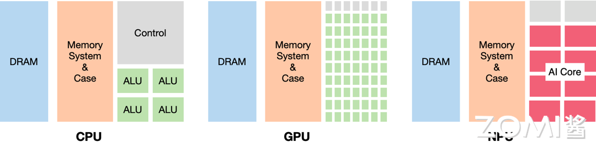

<!--Copyright © 适用于[License](https://github.com/chenzomi12/AISystem)版权许可-->

# AI芯片基础

## 学习目标

1. 理解AI芯片的定义及其与通用芯片的本质区别
2. 掌握CPU、GPU、FPGA、ASIC四大芯片架构的特点与差异
3. 了解AI芯片按照云端与边缘端的应用分类
4. 认识后摩尔定律时代芯片发展的挑战与机遇
5. 理解DSA（领域专用架构）的核心概念及其重要性

## 章节导言

在人工智能飞速发展的今天，AI芯片作为支撑AI技术落地的核心硬件基础设施，其重要性日益凸显。从云端数据中心到边缘终端设备，AI芯片无处不在地推动着深度学习、计算机视觉、自然语言处理等应用的落地。

本章将带领读者从芯片基础出发，深入理解什么是AI芯片、AI芯片与传统通用芯片的区别、以及AI芯片的分类体系。我们将探讨CPU、GPU、FPGA、ASIC四大计算架构的特点，分析它们在AI计算场景下的优劣势。同时，我们还将展望后摩尔定律时代芯片发展的新趋势，重点介绍领域专用架构（DSA）这一重要技术路线。

通过本章的学习，零基础读者将建立起对AI芯片体系的整体认知，为后续深入学习GPU原理、主流AI芯片架构等内容打下坚实基础。

## 1.1 什么是AI芯片

### 1.1.1 AI芯片的定义

**AI芯片**（Artificial Intelligence Chip）是专门为加速人工智能应用中的大量矩阵计算、卷积运算等核心计算任务而设计的处理器或计算模块。与传统的通用芯片如中央处理器（CPU）不同，AI芯片采用针对特定领域优化的体系结构（Domain-Specific Architecture，DSA），侧重于提升执行AI算法所需的专用计算性能。

从本质上讲，AI芯片是针对AI计算场景进行专门优化的加速器。AI算法，特别是深度学习算法，其核心计算模式主要包括：

- **矩阵乘法（Matrix Multiplication）**：神经网络中各层之间的权重与输入数据的乘加运算
- **卷积运算（Convolution）**：卷积神经网络（CNN）中处理图像等二维数据的核心操作
- **激活函数（Activation Function）**：ReLU、Sigmoid、Tanh等非线性变换
- **池化操作（Pooling）**：下采样以减少特征维度

这些计算模式具有高度并行化的特征，传统通用CPU的复杂控制逻辑和通用架构难以高效处理这类计算密集型任务。AI芯片正是通过硬件层面的专门优化，实现了比通用芯片高出数量级的性能提升。

### 1.1.2 AI芯片与通用芯片的区别

要理解AI芯片与通用芯片的区别，我们首先需要了解传统计算芯片的设计哲学。

**CPU（中央处理器）**是通用计算的典型代表，其设计目标是能够处理任何类型的计算任务。CPU采用冯·诺依曼架构，具有以下特点：

- 强大的通用性：能执行各种类型的指令，处理多样化的数据类型
- 复杂的控制逻辑：支持分支预测、乱序执行等高级特性
- 较低的并行度：少量强大计算单元，专注于低延迟单任务处理

用一个形象的比喻来说，CPU就像是一位精通多学科的全能型教授，能够解决各种复杂问题，但一次只能专心处理一个问题。而AI芯片则像是一支由大量小学生组成的计算团队，每个成员只能做简单的加法，但所有人同时工作，团队的整体计算速度可以远超那位教授。

下图展示了CPU、GPU和NPU（神经网络处理器）的架构对比：

从图中可以看出：

- **CPU**：各种组件比例均衡，控制逻辑（Control）占据了相当大的面积，计算单元（ALU）相对较少
- **GPU**：大大减少了控制逻辑，显著增加了计算单元，提供高并行度
- **NPU（AI芯片）**：拥有大量专门的AI计算核心（AI Core），针对矩阵运算进行优化

这种架构差异导致了性能上的巨大差距。以矩阵乘法为例，假设有两个4096×4096的矩阵进行相乘：

- CPU处理可能需要数秒甚至更长时间
- GPU可以将时间缩短到几十毫秒
- 专用AI芯片可能只需要几毫秒

### 1.1.3 AI芯片的核心价值

AI芯片的核心价值体现在以下几个方面：

**1. 性能提升**

AI芯片通过硬件架构的专门优化，能够在相同的功耗和成本下提供比通用芯片高出数十倍甚至数百倍的AI计算性能。这种性能提升使得实时AI应用成为可能，例如自动驾驶中的实时目标检测、智能手机中的即时语音翻译等。

**2. 能效优化**

深度学习模型的训练和推理过程需要消耗大量能源。AI芯片通过专门化的设计，能够在保持高性能的同时显著降低功耗，这对于数据中心和移动设备都具有重要意义。据统计，使用专用AI芯片进行深度学习推理，能效比可提升10-100倍。

**3. 延迟降低**

对于实时性要求较高的应用场景，如自动驾驶、工业检测等，AI芯片能够提供确定性的低延迟计算能力。通用芯片由于其通用性设计，难以针对AI计算进行极致优化。

**4. 成本降低**

虽然AI芯片的研发成本较高，但在规模化部署后，专用芯片的单位算力成本通常低于通用芯片。以数据中心的AI推理任务为例，使用专用AI加速卡可以在提供更高性能的同时，显著降低总拥有成本（TCO）。

## 1.2 AI芯片的分类

### 1.2.1 按架构分类：CPU、GPU、FPGA、ASIC

根据芯片架构的不同，AI芯片可以分为四大类：CPU、GPU、FPGA和ASIC。每一类都有其独特的设计理念和适用场景。

#### CPU与AI计算

CPU作为通用处理器，理论上可以执行任何计算任务，包括AI计算。然而，CPU的设计优先级是通用性而非并行计算能力。CPU的特点包括：

- **强大的通用性**：支持复杂的控制流、分支预测、乱序执行
- **较低的并行度**：核心数量有限（通常4-128核）
- **高主频**：单核性能较强，时钟频率可达3-5GHz
- **复杂缓存**：多级缓存设计，降低内存访问延迟

在AI计算场景下，CPU通常用于：

- AI模型的推理部署（特别是小模型）
- 数据预处理和后处理
- 模型训练中的参数更新
- 边缘设备上的轻量级推理

然而，当面对大规模矩阵运算、深度学习训练等计算密集型任务时，CPU的计算效率远低于专用AI芯片。

#### GPU与AI计算

**GPU（图形处理单元）**最初是为加速图形渲染而设计的处理器。由于图形渲染具有天然的并行特征，GPU演化出了大量简单计算单元的架构，能够高效处理并行任务。

GPU的核心特点包括：

- **大规模并行**：数千个计算核心，可同时处理海量数据
- **高带宽内存**：HBM等高带宽内存技术，满足大数据量传输需求
- **SIMT执行模型**：单指令多线程，高效管理大量并行线程
- **成熟的软件生态**：CUDA、OpenCL等完整的编程工具链

GPU已经成为目前最主流的AI计算平台。从2012年AlexNet在ImageNet竞赛中取得突破性成果开始，GPU就在深度学习领域占据了主导地位。英伟达、AMD等公司不断推出专门针对AI加速的GPU产品，如英伟达的A100、H100系列，AMD的Instinct系列等。

GPU的优势在于其通用性和成熟的软件生态。开发者可以使用CUDA等高级编程接口快速开发AI应用，而无需深入了解硬件细节。同时，GPU的通用性使其能够处理各种类型的AI任务。

然而，GPU作为通用计算芯片，在功耗和成本方面仍有进一步优化的空间。

#### FPGA与AI计算

**FPGA（现场可编程门阵列）**是一种可重构的硬件设备。与CPU和GPU的固定架构不同，FPGA可以通过编程配置其内部的逻辑单元、存储单元和互连方式，实现定制化的硬件功能。

FPGA在AI计算中的特点：

- **硬件可重构**：可根据算法需求配置最优硬件架构
- **低功耗**：专用电路实现，能效比较高
- **低延迟**：硬件级并行，延迟可预测
- **灵活适配**：支持多种精度和算法创新

FPGA的架构使其特别适合以下场景：

- 边缘计算：功耗敏感，需求多样的部署环境
- 特定算法加速：针对特定神经网络结构进行优化
- 原型验证：快速验证新算法、新架构的硬件可行性

然而，FPGA的编程难度较高，通常需要硬件描述语言（Verilog、VHDL）知识，这限制了其在通用AI应用中的普及。主流FPGA厂商如Xilinx（AMD）、Intel也在推出针对AI的优化方案和高级编程工具，以降低使用门槛。

#### ASIC与AI计算

**ASIC（专用集成电路）**是针对特定应用专门设计的芯片。与CPU、GPU的通用性不同，ASIC为某一类特定任务进行极致优化，提供最高的性能和能效。

ASIC在AI计算中的核心优势：

- **极致性能**：针对AI计算进行硬件优化
- **最高能效**：专用电路，无冗余功能
- **最小成本**：大规模量产时单位成本最低
- **高可靠性**：固定功能，出错概率低

谷歌的TPU（张量处理单元）是ASIC在AI领域最著名的代表。TPU专门为深度学习矩阵运算设计，采用了独特的脉动阵列架构，能够在较低的功耗下提供极高的计算吞吐量。

华为昇腾NPU、寒武纪MLU、特斯拉DOJO等也都是ASIC架构的AI芯片。这些芯片针对AI计算的不同环节进行专门优化，在特定场景下能够提供比GPU更高的性能。

ASIC的主要挑战在于：

- 前期投入大：设计周期长、流片成本高
- 灵活性较差：难以适应快速变化的AI算法
- 生态系统建设困难：需要配套软件工具链支持

### 1.2.2 云端芯片 vs 边缘端芯片

根据应用场景的不同，AI芯片可以分为云端芯片和边缘端芯片两大类。

#### 云端AI芯片

云端AI芯片部署在数据中心等基础设施中，负责处理大规模、计算密集型的AI任务。

**云端AI芯片的特点**：

- **高算力**：需要支撑大规模模型训练和推理
- **高带宽**：支持高速互联，多芯片协同
- **高功耗**：TDP通常在100W以上
- **强扩展性**：支持多卡、多机集群部署

**主流云端AI芯片**：

| 芯片 | 厂商 | 算力（FP16) | 显存 | 功耗 |
|------|------|-------------|------|------|
| A100 | 英伟达 | 312 TFLOPS | 40/80GB HBM2 | 400W |
| H100 | 英伟达 | 1,979 TFLOPS | 80GB HBM3 | 700W |
| 昇腾910 | 华为 | 320 TFLOPS | 32GB HBM | 310W |
| TPU v4 | 谷歌 | 275 TFLOPS | 32GB HBM | ~300W |

云端AI芯片主要用于：

- 深度学习模型训练
- 大规模推理服务部署
- 科学计算与仿真
- 数据中心AI加速

#### 边缘AI芯片

边缘AI芯片部署在靠近数据源的设备上，如智能手机、汽车、摄像头等终端设备。

**边缘AI芯片的特点**：

- **低功耗**：TDP通常在10W以下，甚至mW级
- **低延迟**：本地处理，无需网络传输
- **高能效**：每瓦性能至关重要
- **小尺寸**：适应嵌入式设备空间限制

**主流边缘AI芯片**：

| 芯片 | 厂商 | 算力（INT8) | 功耗 | 典型应用 |
|------|------|-------------|------|----------|
| 昇腾310 | 华为 | 22 TFLOPS | 8W | 边缘推理 |
| 寒武纪MLU220 | 寒武纪 | 8 TFLOPS | 6W | 边缘推理 |
| 苹果A17 Pro Neural Engine | 苹果 | 35 TFLOPS | - | 手机AI |
| 特斯拉FSD芯片 | 特斯拉 | - | 36W | 自动驾驶 |

边缘AI芯片主要用于：

- 智能手机AI拍照、AI语音助手
- 自动驾驶汽车感知与决策
- 智能摄像头实时分析
- IoT设备本地智能处理

#### 云端与边缘端的协同

在实际应用中，云端和边缘端AI芯片往往需要协同工作：

- **边缘负责实时感知**：快速响应本地事件，保护隐私
- **云端负责复杂分析**：处理大规模数据，进行模型训练
- **端云协同**：模型更新、增量学习、任务卸载

这种协同架构既能保证实时性，又能利用云端的强大算力，是当前AI系统的主流架构模式。

## 1.3 AI芯片发展历程

### 1.3.1 后摩尔定律时代

**摩尔定律**是由英特尔创始人戈登·摩尔提出的经验法则：集成电路上的晶体管数量每隔18-24个月翻一番，性能提升一倍。这一定律在过去半个世纪里持续生效，推动了计算机产业的飞速发展。

然而，随着芯片工艺接近物理极限，摩尔定律正在放缓：

**1. 工艺瓶颈**

- 晶体管尺寸已接近原子级别（3nm以下）
- 量子隧穿效应导致漏电流增加
- 工艺进步带来的成本收益递减

**2. 功耗墙**

- 芯片功耗密度接近散热极限
- 无法继续通过提升频率来提升性能
- 多核并行也面临通信瓶颈

**3. 成本上升**

- 先进制程工厂建设成本高达数百亿美元
- 良率控制难度增加
- 芯片设计成本指数级增长

在后摩尔定律时代，芯片性能的提升不能再单纯依靠工艺进步，而是需要从多个维度进行创新：

- **架构创新**：通过专门化设计提升特定领域性能
- **封装创新**：Chiplet、3D堆叠等新型封装技术
- **软硬协同**：通过软件优化充分发挥硬件潜能
- **场景创新**：针对特定应用场景进行优化

AI芯片正是在这一背景下蓬勃发展的典型代表。通过针对AI计算进行架构创新，AI芯片在特定领域实现了远超通用芯片的性能提升。

### 1.3.2 DSA领域专用架构

**DSA（Domain-Specific Architecture，领域专用架构）**是后摩尔定律时代最重要的技术趋势之一。DSA通过为特定领域专门设计硬件架构，在该领域实现数量级的性能提升和能效优化。

#### DSA的核心思想

DSA的核心理念是"专项专用"。与通用处理器追求在所有场景下都能工作的设计目标不同，DSA专注于某一特定领域或应用场景，将所有设计资源都用于优化该领域的核心计算模式。

例如：

- **GPU**是图形处理领域的DSA
- **TPU**是深度学习领域的DSA
- **DPU**是数据处理领域的DSA
- **NPU**是神经网络计算领域的DSA

#### DSA的特征

DSA架构通常具有以下特征：

**1. 专门化的计算单元**

针对特定领域设计专用的计算单元。例如，TPU的脉动阵列专门优化矩阵运算，NPU的张量计算单元专门处理卷积和矩阵乘法。

**2. 优化的内存层次**

根据数据访问模式设计专门的内存层次结构。AI芯片通常具有大容量的片上缓存和超高带宽的内存访问。

**3. 简化的控制逻辑**

由于功能专一，DSA可以减少复杂控制逻辑和通用功能模块，将更多晶体管用于计算单元。

**4. 领域特定的指令集**

设计适合领域计算特征的指令集，简化编译器和运行时软件的负担。

#### DSA vs 通用处理器

| 特性 | 通用处理器 | DSA |
|------|-----------|-----|
| 通用性 | 强 | 弱 |
| 性能（特定领域） | 一般 | 极高 |
| 能效（特定领域） | 一般 | 极高 |
| 灵活性 | 强 | 弱 |
| 开发成本 | 低 | 高 |
| 规模化成本 | 低 | 高 |

#### DSA的典型案例：TPU

谷歌的TPU（张量处理单元）是DSA架构最成功的案例之一。TPU专门为TensorFlow框架下的深度学习工作负载设计，在神经网络推理任务上实现了比同期CPU和GPU高出数十倍的性能和能效。

TPU的DSA特征包括：

- **脉动阵列**：专门优化矩阵运算的数据流
- **简化控制**：控制逻辑仅占芯片面积的2%
- **量化支持**：针对INT8推理进行专门优化
- **确定性执行**：简化设计带来可预测的性能

#### DSA的发展前景

随着AI在各行业的深入应用，DSA将成为芯片发展的重要方向：

- **云端DSA**：针对数据中心大规模AI计算优化
- **边缘DSA**：针对嵌入式和IoT设备的低功耗AI
- **异构DSA**：多种DSA组合，应对复杂计算需求

然而，DSA也面临挑战：

- **编程门槛**：需要领域特定的编程模型和工具
- **生态建设**：需要吸引开发者建立应用生态
- **灵活性不足**：难以适应快速变化的算法需求

未来的趋势是**超异构计算**，即在系统中整合CPU、GPU和多种DSA，兼顾通用性和专用性，实现整体最优的系统性能。

## 1.4 AI芯片应用场景

### 1.4.1 AI计算中心

AI计算中心是AI芯片最重要的应用场景之一。随着大模型时代的到来，对AI算力的需求呈指数级增长。

**AI计算中心的特点**：

- 需要处理大规模模型训练任务
- 对算力和带宽有极高要求
- 需要支持分布式并行计算
- 能效和散热是关键考量

**主要芯片方案**：

- 英伟达DGX系统：多卡A100/H100集群
- 华为Atlas集群：高密度昇腾910部署
- 谷歌TPU Pod：自研TPU集群
- 各种超算中心的AI加速方案

AI计算中心的互联带宽是一个关键限制因素。PCIe带宽已难以满足多GPU协同计算的需求，推动了NVLink等高速互联技术的发展。

### 1.4.2 自动驾驶

自动驾驶是AI芯片的另一个重要应用场景，对芯片有独特的要求：

**自动驾驶对AI芯片的要求**：

- **高可靠性**：车规级认证，功能安全
- **低延迟**：实时感知与决策
- **高算力**：多传感器融合、复杂模型推理
- **低功耗**：车载环境散热受限

**主要玩家**：

| 厂商 | 芯片 | 算力 | 特点 |
|------|------|------|------|
| 特斯拉 | FSD | 144 TOPS | 自研NPU，专注视觉方案 |
| 英伟达 | Orin | 254 TOPS | 高算力，开放生态 |
| 华为 | 昇腾610 | - | 达芬奇架构 |
| Mobileye | EyeQ系列 | - | 专注视觉，轻量化 |

### 1.4.3 智能手机

智能手机是边缘AI芯片的最大市场。AI能力已成为智能手机的核心竞争力。

**手机AI芯片的典型应用**：

- AI拍照：场景识别、图像增强、夜景优化
- 语音助手：语音识别、自然语言处理
- 实时翻译：离线翻译、AR翻译
- 游戏增强：图形渲染、AI辅助

**主流手机AI芯片**：

- 苹果A17 Pro：16核Neural Engine，35 TFLOPS
- 高通骁龙8 Gen 3：Hexagon NPU，支持端侧大模型
- 华为麒麟9000：达芬奇NPU，昇腾系列技术下放
- 联发科天玑9300：APU，专注能效

### 1.4.4 IoT与嵌入式

物联网和嵌入式设备是AI芯片下沉的重要方向。

**应用场景**：

- 智能摄像头：人脸识别、行为分析
- 智能家居：语音控制、场景联动
- 工业视觉：质量检测、缺陷识别
- 可穿戴设备：健康监测、运动分析

**技术趋势**：

- 算力持续提升，支持更复杂AI模型
- 功耗进一步降低，延长电池寿命
- 软硬协同优化，提升端侧AI能力

## 1.5 主流AI芯片技术路线对比

### 1.5.1 GPU技术路线

GPU是目前最成熟的AI计算平台，拥有最完善的软件生态。

**优势**：

- 通用性强，支持各类AI任务
- CUDA生态成熟，开发门槛低
- 硬件可扩展，支持多卡集群
- 持续迭代，性能不断提升

**代表产品**：

- 英伟达A100、H100系列
- AMD Instinct系列
- 英特尔数据中心GPU

### 1.5.2 ASIC技术路线

ASIC针对特定任务进行极致优化，是AI芯片发展的重要方向。

**代表产品**：

| 产品 | 厂商 | 架构特点 |
|------|------|----------|
| TPU | 谷歌 | 脉动阵列，MXU |
| 昇腾NPU | 华为 | 达芬奇架构 |
| MLU | 寒武纪 | MLU Core/Cluster |
| DOJO | 特斯拉 | 专用编译器 |

### 1.5.3 FPGA技术路线

FPGA具有硬件可重构的特性，适合快速迭代的AI应用。

**代表厂商**：

- AMD Xilinx：Versal系列
- 英特尔Intel：Stratix、Agilex系列

## 本章小结

本章我们系统学习了AI芯片的基础知识，包括：

1. **AI芯片的定义**：AI芯片是专门为加速AI应用中的矩阵计算、卷积运算等核心任务而设计的处理器，采用领域专用架构（DSA）优化，在性能和能效上远超通用芯片。

2. **AI芯片的分类**：
   - 按架构分为CPU、GPU、FPGA、ASIC四大类
   - 按应用场景分为云端芯片和边缘端芯片
   - 各有优缺点，适用于不同场景

3. **后摩尔定律时代的挑战与机遇**：工艺进步放缓推动架构创新，DSA（领域专用架构）成为重要技术路线，通过专门化设计实现特定领域数量级的性能提升。

4. **AI芯片的广泛应用**：从云端数据中心到边缘终端，AI芯片支撑着AI技术在各行业的落地应用。

理解这些基础知识，将为后续深入学习GPU原理、NVIDIA架构、主流AI芯片等内容打下坚实基础。

## 思考与练习

1. **概念辨析**：请解释AI芯片与通用CPU的核心区别是什么？为什么深度学习计算更适合使用AI芯片而非通用CPU？

2. **架构对比**：比较CPU、GPU、FPGA、ASIC四种芯片架构在AI计算场景下的优劣势，并说明各自的典型应用场景。

3. **云端与边缘**：解释云端AI芯片和边缘AI芯片的设计考量有何不同？为什么需要端云协同的AI架构？

4. **DSA理解**：什么是领域专用架构（DSA）？它与通用处理器的主要区别是什么？请举出三个DSA的实际应用案例。

5. **发展趋势**：分析后摩尔定律时代AI芯片发展的主要技术方向，并展望未来5-10年AI芯片的可能演进。
