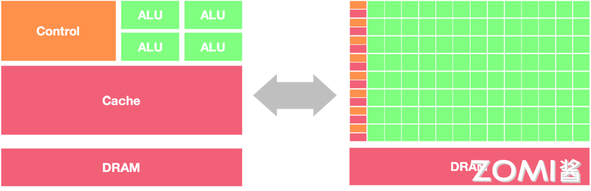
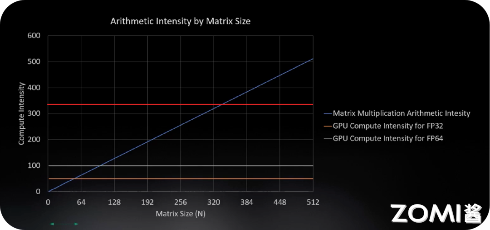

<!--Copyright © 适用于[License](https://github.com/chenzomi12/AISystem)版权许可-->

# GPU原理

## 学习目标

1. 理解GPU的发展历史、三代演进及其与CPU的本质区别
2. 掌握GPU的工作原理，包括并行计算基础、SIMD与SIMT的区别
3. 深入理解GPU的线程结构：Grid、Block、Thread的层次关系
4. 掌握GPU的内存架构：HBM、L2 Cache、L1 Cache、Register的层次及作用
5. 理解Tensor Core的原理及其在混合精度训练中的应用

## 章节导言

GPU（图形处理器单元）是目前人工智能领域最重要的计算平台之一。从2012年AlexNet在ImageNet竞赛中取得突破性成果开始，GPU就在深度学习革命中扮演着核心角色。本章将深入探讨GPU的工作原理，帮助读者理解为什么GPU如此适合AI计算。

我们将首先回顾GPU的发展历史，了解从最初用于图形渲染的专用芯片，如何演变为今天通用并行计算的核心平台。然后，我们将详细分析GPU与CPU在架构上的本质差异，理解为什么GPU能够在并行计算任务中实现数量级的性能领先。

本章的重点是GPU的工作原理和线程结构。我们将探讨SIMD（单指令多数据）与SIMT（单指令多线程）这两种并行计算模式的区别，深入理解GPU如何通过大量线程超配来掩盖内存延迟，实现高吞吐量计算。

此外，GPU的内存架构是理解其性能优势的关键。我们将分析HBM高带宽内存、多级缓存结构以及寄存器文件的层次关系，理解数据在GPU中的流动方式。

最后，我们将介绍Tensor Core这一专门为深度学习矩阵运算设计的硬件单元，理解混合精度计算的原理和优势。

通过本章的学习，读者将建立起对GPU架构和计算模型的深入理解，为后续学习CUDA编程和NVIDIA架构奠定基础。

## 2.1 GPU发展历史

### 2.1.1 GPU的诞生与图形处理

GPU的诞生源于计算机图形学的需求。1980年代，随着个人计算机的普及，用户对图形显示的要求越来越高。传统的CPU需要同时处理操作系统、应用程序和各种计算任务，难以高效处理复杂的图形渲染工作。这催生了专门处理图形运算的芯片——GPU。

**第一代GPU（1999年之前）**

最早的GPU主要承担图形处理中的固定功能。1998年，NVIDIA推出了GeForce 256，这是业界首款被命名为"GPU"的图形处理芯片。第一代GPU的特点是：

- 固定功能流水线：只能执行预定义的图形处理任务
- 无可编程性：用户无法定制图形渲染算法
- 硬件加速：将部分图形运算从CPU转移到专用硬件

这一时期的GPU已经能够在硬件层面加速几何变换和光照计算，但整体功能相对有限。

**第二代GPU（1999-2005年）**

1999年，NVIDIA推出GeForce 256（正式命名为" world's first GPU"），将变换与光照（T&L）计算从CPU转移到GPU，实现了图形处理的重大突破。

这一时期的标志性事件包括：

- 1999年：NVIDIA GeForce 256，首次实现硬件T&L
- 2000年：GeForce 2，进一步提升性能
- 2001年：GeForce 3，引入可编程顶点着色器
- 2003年：NVIDIA GeForce FX，支持像素着色器编程

第二代GPU开始支持部分可编程性，开发者可以编写顶点着色器和像素着色器来定制图形渲染效果。

### 2.1.2 GPU的三代演进

GPU的发展可以划分为三个主要阶段，每一阶段都有标志性性的技术突破。

**第一代：图形专用时代（1999-2006）**

这一阶段GPU的核心特征是图形流水线的优化：

- 固定功能单元为主，少量可编程单元
- 严格服务于图形渲染任务
- 各厂商架构差异较大

2000年代初期，GPU主要被用于电脑游戏和图形工作站，专业应用领域有限。

**第二代：通用计算萌芽（2006-2012）**

2006年是GPU发展的重要分水岭。NVIDIA推出CUDA（Compute Unified Device Architecture）和GeForce 8系列GPU，首次将GPU从纯粹的图形处理器转变为通用并行计算设备。

这一阶段的标志性事件：

- 2006年：NVIDIA推出CUDA编程模型和GeForce 8800 GTX
- 2007年：CUDA正式发布，GPU计算开始普及
- 2008年：Apple推出OpenCL，开放GPU计算标准

GPU从"图形专用"走向"通用计算"，开始被广泛应用于科学计算、物理仿真、信号处理等领域。

**第三代：AI驱动爆发（2012至今）**

2012年，AlexNet在ImageNet竞赛中以压倒性优势夺冠，深度学习时代正式开启。GPU凭借其并行计算能力，成为AI革命的算力核心。

这一阶段的标志性特征：

- 2012年：AlexNet使用GPU训练，深度学习突破
- 2016年：NVIDIA推出Pascal架构，引入NVLink
- 2017年：Volta架构引入Tensor Core
- 2020年：Ampere架构，Tensor Core 3.0
- 2022年：Hopper架构，HBM3内存
- 2024年：Blackwell架构，2080亿晶体管

### 2.1.3 GPU vs CPU：架构的本质差异

理解GPU与CPU的差异，是理解GPU为什么适合AI计算的关键。

**设计哲学的不同**

CPU的设计目标是**通用性**和**低延迟**：

- 强大的ALU（算术逻辑单元），但数量有限
- 复杂的控制单元：分支预测、乱序执行
- 大容量缓存：降低内存访问延迟
- 适合串行任务和复杂逻辑

GPU的设计目标是**高吞吐量**：

- 海量简单ALU，专注并行计算
- 简化的控制逻辑：硬件资源最大化用于计算
- 高带宽内存：满足大数据量并行访问
- 适合大规模数据并行任务

用一句话概括：**CPU是一位能干的博士，一次做一件事但做得很快；GPU是一群小学生，同时做大量简单的事**。

**架构对比**

让我们通过一个形象的比喻来理解CPU和GPU的架构差异：



CPU就像一家精品餐厅：

- 只有少数几位大厨（ALU），但技艺高超
- 有经验丰富的领班（控制单元）协调厨房运作
- 有大型仓库（缓存）存储食材
- 适合做复杂的定制菜品（串行任务）

GPU就像一家快餐连锁店：

- 有成百上千位员工同时工作
- 每个员工只负责特定的简单任务
- 食材快速流转，不做长时间储存
- 适合大规模标准化生产（并行任务）

**性能特征的差异**

| 特性 | CPU | GPU |
|------|-----|-----|
| 核心数 | 4-128 | 数千-数万 |
| 线程数 | 数十 | 数万 |
| 缓存 | 大容量多级 | 小容量多级 |
| 主频 | 3-5 GHz | 1-2 GHz |
| 内存带宽 | 100-500 GB/s | 1000-3000 GB/s |
| 适用场景 | 复杂逻辑、低延迟 | 大规模并行、高吞吐 |

**为什么GPU更适合AI计算？**

深度学习，特别是神经网络，具有天然的并行特征：

1. **神经元独立计算**：神经网络中，每个神经元的计算相互独立
2. **层内并行**：同一层的所有神经元可以并行计算
3. **批量并行**：多个样本可以同时处理
4. **矩阵运算**：核心是大规模矩阵乘加运算

GPU的并行架构完美匹配这些特征。举例来说，一个拥有4096个神经元的层，在GPU上可以由数千个线程同时处理，每个线程计算一个或几个神经元的输出。

## 2.2 GPU工作原理

### 2.2.1 并行计算基础

**并行计算的概念**

并行计算是指同时使用多个计算资源（处理器或计算机）来解决一个问题。分为几种类型：

**任务并行**：不同处理器执行不同任务

```
处理器1 → 任务A
处理器2 → 任务B
处理器3 → 任务C
```

**数据并行**：不同处理器处理数据的不同部分

```
处理器1 → 数据A1, A2
处理器2 → 数据B1, B2
处理器3 → 数据C1, C2
```

深度学习主要涉及**数据并行**。例如，一个批量为1024的样本输入，每个样本可以分配给不同的计算单元同时处理。

**并发与并行的区别**

- **并发（Concurrency）**：系统能够处理多个任务，但不一定同时执行。操作系统通过时间片轮转等方式快速切换任务，给用户造成"同时执行"的错觉。
- **并行（Parallelism）**：真正同时执行多个任务。需要硬件支持，如多核CPU或多GPU系统。

对于GPU来说，其架构天然支持并行执行：

- 数千个计算核心可以真正同时工作
- 通过硬件调度器管理大量线程
- 线程切换开销极低（近乎零成本）

### 2.2.2 SIMD与SIMT

理解SIMD和SIMT是理解GPU编程模型的关键。

**SIMD（Single Instruction, Multiple Data）单指令多数据**

SIMD是一种数据并行技术。在同一时刻，对多个数据执行相同的指令。

```
传统方式（串行）：
a[0] + b[0] → c[0]
a[1] + b[1] → c[1]
a[2] + b[2] → c[2]
a[3] + b[3] → c[3]

SIMD方式（并行）：
[a[0],a[1],a[2],a[3]] + [b[0],b[1],b[2],b[3]] → [c[0],c[1],c[2],c[3]
```

一次指令执行，同时处理4个（或更多）数据元素。

SIMD的特点：

- 单线程执行，但数据级并行
- 需要硬件支持宽向量单元
- 数据必须对齐，类型一致
- 主要用于向量化计算加速

Intel的SSE/AVX指令集，ARM的NEON都是SIMD的实现。

**SIMT（Single Instruction, Multiple Threads）单指令多线程**

SIMT是NVIDIA在GPU上提出的并行执行模型，是SIMD的推广但更加灵活。

与SIMD的关键区别：

- SIMD要求所有数据严格对齐，同步执行
- SIMT允许线程独立执行，每个线程有自己寄存器
- 线程可独立分支，灵活寻址

```
SIMD：
Thread 0-31 执行相同指令，但只能访问连续对齐的内存
|_________|
|_________|
|    ↓    | 同时执行
|_________|
|_________|

SIMT：
Thread 0-31 执行相同指令，但可访问任意内存地址
|  Thread0  | → 数据A[0]
|  Thread1  | → 数据G[7]   （不同地址）
|  Thread2  | → 数据K[12]
|     ...   |
|  Thread31 | → 数据Z[99]
```

**SIMT的优势**

1. **编程模型简单**：开发者可以像写单线程程序一样写并行代码
2. **灵活性高**：每个线程可独立分支、寻址
3. **硬件效率高**：通过线程束（Warp）调度隐藏延迟
4. **易于调试**：可以像单线程程序一样设置断点

CUDA和OpenCL都采用SIMT执行模型。

### 2.2.3 GPU的并行计算原理

让我们通过一个具体例子来理解GPU的并行计算原理。

**AX+Y向量运算**

在深度学习中，$Y = \alpha \times X + Y$是一个常见的向量运算（称为SAXPY）。CPU和GPU处理这个运算的方式截然不同：

**CPU串行执行**：

```c
for (int i = 0; i < N; i++) {
    Y[i] = alpha * X[i] + Y[i];
}
```

一次处理一个元素，需要N次循环。

**GPU并行执行**：

```c
__global__ void saxpy(float *X, float *Y, float alpha, int N) {
    int i = blockIdx.x * blockDim.x + threadIdx.x;
    if (i < N) {
        Y[i] = alpha * X[i] + Y[i];
    }
}
```

数万个线程同时执行，每个线程处理一个或多个元素。

**GPU如何实现高吞吐量？**

GPU实现高吞吐量的关键是**线程超配**和**流水线并行**。

1. **线程超配**：GPU拥有远超过实际计算需要的线程数量。当部分线程等待内存访问时，其他线程可以立即开始计算。通过快速切换执行线程，GPU能够保持计算单元始终忙碌。

2. **流水线并行**：GPU的计算和内存访问是流水线的。多个线程的执行可以重叠，一个线程等待内存时，另一个线程在计算。

3. **硬件调度**：GPU内置的Warp调度器智能调度线程束，最大化硬件利用率。

### 2.2.4 内存带宽与计算强度

理解GPU性能，必须理解内存带宽和计算强度的概念。

**内存带宽（Memory Bandwidth）**

内存带宽是指单位时间内能够从内存传输的数据量，通常以GB/s为单位。

```
内存带宽 = 传输数据量 / 时间
        = (时钟频率 × 位宽 × 传输效率) / 8  bytes/s
```

以NVIDIA A100为例：

- HBM2内存带宽：2,039 GB/s
- L2缓存带宽：4,000 GB/s
- L1缓存带宽：19,400 GB/s

**计算强度（Compute Intensity）**

计算强度是指执行计算所需的算术运算次数与数据传输次数的比值。

```
计算强度 = 算术运算量 / 数据传输量
```

对于矩阵乘法：

- 两个N×N矩阵相乘，需要$2N^3 - N^2$次运算
- 需要传输$3N^2$个数据元素
- 计算强度约为$O(N)$

**屋顶线模型（Roofline Model）**

屋顶线模型是评估GPU性能的理论框架：



- 纵轴是计算性能（GFLOPS）
- 横轴是计算强度（算术强度）
- 屋顶线由内存带宽和峰值算力决定

当计算强度较低时，性能受限于内存带宽（内存_bound）
当计算强度较高时，性能受限于峰值算力（计算_bound）

深度学习的大部分操作处于内存带宽受限区域，因此优化内存访问模式至关重要。

## 2.3 GPU线程结构

### 2.3.1 CUDA编程模型概述

2006年，NVIDIA推出了CUDA（Compute Unified Device Architecture），这是专为GPU通用计算设计的编程平台和计算框架。

CUDA的核心设计思想：

1. **主机-设备分离**：CPU作为主机（Host），GPU作为设备（Device）
2. **层次化线程**：通过Grid、Block、Thread组织线程
3. **SIMT执行**：每个线程执行相同程序，但处理不同数据
4. **统一内存**：简化CPU-GPU数据共享

CUDA编程的基本流程：

```c
// 1. 分配GPU内存
cudaMalloc(&d_A, size);
cudaMalloc(&d_B, size);
cudaMalloc(&d_C, size);

// 2. 将数据从CPU拷贝到GPU
cudaMemcpy(d_A, h_A, size, cudaMemcpyHostToDevice);
cudaMemcpy(d_B, h_B, size, cudaMemcpyHostToDevice);

// 3. 启动GPU内核
dim3 block(256);
dim3 grid((N + block.x - 1) / block.x);
kernel<<<grid, block>>>(d_A, d_B, d_C, N);

// 4. 将结果从GPU拷贝回CPU
cudaMemcpy(h_C, d_C, size, cudaMemcpyDeviceToHost);

// 5. 释放GPU内存
cudaFree(d_A);
cudaFree(d_B);
cudaFree(d_C);
```

### 2.3.2 线程层次结构

CUDA的线程组织是层次化的，从高到低依次为：

**Grid（网格）**

- 整个GPU执行的所有线程组成一个Grid
- 所有线程共享全局内存
- Grid是最顶层的组织单位

**Block（线程块）**

- Grid由多个Block组成
- Block内的线程可以协作：
  - 共享内存：同一Block的线程共享一块Shared Memory
  - 同步：线程可以等待其他线程完成某操作
- Block在物理上对应一个SM（流式多处理器）
- Block一旦分配给SM，会一直保留到内核结束

**Thread（线程）**

- 最基本的执行单位
- 每个线程有唯一ID：threadIdx
- 线程可以访问：
  - 私有寄存器
  - 共享内存（同一Block内）
  - 全局内存（所有线程）

```
Grid
├── Block 0
│   ├── Thread 0
│   ├── Thread 1
│   ├── ...
│   └── Thread 255
├── Block 1
│   ├── Thread 0
│   ├── Thread 1
│   ├── ...
│   └── Thread 255
└── Block N
    ├── ...
```

### 2.3.3 线程索引与数据映射

在CUDA中，通过线程索引来确定每个线程处理的数据。

**一维索引**

```c
__global__ void kernel(float *data, int N) {
    int idx = blockIdx.x * blockDim.x + threadIdx.x;
    if (idx < N) {
        data[idx] = idx * 2;
    }
}
```

- blockDim.x：每个Block的线程数
- blockIdx.x：当前Block的索引
- threadIdx.x：线程在Block内的索引

**二维索引**

对于矩阵运算：

```c
__global__ void matrixOp(float *A, float *B, float *C, int N) {
    int row = blockIdx.y * blockDim.y + threadIdx.y;
    int col = blockIdx.x * blockDim.x + threadIdx.x;
    
    if (row < N && col < N) {
        C[row * N + col] = A[row * N + col] + B[row * N + col];
    }
}

// 调用
dim3 block(16, 16);
dim3 grid((N + block.x - 1) / block.x, (N + block.y - 1) / block.y);
matrixOp<<<grid, block>>>(A, B, C, N);
```

**三维索引**

CUDA也支持三维组织，对于3D数据处理很方便：

```c
dim3 block(8, 8, 8);  // 512线程/block
dim3 grid(16, 16, 16); // 16x16x16=4096 blocks
```

### 2.3.4 Warp调度机制

**Warp的概念**

Warp是SM（流式多处理器）的基本调度单位。每个Warp包含32个并行线程，这些线程执行相同的指令，但处理不同的数据。

**为什么是32？**

32是NVIDIA GPU的Warp大小设计，基于以下考虑：

- 硬件效率：32个线程的调度开销最小
- 内存合并：连续的32个线程访问连续内存地址
- 芯片面积：平衡并行度和硬件复杂度

**Warp执行模式**

SIMT的核心特征：

- Warp内所有线程锁步执行同一条指令
- 每个线程有自己的寄存器副本
- 线程可独立分支，但会导致执行效率下降

```
Warp执行示意：
时刻T0: [Thread0-31] → 执行 ADD指令
时刻T1: [Thread0-31] → 执行 MUL指令
时刻T2: [Thread0-31] → 执行 LOAD指令
```

**分支分化（Branch Divergence）**

当Warp内线程执行不同分支时，会发生分支分化：

```c
if (threadIdx.x < 16) {
    // Thread 0-15 执行这条路径
    A = ...
} else {
    // Thread 16-31 执行另一条路径
    B = ...
}
```

此时GPU需要执行两次：

1. Thread 0-15执行，16-31空转
2. Thread 16-31执行，0-15空转

分支分化会降低GPU利用率，应尽量避免。

### 2.3.5 GPU的线程资源

GPU通过大量线程超配来掩盖内存延迟。

**NVIDIA A100的线程资源**：

| 资源 | 数量 |
|------|------|
| 总SM数 | 108 |
| 每SM最大线程数 | 2048 |
| 每SM最大Warp数 | 64 |
| 总线程数 | 221,184 |
| 总Warp数 | 6,912 |

**活跃线程 vs 等待线程**

- Active Warps：正在执行的Warp
- Waiting Warps：等待调度或等待内存访问的Warp

GPU设计理念：**线程数量远大于硬件计算单元数量**

当一个Warp等待内存访问时，调度器立即切换到另一个Warp执行计算。通过这种方式，GPU能够保持硬件持续忙碌，最大化吞吐量。

## 2.4 GPU内存架构

### 2.4.1 GPU内存层次概述

GPU的内存系统是层次化的，不同层级的带宽和延迟差异巨大。

**NVIDIA A100内存层次**：

```
┌─────────────────────────────────────────────────────┐
│                    HBM (显存)                        │
│                 80 GB, 2,039 GB/s                   │
│  ┌───────────────────────────────────────────────┐  │
│  │              L2 Cache (40 MB)                 │  │
│  │              4,000 GB/s                       │  │
│  │  ┌─────────────────────────────────────────┐  │  │
│  │  │           L1 Cache (192 KB/SM)          │  │  │
│  │  │           19,400 GB/s                   │  │  │
│  │  │  ┌───────────────────────────────────┐  │  │  │
│  │  │  │         Register File             │  │  │  │
│  │  │  │         256 KB/SM                │  │  │  │
│  │  │  └───────────────────────────────────┘  │  │  │
│  │  └─────────────────────────────────────────┘  │  │
│  └───────────────────────────────────────────────┘  │
└─────────────────────────────────────────────────────┘
```

**各层级对比**：

| 层级 | 容量 | 带宽 | 延迟 | 范围 |
|------|------|------|------|------|
| HBM | 80 GB | 2 TB/s | ~400 ns | 全局 |
| L2 | 40 MB | 4 TB/s | ~150 ns | 全局 |
| L1 | 192 KB/SM | 19 TB/s | ~25 ns | SM私有 |
| Register | 256 KB/SM | 极高 | ~1 ns | 线程私有 |

### 2.4.2 HBM高带宽内存

**HBM（High Bandwidth Memory）**是GPU显存的主流技术。

**HBM的技术原理**

HBM通过3D堆叠技术，将多层DRAM芯片堆叠在一起，通过硅通孔（TSV）连接。

```
传统GDDR：
GPU芯片 ←→ PCB走线 ←→ GDDR芯片
                ↓
           限制于IO引脚数
           带宽受限

HBM：
GPU芯片
    ↑
    │ TSV (硅通孔)
    ↓
DRAM芯片堆叠（4-8层）
    ↑
    │ TSV
    ↓
DRAM芯片堆叠
```

**HBM的优势**

1. **超高带宽**：通过更多IO实现带宽突破
2. **低功耗**：驱动电压低，信号完整性好
3. **小尺寸**：3D堆叠节省面积

**HBM发展历程**：

| 型号 | 带宽 | 单芯片容量 |
|------|------|-----------|
| HBM | 128 GB/s | 8 Gb |
| HBM2 | 256 GB/s | 16 Gb |
| HBM2e | 461 GB/s | 16 Gb |
| HBM3 | 819 GB/s | 24 Gb |
| HBM3e | 1.2 TB/s | 32 Gb |

### 2.4.3 多级缓存结构

**L2 Cache**

L2缓存是GPU上所有SM共享的全局缓存：

- 容量：40 MB（A100）
- 作用：缓存全局内存访问，减少显存带宽压力
- 特性：保持一致性，支持原子操作

**L1 Cache**

L1缓存是每个SM私有的缓存：

- 容量：192 KB（A100）
- 组成：L1数据缓存 + 共享内存（共享存储可配置）
- 带宽：是HBM的10倍

**共享内存（Shared Memory）**

共享内存是用户可编程的高速存储：

```c
__global__ void kernel(float *data) {
    __shared__ float sharedData[256];
    
    // 线程协作加载数据到共享内存
    sharedData[threadIdx.x] = data[threadIdx.x];
    __syncthreads();
    
    // 使用共享内存进行计算
    float sum = 0;
    for (int i = 0; i < 256; i++) {
        sum += sharedData[i];
    }
}
```

共享内存的特点：

- 同一Block内线程共享
- 带宽极高，延迟极低
- 需要手动管理同步

### 2.4.4 寄存器文件

寄存器是GPU中最快的存储单位。

**特性**：

- 每SM有256 KB寄存器文件
- 每个线程访问私有寄存器
- 编译器分配，开发者无法直接控制
- 延迟约1个时钟周期

**寄存器溢出**

当线程需要的寄存器超过限制时，会溢出到L1缓存，性能显著下降。

```c
// 编译报告示例
ptxas info : Registers used : 63
ptxas info : Local memory used : 0 bytes
ptxas info : Shared memory used : 0 bytes

// 如果寄存器超过限制（通常为255）
ptxas warning : Register spilling to local memory
```

### 2.4.5 内存访问模式优化

**合并访问（Coalesced Access）**

当GPU线程访问连续内存时，硬件可以合并为一次访问：

```
✓ 合并访问（好）：
Thread 0 → 访问 addr+0
Thread 1 → 访问 addr+1
...
Thread 31 → 访问 addr+31
→ 一次内存事务完成

✗ 非合并访问（差）：
Thread 0 → 访问 addr+0
Thread 1 → 访问 addr+100
...
Thread 31 → 访问 addr+3100
→ 32次内存事务！
```

**矩阵加法的合并访问**：

```c
__global__ void coalescedAdd(float *A, float *B, float *C, int N) {
    int idx = blockIdx.x * blockDim.x + threadIdx.x;
    if (idx < N) {
        C[idx] = A[idx] + B[idx];  // 合并访问
    }
}
```

**Bank冲突（Bank Conflict）**

共享内存被组织为多个bank：

- 连续地址分布在不同bank
- 同时访问同一bank会串行化

```
无冲突（好）：
Thread 0 → Bank 0
Thread 1 → Bank 1
Thread 2 → Bank 2
...

冲突（差）：
Thread 0 → Bank 0
Thread 1 → Bank 0  ← 冲突！
Thread 2 → Bank 0  ← 冲突！
```

优化策略：错开线程访问的地址偏移。

## 2.5 Tensor Core

### 2.5.1 Tensor Core的诞生背景

在深度学习中，矩阵乘法（GEMM）是最核心的计算操作。ResNet-50等网络的计算量中，超过90%来自矩阵乘法。

**传统CUDA Core的限制**：

- 一个时钟周期只能执行一次FMA（乘加）
- 矩阵乘法需要多层循环实现
- 硬件利用率低

**Tensor Core的革命**：

2017年，NVIDIA在Volta架构中引入Tensor Core，专门加速矩阵运算。一个Tensor Core在一个时钟周期内执行4×4矩阵乘加：

$$D = A \times B + C$$

其中A、B、C、D都是4×4矩阵。

### 2.5.2 Tensor Core工作原理

**矩阵乘法并行本质**

矩阵乘法可以分解为多个小矩阵的乘加操作：

```
C = A × B
   ┌─────────┐     ┌─────────┐
   │ A       │     │ B       │
   │ (M×K)   │  ×  │ (K×N)   │
   └─────────┘     └─────────┘
         ↓              ↓
   ┌─────────────────────────┐
   │         C = A×B        │
   │          (M×N)         │
   └─────────────────────────┘
```

Tensor Core将大矩阵分割为4×4子矩阵：

```
┌─────────────────────────────────────┐
│  A(M×K)          B(K×N)           │
│  ┌───┬───┐      ┌───┬───┐         │
│  │A11│A12│      │B11│B12│         │
│  ├───┼───┤  ×   ├───┼───┤         │
│  │A21│A22│      │B21│B22│         │
│  └───┴───┘      └───┴───┘         │
│                                     │
│  C(M×N) = Σ Aik × Bkj              │
│  每个Cij是A的第i行与B的第j列点积     │
└─────────────────────────────────────┘
```

**Tensor Core执行过程**：

```
Tensor Core在一个时钟周期内完成：
┌─────────────────────────────────────────┐
│ 1. 接收 A的一行4个FP16元素              │
│ 2. 接收 B的一列4个FP16元素              │
│ 3. 执行 4×4 乘加运算                    │
│ 4. 输出 D的一个FP16/FP32元素            │
└─────────────────────────────────────────┘
```

**混合精度计算**

Tensor Core支持混合精度（FP16输入，FP32累加）：

```python
# PyTorch中使用Tensor Core
with torch.cuda.amp.autocast():
    output = torch.matmul(A, B)  # 自动使用Tensor Core
```

- 输入：A, B → FP16（加速）
- 累加：C, D → FP32（精度）
- 充分利用Tensor Core性能，同时保持训练精度

### 2.5.3 各代Tensor Core演进

**Volta Tensor Core (第一代)**

- 架构：V100
- 支持精度：FP16
- 每SM 8个Tensor Core

**Turing Tensor Core (第二代)**

- 架构：T4, RTX 20系列
- 新增精度：INT8, INT4, INT1
- 用于推理加速

**Ampere Tensor Core (第三代)**

- 架构：A100, RTX 30系列
- 新增精度：TF32, BF16
- 结构稀疏支持
- 每SM 4个Tensor Core

| 精度 | 计算性能提升（vs FP32 CUDA Core） |
|------|----------------------------------|
| FP64 | 1x（基准） |
| TF32 | 8x |
| BF16 | 16x |
| FP16 | 32x |
| INT8 | 64x |
| INT4 | 128x |

**Hopper Tensor Core (第四代)**

- 架构：H100
- 新增精度：FP8
- Transformer Engine 2.0
-动态范围自适应精度

### 2.5.4 混合精度训练

混合精度训练是利用Tensor Core加速深度学习的关键技术。

**为什么需要混合精度？**

1. **内存节省**：FP16只占FP32一半内存
2. **带宽提升**：相同带宽传输更多数据
3. **计算加速**：Tensor Core专为FP16优化
4. **精度保持**：FP32累加避免精度损失

**混合精度训练三要素**：

1. **FP16主权重**：模型权重以FP16存储
2. **FP32优化器状态**：Adam等优化器状态保持FP32
3. **Loss Scaling**：放大loss避免下溢

**PyTorch实现**：

```python
# 1. 创建GradScaler
scaler = torch.cuda.amp.GradScaler()

# 2. 训练循环
for data, target in dataloader:
    optimizer.zero_grad()
    
    # 自动混合精度
    with torch.cuda.amp.autocast():
        output = model(data)
        loss = loss_fn(output, target)
    
    # 缩放loss，反向传播
    scaler.scale(loss).backward()
    
    # 更新权重
    scaler.step(optimizer)
    scaler.update()
```

### 2.5.5 结构稀疏性

结构稀疏性是提升AI芯片计算效率的重要技术。

**稀疏矩阵**

神经网络中存在大量冗余权重：

- 训练后的权重接近零
- 可以剪枝（pruning）移除
- 稀疏矩阵运算量更少

**结构稀疏（2:4稀疏）**

NVIDIA在A100引入2:4结构稀疏：

```
每4个元素中，恰好2个为0
[1, 0, 3, 0, 5, 6, 0, 0, ...]  ✓ 有效
[1, 0, 3, 5, 0, 6, 0, 0, ...]  ✗ 无效
```

**稀疏Tensor Core加速**

1. 压缩稀疏矩阵（移除零值）
2. Tensor Core直接使用压缩格式计算
3. 理论加速2倍

```python
# PyTorch结构稀疏支持
import torch.nn.utils.prune as prune

# 应用2:4结构稀疏
prune.l1_unstructured(model, name='weight', amount=0.5)
```

## 本章小结

本章我们深入学习了GPU的工作原理：

1. **GPU发展历史**：
   - 从图形专用到通用计算
   - 2012年后成为AI计算核心平台
   - 与CPU的设计哲学完全不同

2. **GPU工作原理**：
   - SIMD vs SIMT：SIMT更灵活，支持线程独立执行
   - 并行计算基础：数据并行是深度学习的主要并行模式
   - 线程超配：大量线程掩盖内存延迟

3. **GPU线程结构**：
   - Grid > Block > Thread的层次关系
   - Warp是SM的基本调度单位（32线程）
   - 线程索引与数据的映射关系

4. **GPU内存架构**：
   - HBM高带宽显存
   - 多级缓存：L2 > L1 > Register
   - 共享内存可编程控制
   - 合并访问优化

5. **Tensor Core**：
   - 专门加速矩阵乘法的硬件单元
   - 混合精度训练：FP16计算 + FP32累加
   - 各代演进支持更多精度

理解这些核心概念，为后续学习NVIDIA具体架构和CUDA编程奠定了坚实基础。

## 思考与练习

1. **架构对比**：解释CPU和GPU在设计哲学上的本质差异。为什么GPU比CPU更适合执行深度学习工作负载？

2. **SIMT理解**：什么是SIMT（单指令多线程）？它与SIMD（单指令多数据）的主要区别是什么？SIMT的灵活性体现在哪些方面？

3. **线程层次**：解释CUDA中Grid、Block、Thread的层次关系，以及如何通过线程索引确定每个线程处理的数据。

4. **内存带宽**：GPU的多级内存架构是如何组织的？什么是合并访问？为什么合并访问对GPU性能很重要？

5. **Tensor Core**：Tensor Core是如何加速矩阵运算的？什么是混合精度训练？它为什么能兼顾性能和精度？

6. **性能优化思考**：如果一个深度学习模型的计算强度较低（内存受限），可以采用哪些策略来提升GPU计算效率？
