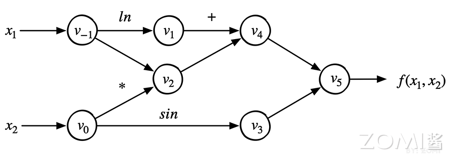

# 自动微分

## 本章学习目标

1. 理解什么是微分以及计算机程序求导的各种方法
2. 掌握自动微分的基本原理和核心思想
3. 了解前向模式和反向模式的区别与适用场景
4. 掌握PyTorch中autograd机制的使用方法
5. 理解Hook机制在自动微分中的应用
6. 了解自动微分面临的挑战与优化方向

## 预备知识

- 高等数学（导数与微分、链式法则）
- 线性代数（向量、矩阵运算）
- Python编程基础

---

## 1 自动微分基础

### 1.1 什么是微分

在深度学习中，**微分（Differentiation）** 是一个核心概念。当我们训练神经网络时，我们需要知道当输入发生微小变化时，输出会如何变化。这种"变化率"就是导数，而计算导数的过程就是微分。

举个具体的例子。假设我们有一个简单的函数：

$$y = f(x) = x^2$$

当 $x$ 从 2 变到 3 时，$y$ 从 4 变到 9。我们可以说，在 $x=2$ 这个点，函数 $f(x)$ 的导数是：

$$\frac{dy}{dx} = 2x = 4$$

这个导数表示：在 $x=2$ 这个点，当 $x$ 增加一个极小的量 $\Delta x$ 时，$y$ 会增加大约 $4 \times \Delta x$。

在神经网络中，我们处理的是成千上万甚至上亿参数的复杂函数。神经网络的"学习"本质上就是找到一组参数，使得损失函数（衡量预测值与真实值差距的函数）的导数为零，或者更准确地说，沿着梯度的反方向更新参数，逐步降低损失函数的值。这个过程叫做**梯度下降**。

### 1.2 计算机求导方法概述

要让计算机程序自动计算导数，有四种主要方法：

| 方法 | 原理 | 优点 | 缺点 |
|------|------|------|------|
| 手动微分 | 人工求导并编写代码 | 精度高 | 工作量大，不灵活 |
| 数值微分 | 使用导数定义 $f'(x) \approx \frac{f(x+h)-f(x)}{h}$ | 简单直观 | 精度低，计算量大 |
| 符号微分 | 完整求导公式变换 | 精度高 | 可能产生表达式膨胀 |
| **自动微分** | 分解为基本操作，利用链式法则 | 精度高，效率高 | 需要记录计算过程 |

下面我们逐一介绍这四种方法。

### 1.3 手动微分

**手动微分（Manual Differentiation）** 是最直接的方法：人工对目标函数求导，然后编写对应的代码。

例如，对于函数 $f(x) = x^2 + \sin(x)$，我们知道：

$$\frac{df}{dx} = 2x + \cos(x)$$

手动微分的代码：

```python
def f(x):
    return x**2 + np.sin(x)

def df_dx(x):
    return 2*x + np.cos(x)
```

手动微分的优点是计算效率高、没有额外开销。但缺点也非常明显：
- 每个新模型都需要人工求导
- 复杂模型的求导极其繁琐，容易出错
- 当模型结构改变时，需要重新求导

### 1.4 数值微分

**数值微分（Numerical Differentiation）** 利用导数的数学定义，通过有限差分近似计算导数值。

导数的定义：

$$f'(x) = \lim_{h \to 0} \frac{f(x+h) - f(x)}{h}$$

当 $h$ 很小时，可以用差商近似导数：

```python
def numerical_diff(f, x, h=1e-5):
    """数值微分：近似计算函数f在点x处的导数"""
    return (f(x + h) - f(x)) / h
```

数值微分有三种常见形式：

1. **向前差分**：$\frac{f(x+h) - f(x)}{h}$，误差 $O(h)$
2. **向后差分**：$\frac{f(x) - f(x-h)}{h}$，误差 $O(h)$
3. **中心差分**：$\frac{f(x+h) - f(x-h)}{2h}$，误差 $O(h^2)$

中心差分精度更高，因为它的误差是二阶的。

数值微分的**优点**：
- 实现非常简单
- 适用于任何函数
- 不需要理解函数的内部结构

**缺点**：
- 计算量大：每个参数都需要多次函数求值
- 精度问题：$h$ 太小会有舍入误差，$h$ 太大会有截断误差
- 无法得到导数的解析表达式

### 1.5 符号微分

**符号微分（Symbolic Differentiation）** 是对完整的数学表达式进行求导，得到导函数的解析表达式。

符号微分的原理是利用求导规则对表达式进行递归变换。例如：

- $\frac{d}{dx}[f(x) + g(x)] = \frac{df}{dx} + \frac{dg}{dx}$
- $\frac{d}{dx}[f(x) \cdot g(x)] = \frac{df}{dx} \cdot g(x) + f(x) \cdot \frac{dg}{dx}$
- $\frac{d}{dx}[f(g(x))] = \frac{df}{dg} \cdot \frac{dg}{dx}$ （链式法则）

使用 Python 的 sympy 库进行符号微分：

```python
import sympy as sp

x = sp.symbols('x')
f = x**2 + sp.sin(x)

# 求导
df = sp.diff(f, x)
print(df)  # 输出: 2*x + cos(x)
```

符号微分的**优点**：
- 得到精确的导数表达式
- 数值精度高

**主要缺点**是**表达式膨胀（Expression Swell）**问题。考虑 Logistic 函数：

$$l_n = \frac{1}{1 + e^{-l_{n-1}}}$$

对其求导会得到极其复杂的表达式，随着层数增加，表达式会指数级膨胀。这使得符号微分在实际应用中受到很大限制。

### 1.6 自动微分：核心思想

**自动微分（Automatic Differentiation，AD）** 是一种介于数值微分和符号微分之间的方法。它既不像数值微分那样近似，也不像符号微分那样产生复杂的中间表达式。

自动微分的核心思想可以概括为：**任何复杂的函数都可以分解为一系列基本操作的组合，而每个基本操作都有已知的导数规则。**

#### 1.6.1 关键洞察

自动微分的精髓在于：微分计算本质上是一系列有限可微算子的组合。

以函数为例：

$$y = f(x_1, x_2) = \ln(x_1) + x_1 \cdot x_2 - \sin(x_2)$$

我们可以将其分解为基本操作：

| 步骤 | 操作 | 表达式 |
|------|------|--------|
| 1 | 取对数 | $v_1 = \ln(x_1)$ |
| 2 | 乘法 | $v_2 = x_1 \cdot x_2$ |
| 3 | 加法 | $v_3 = v_1 + v_2$ |
| 4 | 正弦 | $v_4 = \sin(x_2)$ |
| 5 | 减法 | $y = v_3 - v_4$ |

每个基本操作（加、减、乘、除、对数、三角函数等）的导数都是已知的。自动微分只需：
1. 分解程序为基本操作序列
2. 应用已知的导数规则到每个基本操作
3. 使用链式法则组合结果

#### 1.6.2 链式法则

**链式法则（Chain Rule）** 是自动微分的数学基础。

对于复合函数：
$$y = f(g(x))$$

其导数为：
$$\frac{dy}{dx} = \frac{dy}{dg} \cdot \frac{dg}{dx}$$

更一般地，对于多变量复合函数：
$$\frac{\partial y}{\partial x} = \sum_{k=1}^{n} \frac{\partial y}{\partial v_k} \cdot \frac{\partial v_k}{\partial x}$$

例如，对于 $y = \sin(x^2)$：

令 $u = x^2$，则 $y = \sin(u)$

$$\frac{dy}{dx} = \frac{dy}{du} \cdot \frac{du}{dx} = \cos(u) \cdot 2x = 2x\cos(x^2)$$

### 1.7 计算图与自动微分

**计算图（Computational Graph）** 是表达自动微分的理想数据结构。在计算图中：

- **节点（Node）** 表示变量（标量、向量、矩阵或张量）
- **边（Edge）** 表示操作或函数

以函数 $f(x_1, x_2) = \ln(x_1) + x_1 \cdot x_2 - \sin(x_2)$ 为例，其计算图如下：



从图中可以看出数据流动的过程：
- $x_1$ 和 $x_2$ 是输入节点
- $\ln(x_1)$、$x_1 \cdot x_2$、$\sin(x_2)$ 是中间节点
- 最终输出 $y$ 是根节点

计算图清晰地表达了：
1. **数据依赖关系**：哪些操作需要等待哪些结果
2. **执行顺序**：按照拓扑排序从前向后计算

---

## 2 前向模式与反向模式

自动微分根据链式法则的应用顺序，分为两种主要模式：**前向模式（Forward Mode）** 和 **反向模式（Reverse Mode）**。

### 2.1 雅克比矩阵基础

在深入理解两种模式之前，我们需要了解**雅克比矩阵（Jacobian Matrix）**。

对于一个从 $n$ 维输入到 $m$ 维输出的函数：
$$\mathbf{y} = f(\mathbf{x})$$

其中 $\mathbf{x} \in \mathbb{R}^n$，$\mathbf{y} \in \mathbb{R}^m$。

雅克比矩阵 $\mathbf{J}$ 是一个 $m \times n$ 的矩阵，定义了所有一阶偏导数：

$$\mathbf{J} = \frac{\partial \mathbf{y}}{\partial \mathbf{x}} = \begin{bmatrix} \frac{\partial y_1}{\partial x_1} & \cdots & \frac{\partial y_1}{\partial x_n} \\ \vdots & \ddots & \vdots \\ \frac{\partial y_m}{\partial x_1} & \cdots & \frac{\partial y_m}{\partial x_n} \end{bmatrix}$$

在深度学习中，我们通常处理的是单输出函数（标量损失函数），所以雅克比矩阵会简化为梯度向量。

### 2.2 前向模式详解

**前向模式（Forward Mode）** 从输入向输出方向计算导数，也称为**切线模式（Tangent Mode）**。

#### 2.2.1 工作原理

在前向模式中，我们沿着计算图从输入向输出方向前进，计算每个节点对目标输入的偏导数。

对于函数 $y = f(x_1, x_2)$，如果要求 $\frac{\partial y}{\partial x_1}$：

1. 初始化：$\dot{x}_1 = 1$，$\dot{x}_2 = 0$（表示只对 $x_1$ 求导）
2. 沿计算图前向传播，同时计算数值和导数

以具体数值为例，假设 $x_1 = 2$，$x_2 = 5$，求 $f(x_1, x_2) = \ln(x_1) + x_1 \cdot x_2 - \sin(x_2)$ 的偏导数。

**前向计算过程：**

| 节点 | 数值计算 | 导数计算 $\dot{v} = \frac{\partial v}{\partial x_1}$ |
|------|----------|----------------------------------------------------|
| $v_{-1} = x_1$ | 2 | $\dot{v}_{-1} = 1$ |
| $v_0 = x_2$ | 5 | $\dot{v}_0 = 0$ |
| $v_1 = \ln(v_{-1})$ | $\ln(2) = 0.693$ | $\dot{v}_1 = \frac{1}{v_{-1}} \cdot \dot{v}_{-1} = 0.5$ |
| $v_2 = v_{-1} \cdot v_0$ | $2 \times 5 = 10$ | $\dot{v}_2 = v_0 \cdot \dot{v}_{-1} + v_{-1} \cdot \dot{v}_0 = 5 + 0 = 5$ |
| $v_3 = \sin(v_0)$ | $\sin(5) = -0.959$ | $\dot{v}_3 = \cos(v_0) \cdot \dot{v}_0 = 0.284 \times 0 = 0$ |
| $v_4 = v_1 + v_2$ | $0.693 + 10 = 10.693$ | $\dot{v}_4 = \dot{v}_1 + \dot{v}_2 = 0.5 + 5 = 5.5$ |
| $v_5 = v_4 - v_3$ | $10.693 - (-0.959) = 11.652$ | $\dot{v}_5 = \dot{v}_4 - \dot{v}_3 = 5.5 - 0 = 5.5$ |

最终得到 $\frac{\partial y}{\partial x_1} = 5.5$。

#### 2.2.2 雅克比-向量积

前向模式可以高效地计算**雅克比-向量积（Jacobian-Vector Product）**：

$$\mathbf{J} \cdot \mathbf{r}$$

其中 $\mathbf{r}$ 是一个输入方向的向量。如果设置 $\mathbf{r} = [1, 0, ..., 0]$，就得到雅克比矩阵的第一列。

一次前向计算得到雅克比矩阵的一列。如果有 $n$ 个输入，就需要 $n$ 次前向计算。

#### 2.2.3 优缺点分析

**前向模式的优点：**
- 实现相对简单
- 内存占用较低（不需要保存中间结果）
- 对于**单输入、多输出**的情况效率高

**前向模式的缺点：**
- 对于**多输入、单输出**（深度学习中的典型情况）效率低
- 需要 $n$ 次前向传播才能得到对所有 $n$ 个输入的导数

### 2.3 反向模式详解

**反向模式（Reverse Mode）** 从输出向输入方向计算导数，也称为**伴随模式（Adjoint Mode）**。这是深度学习中使用的核心方法。

#### 2.3.1 工作原理

在反向模式中：

1. 首先进行**前向传播**，计算并保存所有中间节点的值
2. 然后从输出开始，沿着计算图**反向传播**，计算每个节点对损失的导数

定义**伴随变量（Adjoint Variable）**：
$$\bar{v}_i = \frac{\partial y}{\partial v_i}$$

其中 $y$ 是最终的输出（标量）。

反向传播的关键公式：
$$\bar{v}_i = \sum_{j \in \text{Succ}(i)} \bar{v}_j \cdot \frac{\partial v_j}{\partial v_i}$$

即一个节点的导数等于所有后续节点传递来的导数乘以相应偏导数的和。

#### 2.3.2 具体计算示例

仍以函数 $f(x_1, x_2) = \ln(x_1) + x_1 \cdot x_2 - \sin(x_2)$ 为例。

**第一步：前向传播（与之前相同）**

计算并保存所有节点的值。

**第二步：反向传播**

初始化：$\bar{v}_5 = \frac{\partial y}{\partial y} = 1$

| 节点 | 偏导数计算 | 伴随值 $\bar{v}_i$ |
|------|-----------|---------------------|
| $\bar{v}_5 = \bar{y}$ | $1$ | $1$ |
| $\bar{v}_4$ | $\bar{v}_5 \cdot \frac{\partial v_5}{\partial v_4} = 1 \cdot 1$ | $1$ |
| $\bar{v}_3$ | $\bar{v}_5 \cdot \frac{\partial v_5}{\partial v_3} = 1 \cdot (-1)$ | $-1$ |
| $\bar{v}_1$ | $\bar{v}_4 \cdot \frac{\partial v_4}{\partial v_1} = 1 \cdot 1$ | $1$ |
| $\bar{v}_2$ | $\bar{v}_4 \cdot \frac{\partial v_4}{\partial v_2} = 1 \cdot 1$ | $1$ |

对于叶子节点 $v_{-1}$ 和 $v_0$，需要累加来自所有后续节点的贡献：

$\bar{v}_0$ 的计算（有两个后续节点 $v_2$ 和 $v_3$）：
$$\bar{v}_0 = \bar{v}_2 \cdot \frac{\partial v_2}{\partial v_0} + \bar{v}_3 \cdot \frac{\partial v_3}{\partial v_0}$$
$$= 1 \cdot x_1 + (-1) \cdot \cos(x_2) = 2 + 0.284 = 2.284$$

$\bar{v}_{-1}$ 的计算（有两个后续节点 $v_1$ 和 $v_2$）：
$$\bar{v}_{-1} = \bar{v}_1 \cdot \frac{\partial v_1}{\partial v_{-1}} + \bar{v}_2 \cdot \frac{\partial v_2}{\partial v_{-1}}$$
$$= 1 \cdot \frac{1}{x_1} + 1 \cdot x_2 = 0.5 + 5 = 5.5$$

因此：
$$\frac{\partial f}{\partial x_1} = 5.5, \quad \frac{\partial f}{\partial x_2} = 2.284$$

#### 2.3.3 向量-雅克比积

反向模式计算的是**向量-雅克比积（Vector-Jacobian Product，VJP）**：

$$\mathbf{v}^T \cdot \mathbf{J}$$

其中 $\mathbf{v}$ 是从后续节点传来的梯度向量。这正是反向传播算法中计算 $\frac{\partial L}{\partial x}$ 的方式。

#### 2.3.4 优缺点分析

**反向模式的优点：**
- 对于**多输入、单输出**的情况效率极高
- 一次反向传播即可计算出**所有参数**的梯度
- 深度学习中的典型场景（单损失函数、多参数）正好符合

**反向模式的缺点：**
- 需要保存前向传播的**中间结果**，内存开销大
- 实现相对复杂
- 需要特殊的数据结构来记录计算图

### 2.4 两种模式的对比

| 特性 | 前向模式 | 反向模式 |
|------|----------|----------|
| 计算方向 | 输入 $\to$ 输出 | 输出 $\to$ 输入 |
| 计算内容 | 雅克比-向量积 | 向量-雅克比积 |
| 适用场景 | 单输出、多输入 | 多输出（通常为1）、多输入 |
| 计算次数（$n$输入） | $n$ 次前向 | 1 次前向 + 1 次反向 |
| 内存需求 | 较低 | 较高 |

在深度学习中，由于：
- 输出通常是单个标量损失函数
- 输入是庞大的参数集合（百万到万亿级别）

**反向模式是必然选择**，一次反向传播就能得到所有参数的梯度。

### 2.5 为什么深度学习用反向模式

深度学习选择反向模式的原因：

1. **效率**：想象一个有100万个参数的网络，用前向模式需要100万次前向传播，而反向模式只需1次前向+1次反向。

2. **内存优化**：虽然反向模式需要保存中间结果，但可以通过**激活检查点（Activation Checkpointing）**等技术优化。

3. **局部性**：每个节点的梯度计算只依赖于后续节点，便于并行化。

---

## 3 PyTorch自动微分机制

PyTorch 是当前最流行的深度学习框架之一，其自动微分机制（autograd）是整个框架的核心。本节将深入介绍 PyTorch 的 autograd 机制。

### 3.1 autograd 核心概念

PyTorch 的 autograd 系统基于**动态计算图（Dynamic Computational Graph）**。理解 autograd，需要掌握以下核心概念：

#### 3.1.1 张量的 requires_grad 属性

在 PyTorch 中，每个张量（Tensor）有一个 `requires_grad` 属性，标记该张量是否需要计算梯度。

```python
import torch

# 创建一个需要计算梯度的张量
x = torch.tensor([2.0, 5.0], requires_grad=True)
print(x.requires_grad)  # True

# 从其他张量派生出来的张量，默认requires_grad=True
y = x * 2
print(y.requires_grad)  # True

# 显式指定
z = torch.tensor([1.0, 2.0], requires_grad=False)
```

#### 3.1.2 计算图结构

PyTorch 的计算图是**动态构建**的。每执行一个操作（op），就创建一个新的节点（Function），并将它们连接成图。

计算图中的两类节点：
1. **叶子节点（Leaf Nodes）**：用户创建的张量，通常是模型参数
2. **中间节点（Intermediate Nodes）**：操作产生的结果

```python
import torch

# 创建叶子节点
a = torch.tensor([1.0], requires_grad=True)
b = torch.tensor([2.0], requires_grad=True)

# 执行操作，创建中间节点
c = a * b  # MulBackward
d = c + a  # AddBackward

# 反向传播
d.backward()

print(a.grad)  # tensor([3.])  # dc/da * 1 = b * 1 = 2
print(b.grad)  # tensor([1.])  # dc/db * 1 = a * 1 = 1
```

### 3.2 Function 对象

在 PyTorch 计算图中，每个操作都对应一个 `Function` 对象。Function 对象包含：
- **forward()**：执行操作，计算结果
- **backward()**：反向传播，计算梯度

PyTorch 提供两种使用 Function 的方式：

```python
import torch

# 方式1：直接调用
x = torch.tensor([2.0], requires_grad=True)
y = torch.exp(x)  # 等价于 x.exp()

# 方式2：显式调用 Function
x = torch.tensor([2.0], requires_grad=True)
y = torch.exp.apply(x)  # 使用 .apply() 方法
```

自定义 Function 示例：

```python
class MyReLU(torch.autograd.Function):
    @staticmethod
    def forward(ctx, input):
        """正向传播：保存反向传播需要的输入"""
        ctx.save_for_backward(input)
        return input.clamp(min=0)

    @staticmethod
    def backward(ctx, grad_output):
        """反向传播：计算梯度"""
        input, = ctx.saved_tensors
        grad_input = grad_output.clone()
        grad_input[input < 0] = 0
        return grad_input

# 使用自定义 Function
x = torch.tensor([1.0, -2.0, 3.0], requires_grad=True)
y = MyReLU.apply(x)
print(y)  # tensor([1., 0., 3.], grad_fn=<MyReLU>)
```

### 3.3 backward() 函数详解

`tensor.backward()` 是触发反向传播的核心函数。

#### 3.3.1 基本用法

```python
import torch

# 创建输入张量
x = torch.tensor([3.0], requires_grad=True)
y = torch.tensor([4.0], requires_grad=True)

# 定义计算图
z = x * y + x ** 2

# 反向传播
z.backward()

# 查看梯度
print(x.grad)  # tensor([10.])  # dz/dx = y + 2x = 4 + 6 = 10
print(y.grad)  # tensor([3.])  # dz/dy = x = 3
```

#### 3.3.2 非标量张量的反向传播

当输出不是标量时，需要提供 `gradient` 参数（初始梯度）：

```python
import torch

# 输出是向量
x = torch.tensor([[1.0, 2.0], [3.0, 4.0]], requires_grad=True)
y = x * 2  # [[2, 4], [6, 8]]

# 需要提供与y形状相同的梯度向量
gradient = torch.tensor([[1.0, 1.0], [1.0, 1.0]])
y.backward(gradient)

print(x.grad)
# tensor([[2., 2.],
#         [2., 2.]])
```

在深度学习中，损失通常是标量，所以通常不需要传入 gradient。

#### 3.3.3 retain_graph 参数

默认情况下，反向传播后会释放计算图。如果需要多次反向传播，需要设置 `retain_graph=True`：

```python
import torch

x = torch.tensor([2.0], requires_grad=True)
y = x ** 2
z = y ** 2

# 第一次反向传播
z.backward(retain_graph=True)
print(x.grad)  # tensor([32.])  # dz/dx = 4x³ = 32

# 第二次反向传播（梯度会累加）
z.backward()
print(x.grad)  # tensor([64.])  # 32 + 32 = 64

# 如果想覆盖而不是累加，需要先清零
x.grad.zero_()
z.backward()
print(x.grad)  # tensor([32.])
```

### 3.4 计算图构建过程

理解 PyTorch 计算图的构建过程，对于调试和优化非常重要。

#### 3.4.1 叶子节点判定

只有叶子节点的梯度会被保留。叶子节点的定义：
- 用户直接创建的张量（不是从操作结果得到的）
- 设置 `requires_grad=True`

```python
import torch

# 叶子节点
a = torch.tensor([1.0], requires_grad=True)
print(a.is_leaf)  # True

# 非叶子节点
b = a * 2
print(b.is_leaf)  # False
print(b.grad_fn)  # <MulBackward0>
```

叶子节点的梯度默认会累加到 `.grad` 属性：

```python
a = torch.tensor([1.0], requires_grad=True)
b = a * 2
c = b * 2

c.backward()
print(a.grad)  # tensor([4.])  # dc/da = dc/db * db/da = 4 * 2 = 4
```

#### 3.4.2 计算图的可视化

可以使用 `register_full_hook` 查看计算图的结构：

```python
import torch

def print_grad_fn(grad):
    print(grad)

x = torch.tensor([1.0], requires_grad=True)
y = x * 2
z = y + x

# 打印每个张量的grad_fn
print(f"x.grad_fn: {x.grad_fn}")  # None
print(f"y.grad_fn: {y.grad_fn}")  # <MulBackward0>
print(f"z.grad_fn: {z.grad_fn}")  # <AddBackward0>
```

### 3.5 梯度累积与清零

PyTorch 默认会**累加梯度**，而不是覆盖。这是有意为之的设计，便于实现梯度累积（Gradient Accumulation）技术。

```python
import torch

model = torch.nn.Linear(10, 1)

# 模拟梯度累积：micro-batch
for batch in range(3):
    # 前向传播
    x = torch.randn(32, 10)
    y = model(x)
    loss = y.sum()

    # 反向传播（梯度累加）
    loss.backward()

# 实际梯度 = 所有batch梯度的和
print(model.weight.grad)  # 累加后的梯度

# 清零方法1：使用 optimizer.zero_grad()
optimizer = torch.optim.SGD(model.parameters(), lr=0.01)
optimizer.zero_grad()

# 清零方法2：手动清零
if model.weight.grad is not None:
    model.weight.grad.zero_()
```

### 3.6 no_grad 上下文

当不需要计算梯度时，可以使用 `torch.no_grad()` 上下文来**禁用梯度计算**，这可以显著提高执行效率并减少内存消耗。

```python
import torch

x = torch.tensor([1.0], requires_grad=True)
y = x * 2

# 方法1：装饰器
@torch.no_grad()
def inference(model, x):
    return model(x)

# 方法2：上下文管理器
with torch.no_grad():
    z = x * 2
    print(z.requires_grad)  # False

# 方法3：entirely
torch.set_grad_enabled(False)
z = x * 2
torch.set_grad_enabled(True)
```

在推理（inference）阶段，必须使用 `no_grad`：
1. 减少内存消耗（不需要保存中间结果）
2. 提高推理速度
3. 确保不会意外修改模型参数

---

## 4 Hook机制详解

PyTorch 的 Hook 机制是一种强大的扩展功能，允许在反向传播过程中插入自定义逻辑，实现高级功能如梯度监控、梯度修改等。

### 4.1 什么是Hook

**Hook（钩子）** 是一种回调机制，允许在特定事件发生时被调用。在 PyTorch autograd 中，Hook 主要用于：

1. 查看中间变量的梯度
2. 修改（遮挡或缩放）梯度
3. 实现自定义的反向传播逻辑

PyTorch 提供两种主要 Hook：
- **张量 Hook**：注册在张量上的 Hook
- **模块 Hook**：注册在 `nn.Module` 上的 Hook

### 4.2 张量Hook详解

#### 4.2.1 register_hook 基本用法

张量 Hook 通过 `tensor.register_hook()` 注册：

```python
import torch

# 创建需要梯度的张量
x = torch.tensor([1.0, 2.0, 3.0], requires_grad=True)
y = x ** 2
z = y.sum()

# 注册 hook 来打印梯度
def print_gradient(grad):
    print(f"Gradient: {grad}")

z.backward()
# z的梯度是1，打印出来
# 输出: Gradient: tensor([1.])
```

#### 4.2.2 修改梯度

Hook 最重要的用途之一是**修改梯度**。这在以下场景中很有用：

1. **梯度裁剪（Gradient Clipping）**：防止梯度爆炸
2. **梯度遮挡（Gradient Masking）**：某些参数不更新
3. **自定义优化**：修改梯度用于特殊目的

```python
import torch
import torch.nn as nn

model = nn.Linear(10, 1)

# 梯度裁剪：限制梯度范数不超过1.0
for p in model.parameters():
    p.register_hook(lambda grad: torch.clamp(grad, -1.0, 1.0))

# 或者使用更灵活的版本
def gradient_clipping_hook(grad, max_norm=1.0):
    return torch.clamp(grad, -max_norm, max_norm)

param = model.weight
param.register_hook(gradient_clipping_hook)
```

#### 4.2.3 累计梯度处理

Hook 对梯度修改是**即时生效**的，所有后续操作都会看到修改后的梯度：

```python
import torch

x = torch.tensor([3.0], requires_grad=True)
y = x ** 2

# 修改梯度为固定值
def modify_grad(grad):
    return torch.tensor([0.0])

y.register_hook(modify_grad)

z = y * 2
z.backward()

print(x.grad)  # tensor([0.])  # 不是 6*2=12，而是被hook改成了0
```

### 4.3 Module Hook详解

`nn.Module` 提供了更高级的 Hook 接口，可以在特定事件触发时执行回调。

#### 4.3.1 前向Hook

前向Hook在 `forward()` 执行后被调用：

```python
import torch
import torch.nn as nn

class SimpleNet(nn.Module):
    def __init__(self):
        super().__init__()
        self.fc = nn.Linear(10, 5)

    def forward(self, x):
        return self.fc(x)

model = SimpleNet()

# 注册前向hook
def forward_hook(module, input, output):
    print(f"Output shape: {output.shape}")
    print(f"Output mean: {output.mean().item():.4f}")

# 在特定层注册hook
model.fc.register_forward_hook(forward_hook)

# 前向传播时会触发hook
x = torch.randn(2, 10)
y = model(x)
# 输出: Output shape: torch.Size([2, 5])
#       Output mean: 0.1234
```

#### 4.3.2 反向Hook

反向Hook在 `backward()` 执行时被调用：

```python
import torch
import torch.nn as nn

model = nn.Linear(10, 5)

# 注册反向hook
def backward_hook(module, grad_input, grad_output):
    print(f"grad_output: {grad_output}")
    print(f"grad_input: {grad_input}")

model.fc.register_backward_hook(backward_hook)

x = torch.randn(2, 10)
y = model(x)
loss = y.sum()
loss.backward()
```

#### 4.3.3 完整Hook示例：特征图提取

Hook 常用于**特征提取**和**中间激活可视化**：

```python
import torch
import torch.nn as nn

class FeatureExtractor(nn.Module):
    def __init__(self):
        super().__init__()
        self.features = nn.Sequential(
            nn.Conv2d(3, 64, 3, padding=1),
            nn.ReLU(),
            nn.MaxPool2d(2),
            nn.Conv2d(64, 128, 3, padding=1),
            nn.ReLU(),
        )
        self.avgpool = nn.AdaptiveAvgPool2d((1, 1))
        self.fc = nn.Linear(128, 10)

        self.feature_maps = {}  # 存储中间特征

        # 注册hook
        self.features[1].register_forward_hook(self.save_activation('relu1'))
        self.features[4].register_forward_hook(self.save_activation('relu2'))

    def save_activation(self, name):
        def hook(module, input, output):
            self.feature_maps[name] = output.detach()
        return hook

    def forward(self, x):
        x = self.features(x)
        x = self.avgpool(x)
        x = x.view(x.size(0), -1)
        x = self.fc(x)
        return x

# 使用
model = FeatureExtractor()
x = torch.randn(1, 3, 32, 32)
y = model(x)

print(model.feature_maps['relu1'].shape)  # torch.Size([1, 64, 16, 16])
print(model.feature_maps['relu2'].shape)  # torch.Size([1, 128, 8, 8])
```

### 4.4 Hook的高级应用

#### 4.4.1 梯度检查点（Gradient Checkpointing）

Hook 可以用于实现梯度检查点技术，在前向传播时不保存所有中间结果，而是在反向传播时重新计算需要的值：

```python
import torch

def checkpoint(forward_fn, *args):
    """简化的checkpoint实现"""
    output = forward_fn(*args)

    def recompute():
        return forward_fn(*args)

    # 保存重新计算函数
    output.register_post_accumulate_grad_hook(lambda _: recompute())
    return output
```

#### 4.4.2 自定义优化器Hook

Hook 可以用于实现复杂的优化策略：

```python
import torch
import torch.nn as nn

class AdaptiveGradientScaling(nn.Module):
    def __init__(self, model):
        super().__init__()
        self.model = model
        self.scales = {}

        # 为每个参数注册hook
        for name, param in model.named_parameters():
            self.scales[name] = 1.0
            param.register_hook(self.make_gradient_hook(name))

    def make_gradient_hook(self, name):
        def hook(grad):
            # 根据参数名称调整梯度
            scale = self.scales[name]
            return grad * scale
        return hook

    def forward(self, x):
        return self.model(x)
```

### 4.5 Hook的注意事项

使用Hook时需要注意以下几点：

1. **Hook的执行时机**：Hook在反向传播过程中执行，此时计算图可能已经被部分释放。

2. **内存管理**：如果Hook保存了梯度的引用，确保不会导致内存泄漏。

3. **多线程**：在DataLoader使用多个worker时，Hook的行为可能不符合预期。

4. **梯度累加**：Hook对梯度的修改会影响后续所有使用该梯度的操作。

```python
# 注意事项示例
import torch

x = torch.tensor([1.0], requires_grad=True)
y = x * 2
z = y * 2

# 注册hook修改梯度
def modify_grad(grad):
    return grad * 0

y.register_hook(modify_grad)

# 注意：x的梯度会被修改，但不会影响z的值
z.backward()
print(x.grad)  # tensor([0.])  # 被hook改成0了
```

---

## 5 自动微分的挑战与优化

### 5.1 自动微分面临的挑战

虽然自动微分是深度学习的基础，但在大规模训练中仍面临诸多挑战。

#### 5.1.1 内存优化挑战

反向模式需要保存所有中间结果以用于反向传播。这在深度网络中会成为严重的内存瓶颈。

以一个简单的100层网络为例：
- 每层需要保存输入、输出、权重、梯度
- 对于参数量100M的模型，中间激活可能占用数GB内存

**内存消耗的主要来源**：

| 类型 | 说明 | 典型大小 |
|------|------|----------|
| 参数 | 模型权重 $W$ | $O(\text{参数量})$ |
| 梯度 | 参数梯度 $\frac{\partial L}{\partial W}$ | $O(\text{参数量})$ |
| 优化器状态 | Adam的momentum和variance | $O(2 \times \text{参数量})$ |
| 激活 | 前向传播中间结果 | $O(\text{批大小} \times \text{序列长度} \times \text{隐藏层维度})$ |

#### 5.1.2 计算效率挑战

除了内存，计算效率也是重要考量：

1. **梯度计算本身**：虽然反向传播的时间复杂度与前向传播相当，但额外的内存操作（读写）会影响性能。

2. **通信开销**：在分布式训练中，梯度同步需要大量通信。

3. **操作符实现**：某些操作的导数计算可能比前向计算更复杂。

### 5.2 内存优化技术

#### 5.2.1 激活检查点（Activation Checkpointing）

**激活检查点**（也称为**重计算，Recomputation**）是一种用计算换内存的技术。

核心思想：
- 不保存所有中间激活，只保存部分"检查点"
- 在反向传播时，从最近的检查点重新计算需要的中间结果

```python
import torch
import torch.nn as nn

# PyTorch的checkpoint实现
from torch.utils.checkpoint import checkpoint

class CheckpointedLayer(nn.Module):
    def __init__(self, module):
        super().__init__()
        self.module = module

    def forward(self, x):
        # 使用checkpoint包装前向传播
        return checkpoint(self.module, x)

# 使用示例
class Net(nn.Module):
    def __init__(self):
        super().__init__()
        self.layers = nn.ModuleList([
            CheckpointedLayer(nn.Linear(512, 512))
            for _ in range(100)
        ])

    def forward(self, x):
        for layer in self.layers:
            x = layer(x)
        return x
```

**Checkpointing的权衡**：
- 内存节省：可达50%以上
- 计算开销增加：约20-30%（需要重新计算部分激活）

#### 5.2.2 梯度累积（Gradient Accumulation）

梯度累积是一种在有限显存下模拟大批量训练的技术：

```python
import torch
import torch.nn as nn

# 假设显存只能容纳 batch_size=4，但实际需要 batch_size=32
effective_batch_size = 32
mini_batch_size = 4
num_accumulation_steps = effective_batch_size // mini_batch_size

model = nn.Linear(100, 10)
optimizer = torch.optim.SGD(model.parameters(), lr=0.01)

for epoch in range(10):
    optimizer.zero_grad()

    for step in range(num_accumulation_steps):
        # 模拟数据
        x = torch.randn(mini_batch_size, 100)
        y = model(x)
        loss = y.sum()

        # 反向传播（但不更新参数）
        loss.backward()

        # 梯度会累加到 .grad 属性
        if step < num_accumulation_steps - 1:
            # 不清零，只是累积
            pass
        else:
            # 最后一步，累积完成，更新参数
            optimizer.step()
            optimizer.zero_grad()
```

#### 5.2.3 混合精度训练（Mixed Precision Training）

混合精度训练使用FP16进行大部分计算，以节省内存和加速：

```python
import torch
from torch.cuda.amp import autocast, GradScaler

model = model.cuda()
scaler = GradScaler()

for data, target in dataloader:
    data, target = data.cuda(), target.cuda()

    optimizer.zero_grad()

    # 自动混合精度
    with autocast():
        output = model(data)
        loss = loss_fn(output, target)

    # Scales loss，防止下溢
    scaler.scale(loss).backward()

    # Unscale gradients，优化器状态用FP32
    scaler.step(optimizer)
    scaler.update()
```

**混合精度的内存节省**：
- FP16 vs FP32：减少50%内存
- 梯度也用FP16：额外节省
- 某些操作仍需FP32（如BatchNorm统计）

### 5.3 效率优化技术

#### 5.3.1 JIT编译优化

PyTorch 2.0引入的TorchDynamo可以通过JIT编译优化执行效率：

```python
import torch

# 方式1：torch.compile (PyTorch 2.0+)
model = torch.compile(model)

# 方式2：torch.jit.script
@torch.jit.script
def optimized_function(x):
    return x * 2 + 1
```

#### 5.3.2 算子融合（Operator Fusion）

算子融合将多个小算子合并为一个，以减少内存访问和内核启动开销：

```python
# 融合前：多个核（kernel）
y = x + 1
z = y * 2
w = z + 3

# 融合后：单个核
# w = ((x + 1) * 2) + 3 只需要一次kernel launch
```

#### 5.3.3 数据加载优化

高效的数据加载可以避免GPU等待：

```python
from torch.utils.data import DataLoader

train_loader = DataLoader(
    dataset,
    batch_size=32,
    num_workers=4,        # 多进程加载
    pin_memory=True,      # 固定内存，加速传输
    prefetch_factor=2,   # 预取因子
    persistent_workers=True
)
```

### 5.4 分布式训练中的自动微分

在分布式训练中，自动微分面临额外的挑战。

#### 5.4.1 梯度同步

数据并行中，每个设备独立计算梯度，然后需要同步：

```python
import torch.distributed as dist

# 在反向传播后同步梯度
def reduce_gradients(model):
    for param in model.parameters():
        if param.grad is not None:
            dist.all_reduce(param.grad, op=dist.ReduceOp.SUM)
            param.grad /= world_size
```

#### 5.4.2 分片梯度计算

ZeRO等技术将梯度分片存储，减少内存：

```python
# 伪代码：ZeRO-1 优化器状态分片
for param in model.parameters():
    # 每个设备只保存1/N的优化器状态
    shard_id = getShardId(param, rank, world_size)
    param.optim_state = load_shard(shard_id)
```

---

## 6 动手实现自动微分

理论不如实践。本节将带领读者从头实现一个简单的自动微分系统，以深入理解其原理。

### 6.1 设计概述

我们将实现一个简化版的自动微分系统，支持：
- 基本数学运算（加、减、乘、除）
- 初等函数（sin、cos、exp、log）
- 反向模式自动求导
- 计算图可视化

### 6.2 核心数据结构

```python
from typing import List, Dict, Optional, Callable
from dataclasses import dataclass, field

@dataclass
class TapeEntry:
    """记录一次操作的信息"""
    inputs: List['Variable']  # 输入变量
    outputs: ['Variable']      # 输出变量
    grad_fn: Callable         # 梯度计算函数

class Variable:
    """自动微分中的变量"""
    def __init__(self, value: float, name: Optional[str] = None):
        self.value = value
        self.grad = 0.0
        self.name = name or fresh_name()
        self.grad_fn: Optional[Callable] = None  # 如何计算梯度的函数

    def backward(self):
        """执行反向传播"""
        # 从自身开始，反向累积梯度
        self.grad = 1.0  # 根节点梯度为1
        _backward_list = [self]

        while _backward_list:
            v = _backward_list.pop()
            if v.grad_fn is not None:
                grads = v.grad_fn(v.grad)
                for input_var, g in zip(v.grad_fn.inputs, grads):
                    input_var.grad += g
                    if input_var.grad_fn is not None:
                        _backward_list.append(input_var)

# 全局计数器
_name_counter = 0
def fresh_name():
    global _name_counter
    _name_counter += 1
    return f"v{_name_counter}"

# 重置函数
def reset():
    global _name_counter
    _name_counter = 0
```

### 6.3 基本运算实现

```python
def add(left: Variable, right: Variable) -> Variable:
    """加法：导数为1"""
    out = Variable(left.value + right.value)

    def grad_fn(dout):
        return [dout, dout]

    out.grad_fn = lambda g: grad_fn(g)
    out.grad_fn.inputs = [left, right]
    return out

def mul(left: Variable, right: Variable) -> Variable:
    """乘法：导数为另一个乘数"""
    out = Variable(left.value * right.value)

    def grad_fn(dout):
        return [dout * right.value, dout * left.value]

    out.grad_fn = lambda g: grad_fn(g)
    out.grad_fn.inputs = [left, right]
    return out

def power(base: Variable, exp: float) -> Variable:
    """幂函数：(x^n)' = n * x^(n-1)"""
    out = Variable(base.value ** exp)

    def grad_fn(dout):
        return [dout * exp * (base.value ** (exp - 1))]

    out.grad_fn = lambda g: grad_fn(g)
    out.grad_fn.inputs = [base]
    return out

def sin(x: Variable) -> Variable:
    """正弦：sin(x)' = cos(x)"""
    import math
    out = Variable(math.sin(x.value))

    def grad_fn(dout):
        return [dout * math.cos(x.value)]

    out.grad_fn = lambda g: grad_fn(g)
    out.grad_fn.inputs = [x]
    return out

def cos(x: Variable) -> Variable:
    """余弦：cos(x)' = -sin(x)"""
    import math
    out = Variable(math.cos(x.value))

    def grad_fn(dout):
        return [dout * (-math.sin(x.value))]

    out.grad_fn = lambda g: grad_fn(g)
    out.grad_fn.inputs = [x]
    return out

def exp(x: Variable) -> Variable:
    """指数：exp(x)' = exp(x)"""
    import math
    out = Variable(math.exp(x.value))

    def grad_fn(dout):
        return [dout * out.value]

    out.grad_fn = lambda g: grad_fn(g)
    out.grad_fn.inputs = [x]
    return out

def log(x: Variable) -> Variable:
    """对数：log(x)' = 1/x"""
    import math
    out = Variable(math.log(x.value))

    def grad_fn(dout):
        return [dout / x.value]

    out.grad_fn = lambda g: grad_fn(g)
    out.grad_fn.inputs = [x]
    return out
```

### 6.4 算符重载

为了让代码更自然，我们重载Python的操作符：

```python
import math

class Variable:
    # ... (前面的代码不变)

    def __add__(self, other):
        if isinstance(other, (int, float)):
            other = Constant(other)
        return add(self, other)

    def __radd__(self, other):
        return self.__add__(other)

    def __mul__(self, other):
        if isinstance(other, (int, float)):
            other = Constant(other)
        return mul(self, other)

    def __rmul__(self, other):
        return self.__mul__(other)

    def __sub__(self, other):
        if isinstance(other, (int, float)):
            other = Constant(other)
        return sub(self, other)

    def __rsub__(self, other):
        return Constant(other).__sub__(self)

    def __truediv__(self, other):
        if isinstance(other, (int, float)):
            other = Constant(other)
        return div(self, other)

    def __rtruediv__(self, other):
        return Constant(other).__truediv__(self)

    def __pow__(self, exp):
        if isinstance(exp, (int, float)):
            return power(self, exp)
        raise NotImplementedError()

    def sin(self):
        return sin(self)

    def cos(self):
        return cos(self)

    def exp(self):
        return exp(self)

    def log(self):
        return log(self)

class Constant(Variable):
    """常数类，不需要计算梯度"""
    def __init__(self, value: float):
        super().__init__(value)
        self.grad_fn = None
```

### 6.5 完整示例

现在我们可以使用自动微分系统了：

```python
# 示例：计算 f(x) = ln(x) + x^2 - sin(x) 在 x=2 处的导数

reset()

x = Variable(2.0, name="x")
f = log(x) + power(x, 2) - sin(x)

print(f"f({x.value}) = {f.value}")  # f(2) = ...
f.backward()

print(f"f'({x.value}) = {x.grad}")  # 导数

# 对比：手动求导
# f(x) = ln(x) + x^2 - sin(x)
# f'(x) = 1/x + 2x - cos(x)
# f'(2) = 1/2 + 4 - cos(2) = 0.5 + 4 - (-0.416) = 4.916
```

### 6.6 扩展：支持向量和矩阵

上面的实现是标量版本的。实际应用中需要支持向量、矩阵运算（张量）。这需要：

1. 使用NumPy或PyTorch的张量代替Python标量
2. 梯度计算使用逐元素运算
3. 雅克比矩阵乘法的向量化实现

完整的张量版本实现会复杂得多，但核心原理相同：记录操作，应用链式法则，反向累积梯度。

---

## 7 PyTorch autograd 高级用法

### 7.1 自定义可微函数

在实际应用中，可能需要实现自定义的操作。本节展示如何创建完全可微的自定义函数。

#### 7.1.1 基础自定义函数

```python
import torch
from torch.autograd import Function

class Sigmoid(Function):
    @staticmethod
    def forward(ctx, x):
        """正向传播：保存sigmoid值供反向使用"""
        sig = torch.sigmoid(x)
        ctx.save_for_backward(sig)
        return sig

    @staticmethod
    def backward(ctx, grad_output):
        """反向传播：dsigmoid/dx = sigmoid * (1 - sigmoid)"""
        sig, = ctx.saved_tensors
        grad_input = sig * (1 - sig) * grad_output
        return grad_input

# 使用
x = torch.tensor([0.0, 1.0, 2.0], requires_grad=True)
y = Sigmoid.apply(x)
loss = y.sum()
loss.backward()
print(x.grad)  # [0.25, 0.1966, 0.1966]
```

#### 7.1.2 支持ctx参数

`ctx`（context）是Function之间传递信息的机制：

```python
class Softmax(Function):
    @staticmethod
    def forward(ctx, x):
        # 计算softmax
        e_x = torch.exp(x - x.max())
        softmax = e_x / e_x.sum(dim=-1, keepdim=True)
        # 保存softmax值和维度
        ctx.save_for_backward(softmax)
        ctx.dim = x.dim()
        return softmax

    @staticmethod
    def backward(ctx, grad_output):
        softmax, = ctx.saved_tensors
        # 复杂的梯度计算
        grad_input = softmax * (grad_output - (softmax * grad_output).sum(dim=-1, keepdim=True))
        return grad_input
```

### 7.2 函数式梯度修改

有时需要对梯度进行更复杂的修改，比如实现自定义的优化器逻辑：

```python
import torch
import torch.nn as nn

# 实现一个简单的梯度裁剪优化器
class GradientClippingOptimizer:
    def __init__(self, params, lr, max_norm=1.0):
        self.params = list(params)
        self.lr = lr
        self.max_norm = max_norm

    def step(self):
        total_norm = 0.0
        for p in self.params:
            if p.grad is not None:
                total_norm += p.grad.norm() ** 2
        total_norm = total_norm ** 0.5

        # 裁剪
        clip_coef = self.max_norm / (total_norm + 1e-6)
        if clip_coef < 1:
            for p in self.params:
                if p.grad is not None:
                    p.grad.mul_(clip_coef)

        # 更新参数
        with torch.no_grad():
            for p in self.params:
                if p.grad is not None:
                    p -= self.lr * p.grad

    def zero_grad(self):
        for p in self.params:
            if p.grad is not None:
                p.grad.zero_()
```

### 7.3 梯度检查点实用技巧

#### 7.3.1 选择性检查点

不一定所有层都需要检查点，对于那些：
- 占用内存大的层（如大矩阵乘法）
- 计算成本低的层（如激活函数）

```python
from torch.utils.checkpoint import checkpoint_sequential

class Model(nn.Module):
    def __init__(self):
        super().__init__()
        self.layers = nn.ModuleList([
            nn.Linear(512, 512) for _ in range(20)
        ])

    def forward(self, x):
        # 将模型分成几个段落，每个段落使用检查点
        segments = 4
        segment_size = len(self.layers) // segments

        for i in range(segments):
            start = i * segment_size
            end = start + segment_size
            segment = nn.Sequential(*self.layers[start:end])

            if i < segments - 1:
                x = checkpoint(segment, x)
            else:
                x = segment(x)

        return x
```

#### 7.3.2 自定义检查点函数

```python
from torch.utils.checkpoint import checkpoint

class MyModule(nn.Module):
    def __init__(self):
        super().__init__()
        self.linear1 = nn.Linear(512, 512)
        self.linear2 = nn.Linear(512, 512)

    def forward(self, x):
        # 使用自定义的检查点函数
        x = checkpoint(self.custom_fn, x)
        return x

    def custom_fn(self, x):
        x = self.linear1(x)
        x = torch.relu(x)
        x = self.linear2(x)
        return x
```

### 7.4 调试自动微分

#### 7.4.1 检测NaN和Inf

```python
import torch

def check_gradients(model):
    for name, param in model.named_parameters():
        if param.grad is not None:
            if torch.isnan(param.grad).any():
                print(f"NaN detected in gradient of {name}")
            if torch.isinf(param.grad).any():
                print(f"Inf detected in gradient of {name}")

# 或者使用钩子检测
def gradient_hook(grad):
    if torch.isnan(grad).any():
        print("NaN in gradient!")
    if torch.isinf(grad).any():
        print("Inf in gradient!")
    return grad

x = torch.tensor([1.0], requires_grad=True)
y = x ** 100  # 可能导致梯度爆炸
z = torch.log(y)  # 可能导致梯度消失
z.backward()
```

#### 7.4.2 可视化计算图

```python
import torch

# 使用torchviz可视化（需要安装torchviz）
try:
    from torchviz import make_dot

    x = torch.tensor([2.0], requires_grad=True)
    y = x ** 2
    z = y ** 2 + x

    dot = make_dot(z, params={'x': x})
    dot.render("compute_graph")  # 生成PDF
except ImportError:
    print("torchviz not installed, skipping visualization")
```

---

## 本章小结

本章系统介绍了自动微分的原理与PyTorch实现。

**核心要点回顾**：

1. **微分的基本概念**：导数衡量的是函数的局部变化率，是梯度下降等优化算法的基础。

2. **四种求导方法对比**：
   - 手动微分：精度高但工作量大
   - 数值微分：简单但精度低
   - 符号微分：精度高但有表达式膨胀问题
   - 自动微分：结合前两者优点，是深度学习的选择

3. **前向模式与反向模式**：
   - 前向模式适合少输出多输入场景
   - 反向模式适合多少出少输入场景，深度学习采用反向模式

4. **PyTorch autograd机制**：
   - 基于动态计算图
   - 通过Function对象记录操作
   - backward()触发反向传播
   - 梯度会累加而非覆盖

5. **Hook机制**：
   - 张量Hook：查看和修改梯度
   - Module Hook：前向/反向钩子
   - 用于梯度裁剪、特征提取等

6. **优化方向**：
   - 内存优化：检查点、梯度累积、混合精度
   - 效率优化：JIT编译、算子融合

7. **实践实现**：
   - 理解了核心原理后，可以实现简化版自动微分系统
   - PyTorch的高级用法支持复杂自定义需求

**思考与练习**：

1. 为什么深度学习选择反向模式而不是前向模式？
2. 如果要计算一个1000层网络的梯度，需要保存多少中间结果？
3. 梯度检查点技术是如何用计算换内存的？
4. 为什么PyTorch默认累加梯度而不是覆盖？这有什么好处？
5. 如果想在反向传播中跳过某些参数，应该如何实现？
6. 混合精度训练中，为什么有些操作必须用FP32？
7. 设计一个自定义的LeakyReLU函数，支持自动微分。

---

## 本节视频

<html>
<iframe src="https://player.bilibili.com/player.html?aid=858374177&bvid=BV1FV4y1T7zp&cid=909151631&page=1&as_wide=1&high_quality=1&danmaku=0&t=30&autoplay=0" width="100%" height="500" scrolling="no" border="0" frameborder="no" framespacing="0" allowfullscreen="true"> </iframe>
</html>

<!--Copyright © ZOMI 适用于[License](https://github.com/chenzomi12/AISystem)版权许可-->
